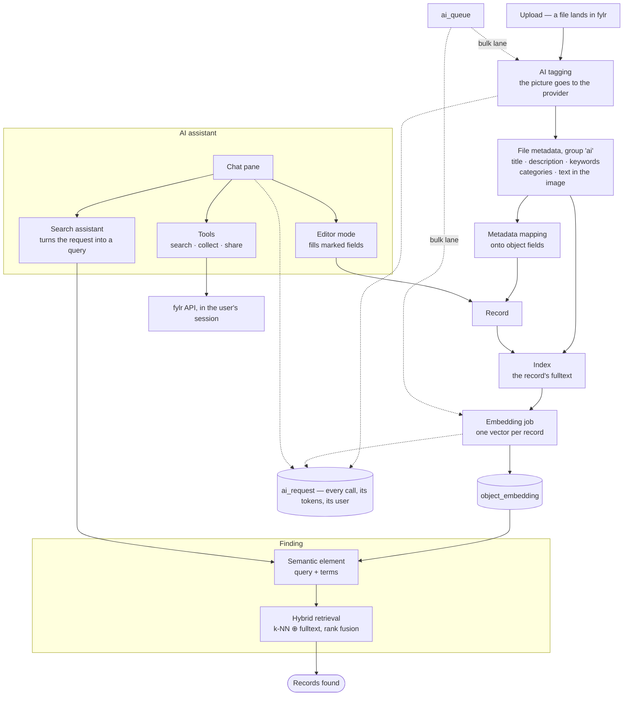

# AI

**From version 6.36.0**, fylr talks to AI providers itself. It describes uploaded files, embeds records so they can be found by meaning, and puts an assistant next to the editor and the search that can act in the instance on the user's behalf.

Nothing here happens without configuration: an administrator connects a provider, decides which models may be used where, and switches on the parts that should run. Every request fylr sends is recorded, and every action the assistant takes runs in the session of the user who asked for it — with their rights, their masks, their audit trail.

## The flow

## The pieces

<table data-header-hidden><thead><tr><th width="230"></th><th></th></tr></thead><tbody>
<tr><td><a href="providers.md">AI Providers</a></td><td>Who fylr may talk to, and with which models.</td></tr>
<tr><td><a href="configuration.md">AI Configuration</a></td><td>The instance-wide settings: embeddings, semantic search, the search assistant, and the request log.</td></tr>
<tr><td><a href="tagging.md">Tagging files</a></td><td>What the AI writes about an uploaded file, and how it reaches your fields.</td></tr>
<tr><td><a href="semantic-search.md">Semantic and hybrid search</a></td><td>Finding records by meaning instead of by words — and by both at once.</td></tr>
<tr><td><a href="assistant.md">The AI assistant</a></td><td>The chat pane: filling fields in the editor, searching, and acting through tools.</td></tr>
<tr><td><a href="operations.md">Queue, log and costs</a></td><td>How the work is scheduled, what is recorded, and where to look when something is wrong.</td></tr>
</tbody></table>

## What leaves the instance

Only what a configured feature needs, and only to the provider configured for it:

* **Tagging** sends one rendition of the file — a preview, not the original, unless the pool policy allows it — and the prompts.
* **Embeddings** send the text a record is embedded from.
* **The assistant** sends the conversation, the marked fields with their current values, and the files the pool policy permits.

The tools the assistant may call are executed by fylr, not by the provider: the model asks for a tool, fylr runs it in the user's session and hands back the result. A provider never receives credentials, and never reaches the API directly.
