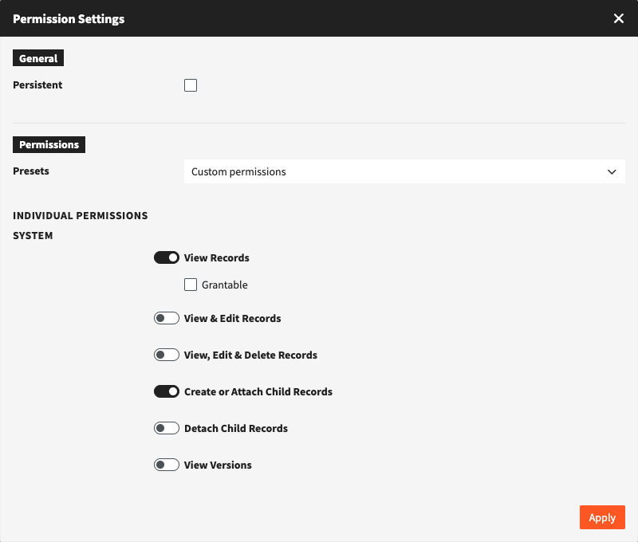

# Record Permissions

## General

Records get their own permissions if **Individual permissions per record** is enabled for their object type in the data model. The permissions of a record are edited in the record itself, in the field **Permissions** of the editor. They apply in addition to the permissions of the [pool](pools.md) or of the [object type](object-types.md).

Editing the permissions of a record requires the permission "Edit Permissions of Records" from the pool or the object type. The owner of a record can always edit its permissions.

## Hierarchies

In a hierarchical object type, a record **inherits** the permissions of its superordinate records. The options are the same as for pools:

<table><thead><tr><th width="330">OPTION</th><th>DESCRIPTION</th></tr></thead><tbody><tr><td>Ignore permissions for superordinate records</td><td>The record and its subordinate records no longer inherit the permissions of the superordinate records. Permissions that are "Persistent" there still apply. The permissions of the pool or object type are not affected.</td></tr><tr><td>Persistent</td><td>Set per permission. The permission also applies to subordinate records that ignore the permissions of their superordinate records.</td></tr></tbody></table>

## Creating and Moving Subordinate Records


Available from version 6.35.0.


Two permissions of a record decide who may change which records hang beneath it:

<table><thead><tr><th width="330">PERMISSION</th><th>DESCRIPTION</th></tr></thead><tbody><tr><td>Create or Attach Child Records</td><td>Allows to create a new record beneath this record and to move an existing record beneath it.</td></tr><tr><td>Detach Child Records</td><td>Allows to move a record away from beneath this record, to another superordinate record or to the top level.</td></tr></tbody></table>

<figure><figcaption>The record permissions of a record in a hierarchy, with the child record rights</figcaption></figure>

Both permissions can only be set in the permissions of a record, not for a pool or an object type. As they are inherited, setting them for a record on the top level applies to all records beneath it. The owner of a record has both permissions for it automatically.

The user additionally needs to see the superordinate record and needs the permission to create records in the pool or object type. Editing a record without changing its superordinate record requires neither permission, and deleting a subordinate record requires no permission for the superordinate record.

Without the permission, "Create new subordinate record" is disabled for the record and shows the missing permission. Moving a record is refused when saving, with a message naming the missing permission and the superordinate record.

The permissions are only checked for hierarchical object types with individual permissions per record. For all other object types, including polyhierarchies, nothing changes.


**Updating to 6.35.0:** in a hierarchical object type that already uses individual permissions per record, only administrators with the system right "root" and the owner of a record can create or move records beneath it, until the two permissions are set. Set them for the records on the top level to allow it for the whole hierarchy.

