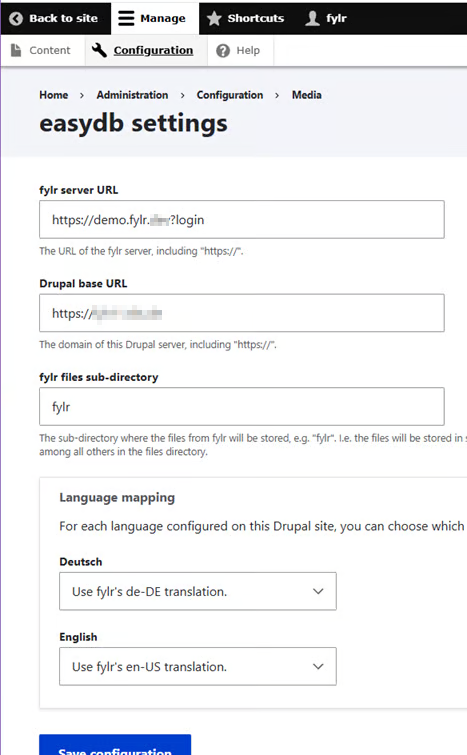

# Drupal

## Preparation of fylr

1. Contact [support@programmfabrik.de](mailto:support@programmfabrik.de) for a fylr license that includes this plugin.
2. Install and enable the plugin.
3. Activate the API as shown in the below screenshot:

<figure><figcaption></figcaption></figure>

## Preparation of Drupal

1. Get the Drupal module "easydb"

* Maintained at [https://git.drupalcode.org/project/easydb](https://git.drupalcode.org/project/easydb)
* Provides the receiving endpoint and the `fetch from fylr` action in the Drupal editor.
* Drupal 10.3 or higher is required for module version 2.1.0. Version 2.1.0 is current in Aug. 2026.

2. Compare that your settings in Drupal are similar enough:

<figure><figcaption></figcaption></figure>

* example values:

<figure><figcaption></figcaption></figure>

## Usage

In Drupal, create/edit content, choose e.g. "article with easydb image" → choose **Fetch from fylr** → the fylr login page opens → log in → select assets\
\
For more, see fylr [User docs](../../for-users/additional-features/drupal-integration.md).\
\
Files land in Drupal's media library.

## Troubleshooting

* **CORS error / "problem sending to Drupal" / `DRUPAL_FILE_COPY_ERROR` (`network_failure`)**: the Drupal server does not list your fylr instance as an allowed origin. Configure the Drupal server (and any reverse proxy) to return the correct `Access-Control-Allow-Origin` header for your fylr domain.
* **Checking transfer errors**: file-transfer events are logged in fylr under the **Event Manager** – look for `DRUPAL_FILE_COPY` (success) and `DRUPAL_FILE_COPY_ERROR` (failure).
* **A file is not transferred**: ensure `API` is enabled and the file does not exceed `send_files_max_filesize`. Try `Send file via browser` in fylr plugin settings.

## Related links

* [Plugin overview entry](../../plugins/overview.md#fylr-plugin-drupal)
* Predecessor easydb plugin: [https://github.com/programmfabrik/easydb-drupal-plugin](https://github.com/programmfabrik/easydb-drupal-plugin)
* fylr [User docs](../../for-users/additional-features/drupal-integration.md) for the drupal plugin

