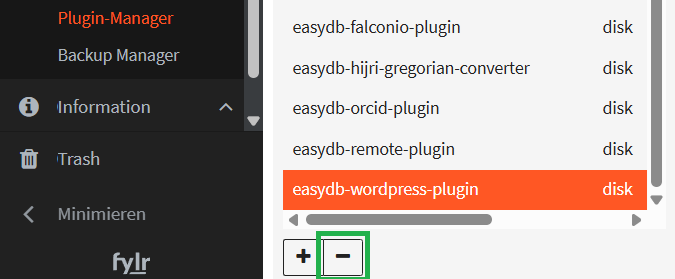
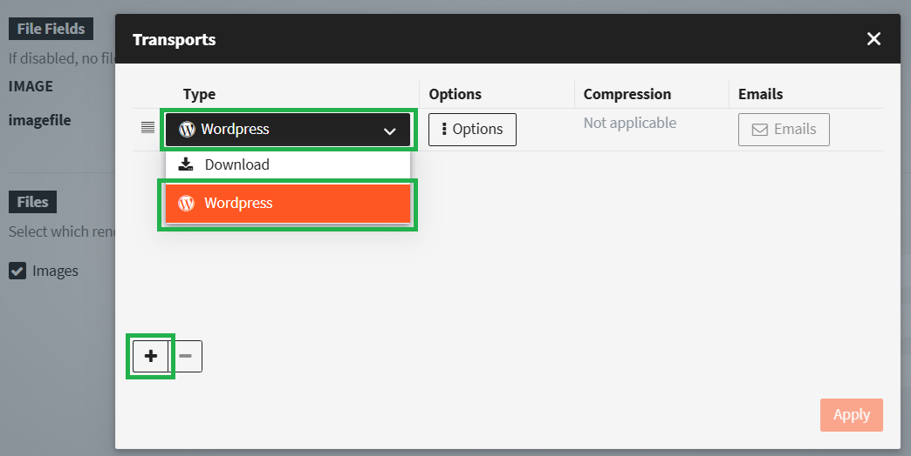

# Wordpress


At least Wordpress version 4.7 is required.


## Preparation of Wordpress

1. Go to _Settings > Permalinks_.
2. Select a permalink structure other than “Plain.”
3. Save the changes.

We aim to remove this requirement. So if this is a problematic requirement, try without it, but as of February 2026, it is still needed.

For your chosen Wordpress account, create an "Application Password" for use in fylr.\
.png>)

## Installation & Configuration

### 1. Use the newest version of the plugin

Make sure to use the newest version of the plugin. E.g. in fylr 6.29, an old version of the plugin is included that has since been updated independently from fylr. To get the newest version:

Go to Administration - Plugin-Manager - select the easydb-wordpress-plugin (type **disk**)

Click the minus ( `-` )button as shown below:

<figure><figcaption></figcaption></figure>

Then click the plus (+) button and add a plugin from type URL:

\
Enter the URL [https://programmfabrik.github.io/easydb-wordpress-plugin/easydb-wordpress-plugin-a4bd14b6-f687-4138-a0a4-274414cfdb8b-latest.zip](https://programmfabrik.github.io/easydb-wordpress-plugin/easydb-wordpress-plugin-a4bd14b6-f687-4138-a0a4-274414cfdb8b-latest.zip)\
\
.png>)

### 2. Configuration

After the plugin was installed successfully, go to its settings. Here you can add and connect one or more Wordpress installation(s):\
.png>)

For each Wordpress installation you need to configure the following:

<table><thead><tr><th width="208">FIELD</th><th>DESCRIPTION</th></tr></thead><tbody><tr><td>Instance Name</td><td>Name for the Wordpress installation. Will be shown in fylr when choosing the target for the export.</td></tr><tr><td>URL</td><td>URL of the Wordpress installation.</td></tr><tr><td>Authentication Type</td><td>Choose "HTTP Authentication".</td></tr><tr><td>Login</td><td>Login for Wordpress. Only available for type "HTTP Authentication". Consider using a Wordpress "Application Password" instead of your main admin credentials.</td></tr><tr><td>Password</td><td>Password for Wordpress. Only available for type "HTTP Authentication".</td></tr><tr><td>Client Key</td><td>Client Key for Wordpress. Only available for type "OAuth 1.0".</td></tr><tr><td>Client Secret</td><td>Client Secret for Wordpress. Only available for type "OAuth 1.0".</td></tr><tr><td>Token</td><td>Token for Wordpress. Only available for type "OAuth 1.0".</td></tr><tr><td>Token Secret</td><td>Token Secret for Wordpress. Only available for type "OAuth 1.0".</td></tr></tbody></table>

### 3. Permissions

By default, the plugin is disabled for all users except root. To grant selected users/groups access to the plugin, you need to assign them the system right "Allow Wordpress Export". This can be done in the [user](../permissions/user.md)/[group](../permissions/groups.md) editor on the tab "System Rights" > "Plugins". 

## Usage

After a successful installation and configuration, authorized users can create a Wordpress transport via the exporter:

1.  To transfer selected images to Wordpress, select the records in the search and right click on a record and choose "Export".&#x20;

    <figure><figcaption></figcaption></figure>
2. Define which versions should be used and click on the little truck icon in the lower right. \
   .png>)
3.  Add a transport there and choose the type "Wordpress"  

    <figure><figcaption></figcaption></figure>
4.  as well as your desired Wordpress installation under "Options".  

    <figure><figcaption></figcaption></figure>
5. Hit "Apply" and "Export" to send the files to Wordpress.

You can then go to your Wordpress installation and use the files from the media gallery for your website.


Please note, that only images are currently supported and that the deletion of files in Wordpress is currently not supported.

