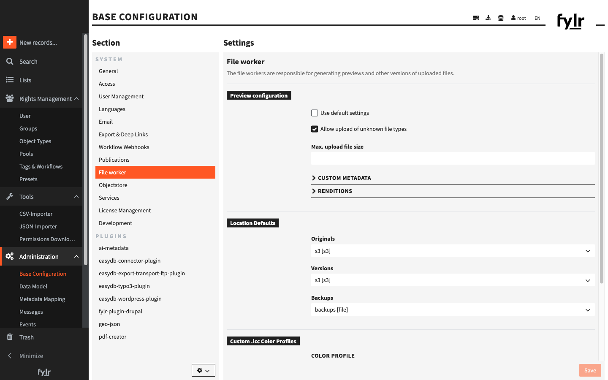

# File Worker

The **file worker** takes care of every file that is uploaded to fylr. It has two jobs:

* **Store the file** — the uploaded **original** is kept in a storage location and can always be downloaded again unchanged.
* **Generate versions** — from the original the file worker produces a set of **versions** (also called *renditions*): smaller preview images, thumbnails, a web-friendly video, a PDF of an office document, and so on. Versions are what the frontend shows in search results and detail views, and what most users download.

<figure><figcaption></figcaption></figure>

## File classes

Every uploadable file type belongs to one of four **file classes**. The file worker handles each class with its own tools and its own set of versions:

| CLASS | EXAMPLES |
| ----- | -------- |
| **Image** | jpg, png, tiff, gif, heic, camera raw (cr2, nef, dng, …), svg, ai, eps, psd |
| **Audio** | mp3, wav, flac, m4a, aac, ogg |
| **Video** | mp4, mov, avi, mkv, webm, mpeg |
| **Office** | pdf, doc(x), xls(x), ppt(x), odt, rtf, txt, indd, fonts (ttf, otf) |

For each class you decide which file extensions may be uploaded at all, and which versions are generated for them. See [Preview Configuration](preview-configuration.md).

## Versions and recipes

A **version** is one rendition of an original — for example a 250 px thumbnail or a 1000 px preview. Each version is produced by a **recipe**: a named conversion routine (for example `imageconverter:browserthumbs` resizes an image, `officeconverter:pdf` turns a document into a PDF). The recipe's **options** — output format, size, quality and so on — are what turn the original into that specific version. The recipes and their options are documented on the [Preview Configuration](preview-configuration.md) page.

Some versions are **derived from another version** instead of from the original: the watermarked preview is built from the `preview` version, and previews of vector files (ai, eps, wmf) are built from a generated `svg`. This *source version* chaining means that re-generating a source version also re-generates everything built on top of it.

### Standard, rights-management and watermark versions

* A **standard** version (such as `preview` and `small`) is the one shown by default — in search results, in the detail view and so on.
* A version marked for **rights management** can be restricted per pool or object type in the [permissions](../../permissions/); versions without it are always accessible to everyone who may see the record.
* A **watermark** version carries the pool watermark and is used together with rights management to hand out watermarked previews.

## Storage

The file worker keeps three kinds of data, each in its own [storage location](location-defaults.md):

* **Originals** — the untouched uploaded files.
* **Versions** — the generated renditions.
* **Backups** — backup copies.

## When versions are generated

Versions are generated **when a file is uploaded**. Changing the version configuration therefore only affects files uploaded afterwards — existing files keep their current versions until you re-generate them with a resync. See [Regenerating preview images](../../../help/tutorials/for-system-administrators/regenerating-preview-images.md), and [Changing the preview format](../../../help/tutorials/for-system-administrators/regenerating-preview-images.md#changing-the-preview-format) for the special case of switching a version's file format.

## In this section

* **[Preview Configuration](preview-configuration.md)** — which versions are generated for each file class, and the recipes and options behind them.
* **[Location Defaults](location-defaults.md)** — the default storage locations for originals, versions and backups.
* **[Custom .icc Color Profiles](custom-.icc-color-profiles.md)** — add your own ICC color profiles for image conversion.
* **[Custom Version Presets](custom-version-presets.md)** — on-demand rendition presets offered to users in the download dialog.
