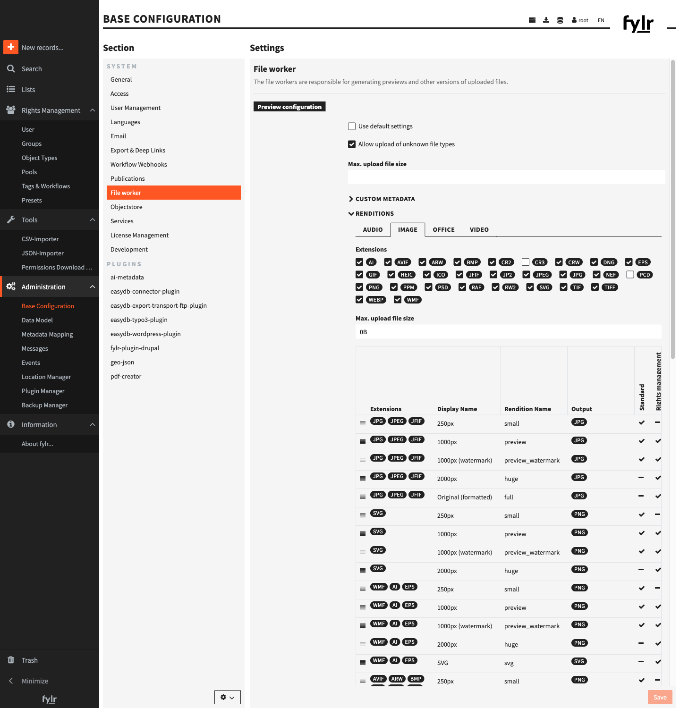

# Preview Configuration

## Use Default Settings

If this checkbox is enabled, the default versions are used. These are:

| CLASS | VERSION | DESCRIPTION |
| ----- | ------- | ----------- |
| Image | small | 250 px thumbnail (JPEG; PNG for formats with transparency) |
| Image | preview | 1000 px preview (standard) |
| Image | preview\_watermark | 1000 px preview carrying the pool watermark |
| Image | huge | 2000 px preview |
| Image | full | the full-size image, re-encoded |
| Image | zoom | very large preview (up to 32000 px) for deep-zoom viewers |
| Audio | small / preview | 250 px / 1000 px preview image of the waveform |
| Audio | aac | the audio re-encoded as AAC |
| Video | small / preview / huge | 250 px / 720 px / 1080 px thumbnail image |
| Video | 360p / 720p / 1080p | the video transcoded to that resolution |
| Office | small / preview | 250 px / 1000 px preview image of the first page |
| Office | pdf | the document converted to PDF |
| Office | pages | one preview image per page |

Each class also has a `preview_watermark` version (the preview with the pool watermark). Which versions count as *standard*, and which are for *rights management* or carry a *watermark*, is explained under [Version Settings](#version-settings) below.

If you want to use other versions, you have to disable the checkbox and then you'll be able to define your own set of preview versions. You can always go back to the default versions by enabling the checkbox. Your settings for the custom versions will not be overwritten, so you can also go back to your custom versions at any time.


Please note: when changing version settings, these changes are only applied for newly uploaded files, already existing preview versions are not updated automatically. You have to go to /inspect/files and start a re-sync.


## Allow Upload of Unknown File Types

Enable this checkbox, if you want to allow the upload of files with extensions not explicitly listed below. Otherwise these unknown or not supported file types are declined during the upload process.

## Max. upload file size

Set the maximum file size allowed for all uploads (for example: 500MB, 2GB). This value determines the upper limit on the size of each individual file that can be uploaded to the system. Make sure to consider user needs and system capabilities when configuring this setting.

## Extensions

For each file class (Audio, Image, Office & Video) the allowed file types can be (de-)activated. Only for activated extensions the upload is allowed and preview versions are generated. The allowed maximum file size for uploads can be set here again and overwrite the value defined above.

## Versions

All configured versions are shown in a table with their most important details. Hover over a version and click the little pencil button to edit the version settings (see below) or select a version and click the minus button on the bottom of the table to delete the version. You can add new versions by clicking on the plus button.

<figure><figcaption>The renditions of the <strong>Image</strong> class: each row is one version with its allowed extensions, display name, rendition name and output format.</figcaption></figure>

### Override original

If enabled, the original file won't be saved in fylr. Instead it will be replaced by the biggest version.

### Version name

Internal name of the version.

### Recipes

Recipes define the options available for generating the preview versions. Each file class brings their own recipes.

<table><thead><tr><th width="241">RECIPE</th><th width="559">DESCRIPTION</th></tr></thead><tbody><tr><td><strong>preview</strong> (audioconverter)</td><td>Creates preview images from audio files.</td></tr><tr><td><strong>convert</strong> (audioconverter)</td><td>Converts audio files into a different audio format.</td></tr><tr><td><strong>vectortosvg</strong> (imageconverter)</td><td>Converts vector files to SVG files.</td></tr><tr><td><strong>browserthumbs</strong> (imageconverter)</td><td>Converts image files.</td></tr><tr><td><strong>preview_pool_watermark</strong> (imageconverter)</td><td>Creates preview images with watermarks.</td></tr><tr><td><strong>browserthumbs</strong> (officeconverter)</td><td>Creates preview images for InDesign (indd) files from their embedded previews.</td></tr><tr><td><strong>font</strong> (officeconverter)</td><td>Creates preview images for font files.</td></tr><tr><td><strong>pdf</strong> (officeconverter)</td><td>Creates a pdf file from a document.</td></tr><tr><td><strong>preview</strong> (officeconverter)</td><td>Creates preview images from office documents (spreadsheets, presentations, text documents).</td></tr><tr><td><strong>pdfpages</strong> (pdfconverter)</td><td>Creates preview images for all pages in a pdf file.</td></tr><tr><td><strong>resize</strong> (videoconverter)</td><td>Converts video files.</td></tr><tr><td><strong>thumbnail</strong> (videoconverter)</td><td>Creates preview images from videos.</td></tr></tbody></table>

### Extensions

Each recipe brings its own extension options. Enable all extensions you want the preview version to be generated for.

### Recipe Configuration

Each recipe brings its own recipe options.

<table><thead><tr><th width="150">OPTION</th><th>DESCRIPTION</th></tr></thead><tbody><tr><td>format</td><td>Output format of the version — for example <code>jpg</code> or <code>png</code> for images, or <code>aac</code> for audio.</td></tr><tr><td>size</td><td>Target size in pixels, interpreted according to <code>resize_mode</code>. <code>0</code> keeps the original size (the image is only re-encoded).</td></tr><tr><td>size_minimum</td><td>Only generate this version if the source is at least this many pixels. This prevents upscaling and lets the larger versions (huge, full, zoom) be skipped for smaller originals.</td></tr><tr><td>resize_mode</td><td><ul><li><strong>max:</strong> Maximum length allowed for either the width or the height. The image is resized so its longest side equals size.</li><li><strong>min:</strong> Minimum length required for either the width or the height. The image is resized so its shortest side equals size.</li><li><strong>width:</strong> Sets the exact width of the image. The height is automatically adjusted to preserve the aspect ratio.</li><li><strong>height:</strong> Sets the exact height of the image. The width is automatically adjusted to preserve the aspect ratio.</li></ul></td></tr><tr><td>jpegquality</td><td>JPEG quality from 1 to 100. The default versions use 80.</td></tr><tr><td>strip</td><td>Remove embedded metadata (EXIF, color profile, …) from the generated image.</td></tr><tr><td>clip</td><td>Honor an embedded clipping path and preserve transparency when converting.</td></tr><tr><td>height / height_minimum</td><td>For video: the target height in pixels (for example 360, 720, 1080). <code>height_minimum</code> skips the version for smaller source videos.</td></tr></tbody></table>

### Version Settings

Furthermore you have the following settings for versions:

<table><thead><tr><th width="208">OPTION</th><th>DESCRIPTION</th></tr></thead><tbody><tr><td>Standard</td><td>If enabled, this version is used as the standard for an object type. The version is then shown in the search result for example. Please note, that "standard" needs to be enabled in the data model for the file field.</td></tr><tr><td>Rights Management</td><td>If enabled, the version can be used in the permissions for pools etc. Otherwise the version is always accessible to all users.</td></tr><tr><td>Watermark</td><td>If enabled, watermarked versions can be generated automatically and used for rights management. This needs additional configuration for the version and rights management.</td></tr><tr><td>Display Name</td><td>Name of the version that is used in fylr. Shown in the download manager for example.</td></tr><tr><td>Group</td><td>Choose a group that is used when exporting URLs to a CSV or XML file.</td></tr></tbody></table>
