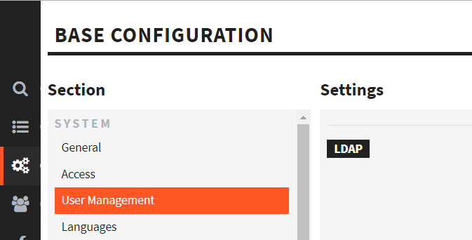
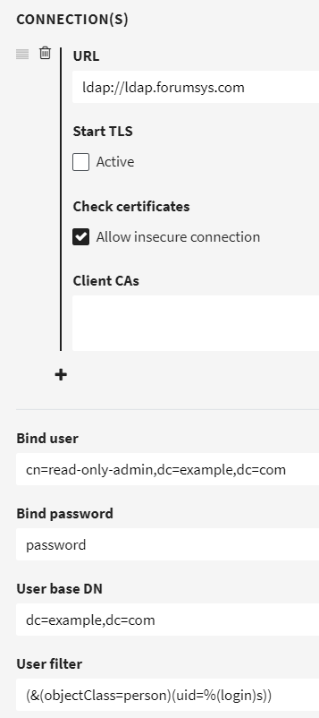
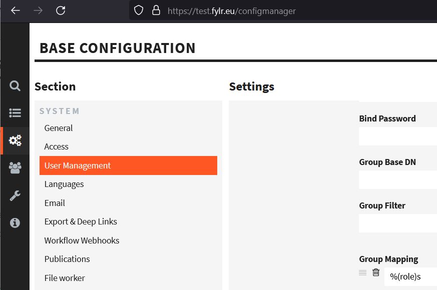
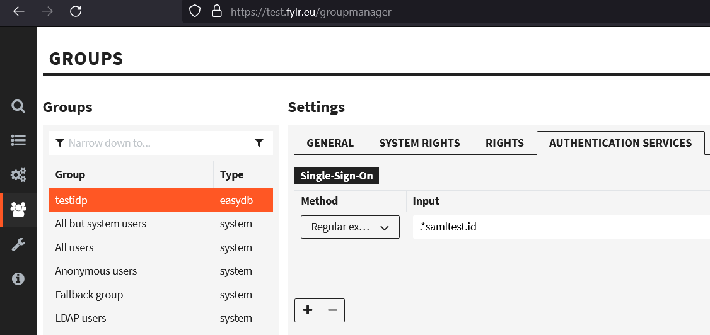

# User Management

<div align="left">

<figure><figcaption></figcaption></figure>

</div>

## User Management

### Handling When Deleting Users

Define what should happen, when someone deletes a user in the user management.

| OPTION  | DESCRIPTION                                                                                                                                                    |
| ------- | -------------------------------------------------------------------------------------------------------------------------------------------------------------- |
| Ask     | When someone clicks on the minus to delete a user, they'll be asked if the user should be archived or deleted.                                                 |
| Archive | When someone clicks on the minus to delete a user, the user will be archived. Archived users can't access the system but can be un-archived by administrators. |
| Delete  | When someone clicks on the minus to delete a user, the user will be deleted. Deleted users can't access the system.                                            |


Please note, that in both cases "Archive" and "Delete", the collections of the users will be deleted and cannot be restored.


### Store User in Events

Enable all event types that should store the user. Otherwise the event will not be connected to a user.

### Copy User Data to Events

Define which data of the user should be copied to the events. This is independent from the event user. If the user get's deleted or pseudonymized, this data remains in the events.

## OAuth-Service

Add pairs of Client IDs and Secrets for the [OAuth2 Authentication](for-developers/api/oauth2/#configuring-client-id-and-secret).

* **Name**: Name of the Client (used as Client ID)
* **Secret**: Client Secret, must be entered as a [Bcrypt Hash](https://bcrypt-generator.com/)
* **Redirect URIs**: List of callback URLs to the local client, needed for some OAuth2 Authentication flows
* **Expiration Time: Access Token**: Time after which the Access Token expires and needs to be refreshed, default: 24 hours
* **Expiration Time: Refresh Token**: Time after which the Refresh Token expires, default: 720 hours

## OpenID Userinfo

Select which user information should be returned over the OpenID endpoint `oauth2/userinfo`.


***

## LDAP

LDAP is an authentication service that you might already have to hold your users' accounts centrally. It is part of **Microsoft Active Directory** (predecessor to Azure Active Directory).

To enable fylr users to **log in** with LDAP accounts, scroll the **User Management** page to LDAP, _above_ SAML:

<figure><figcaption><p>where to find LDAP in the menues</p></figcaption></figure>

Here is an **example** configuration with the public test provider ldap.forumsys.com:

<figure><figcaption><p>example ldap configuration</p></figcaption></figure>

**URL**: Do not forget the protocol, in this case, `ldap://`. This could also be `ldaps://`.

**Allow insecure connection**: Can be safe if security is done by other means, e.g. fylr and LDAP server are running internally.

**Bind User**: An LDAP user, which fylr uses to search for other users and groups. Does not need administrative privileges.

**Bind Password**: Password of the Bind User.

**User Base DN**: Organizatinal Unit or whole organization, in which to search for users. All users who shall be able to log in must be inside this unit. Bind User does not have to be inside this unit. Example: `OU=Users,DC=example,DC=com` .

**User filter**: Which LDAP attribute shall be compared to the login string (which is entered during fylr login)? For example if I am Albert Einstein and my login username ist `einstein`: Which **LDAP attribute** contains the string `einstein`? In the example above: the attribute `uid` is compared to the login given by the user. So if I enter `einstein` and my password, fylr then searches for LDAP objects which have the attribute `uid` with value `einstein` in that attribute. If one is found, the password of _that_ LDAP object is also checked and if correct, this LDAP object is considered logged in. fylr creates a fylr user (if not already existing) that is considered connected to this LDAP object. For this scenario, the user filter `(uid=%(login)s)` is enough. To reduce search time and number of objects searched, the example in the screenshot additionally restricts the search to only LDAP objects of `objectClass` = `person`.

#### **USER MAPPING**&#x20;

.png>)

**+**: Add another mapped Attribute. We suggest `Display Name` and `EMail`.

**Target:** Choose one, at least `Login`.

**Value:** Enter one or more LDAP attributes, each given between `%(` and`)s`. <mark style="color:red;">Upper case / lower case</mark> <mark style="color:red;"></mark>_<mark style="color:red;">is</mark>_ <mark style="color:red;"></mark><mark style="color:red;">important here, even if it is not important inside your LDAP Directory!</mark>

If in doubt, which LDAP attributes can be used between `%(` and `)` during **User Mapping**, set fylr's log level to at least `debug` and pick attributes from the log output after a LDAP search. It looks like:

<pre><code><strong>2029-12-31 23:59:59 DBG search with base DN "dc=example,dc=com" and filter "(uid=einstein)" login=lda
</strong><strong>2029-12-31 23:59:59 DBG search found 1 entries [...] login=ldap
</strong>2029-12-31 23:59:59 DBG DN: uid=einstein,dc=example,dc=com
  objectClass: [inetOrgPerson organizationalPerson person top]
  cn: [Albert Einstein]
  sn: [Einstein]
  uid: [einstein]
  mail: [einstein@ldap.forumsys.com]
  telephoneNumber: [314-159-2653]
</code></pre>

So, usable attributes in this example are `DN`, `objectClass`, `cn`, `sn`, `uid`, `mail` and `telephoneNumber`.

### Group settings

We recommend to only configure group settings after the above settings are working to log in. Group settings are optional.

**Group Base DN**: Organizational Unit or whole organization, in which to search for groups. Example: `OU=Groups,DC=example,DC=com` .

**Group Filter**: Here, entere a search expression to find the LDAP objects to look at when deciding group membership. You can use attributes of the user here, e.g. `cn`, in the syntax `%(cn)s` - but you have to use it in an evaluation. In other words, compare it to another attribute with `=`.

Example: To compare all attributes named `member`, use as Group Filter: `(member=%(cn)s)`. This will result in all objects that have the user's `cn` in an attribute called `member`.

For the context of ldap.forumsys.com, the distinguished name (usable as `DN`) is in the group attribute `uniqueMember`.

So `(uniqueMember=%(DN)s)` could work. But to not evaluate _all_ objects, or in other words, to evaluate only groups, we add the object class: `(&(objectClass=groupOfUniqueNames)(uniqueMember=%(DN)s))`. This was successfully tested with ldap.formusys.com.

Another example, from a different LDAP installation:&#x20;

`(&(member=%(distinguishedName)s)(objectClass=group))` .

Now you have narrowed the comparison to a few objects, likely groups. Next step: Which attribute of these objects shall be compared during matching of fylr groups to LDAP groups? This is determined in Group Mapping:

**Group Mapping**: Which attribute to look at when matching groups. Look at the (final) next step for an example. To use e.g. the group's common name, use `%(cn)s` here, which works with  ldap.forumsys.com. \
If in doubt, which LDAP attributes can be used between `%(` and `)`, set the log level of fylr to at least `debug` and pick attributes from the log output after a LDAP search. It looks like:

```
2029-12-31 23:59:59 DBG search with base DN "dc=example,dc=com" and filter "(uniquemember=uid=einstein,dc=example,dc=com)"  login=ldap
2029-12-31 23:59:59 DBG search found 1 entries
2029-12-31 23:59:59 DBG DN: ou=scientists,dc=example,dc=com
  uniqueMember: [uid=einstein,dc=example,dc=com uid=galieleo,dc=example,dc=com uid=tesla,dc=example,dc=com uid=newton,dc=example,dc=com]
  ou: [scientists]
  cn: [Scientists]
  objectClass: [groupOfUniqueNames top]
```

So, usable attributes in this example are `DN`, `uniqueMember`, `cn`, `ou` and `objectClass`.

Final step: **Matching an LDAP group to a fylr group**:

*   In a fylr group's settings, enter a string that matches one LDAP group. For the example of ldap.forumsys.com, we created the fylr group `scientists` and since we chose `cn` above in **Group Mapping**, we now have to use the string `Scientists`, as this is the value in that group's common name (`cn`). In the fylr frontend this is done here:

    <figure><figcaption><p>fylr frontend > Rights Management > Groups > Choose group > Authentication Services > LDAP section > Add row</p></figcaption></figure>
* So now, when the ldap.forumsys.com's user `einstein` or `newton` logs into this fylr, they will be automatically in the fylr group `scientists` and enjoy all the group's system rights and permissions in fylr.&#x20;


***

## SAML

This can be used to log into fylr with users from e.g. Shibboleth and Azure ActiveDirectory.

Background: SAML 2.0 is an [XML](https://en.wikipedia.org/wiki/XML)-based [protocol](https://en.wikipedia.org/wiki/Communications\_protocol) that uses [security tokens](https://en.wikipedia.org/wiki/Software\_token) containing [assertions](https://en.wikipedia.org/wiki/Security\_Assertion\_Markup\_Language) to pass information about a principal (usually an end user) between a SAML authority, named an [Identity Provider](https://en.wikipedia.org/wiki/Identity\_Provider), and a SAML consumer, named a [Service Provider](https://en.wikipedia.org/wiki/Service\_Provider).

fylr acts as a Service Provider and as such needs to connect to an Identity Provider. For testing and to understand the configuration workflow, you can use the public Identity Provider [https://samltest.id/](https://samltest.id/).&#x20;

At some point you will need: fylr's endpoint to get the required metadata XML is [http://localhost/api/saml/metadata](http://localhost/api/saml/metadata) (replace _localhost_ with the domain of your fylr server).

### SAML with samltest.id

Follow this example to get into the workflow of configuring SAMl with fylr.

First you need to generate a certificate and private key.&#x20;

Background: The certificate will be entered in the fylr frontend's form fields and then be given to the Identity Provider as part of the metadata, so that requests coming from fylr are accepted. It is in addition to fylr's https certificate and not to be confused with it.

#### Generate Certificate

This can be done whereever openssl is installed as a command line utility.&#x20;

```bash
openssl genrsa -out private.key 1024
openssl req -new -x509 -key private.key -out publickey.cer -days 365
```

Now you can view the contents of the files `private.key` and `publickey.cer` and put that into fylr's frontend: (**Certificate** and **Key** fields)

<figure><figcaption></figcaption></figure>

#### Base Config

* As **URL** add [https://samltest.id/saml/idp](https://samltest.id/saml/idp) (this is the Identity Provider).
* We recommend to check **Log Steps**. This will write log events to debug SAML connections. In case of an error, the connection attempt is always logged.
* In **User Mapping** define how the SAML user is created in fylr. Upon each login the SAML users are mapped to fylr users. If an user already exists, an update is performed. Working with samltest.id:
  * Target: Reference: `%(urn:oasis:names:tc:SAML:attribute:subject-id)s`
  * Target: Display Name: `%(displayName)s`
  * Target: Email: `%(mail)s`

#### Upload Metadata

Get fylr's metadata from https://FYLR.EXAMPLE.COM/api/saml/metadata (replace domain name with your instance).

Upload the downloaded metadata file to the testing service ([https://samltest.id/upload.php](https://samltest.id/upload.php)). The test system replies with _We successfully parsed and saved your metadata file. We now trust you._

#### Test Connection

Now go to the fylr login page (e.g. by logging out or using a second browser or private tab) and click on **SAMLtestIdP** in the login dialog. This sends you to the login page of the Identify Provider. Login using any of the provided users (they are written on that test login page explicitly, with password). fylr will log the user in with no further rights (unless configured). Check the User Manager in fylr to see that the user record has been created.

#### Group Mapping

Users of samltest.id have a `role` attribute with values like `janitor@samltest.id`. This is shown during login on samltest.id's page. We will use this attribute to demonstrate a group mapping:

Mapping goal: Every role that ends in `samltest.id` shall be autmatically member of the fylr group `testidp`.

1. In fylr-URL/configmanager > User management > SAML add into the form field `Group Mapping` the value `%(role)s` (see following screenshot).

<figure><figcaption><p>How to add an attribute for SAML group mapping in the fylr frontend</p></figcaption></figure>

2. In fylr-URL/groupmanager add a group named `testidp`. Give that group some system rights that are visible after logging in.
3. In this group's configuration > `AUTHENTICATION SERVICES` > below `Single-Sign-On` add an entry with Method `Regular Expression` and Input `.*samltest.id` (see following screenshot).

<figure><figcaption><p>How to match a value for a group mapping in the fylr frontend</p></figcaption></figure>

4. Save. Test the login as a SAML user with a matching role. The user now has the rights given to the group `testidp`.
