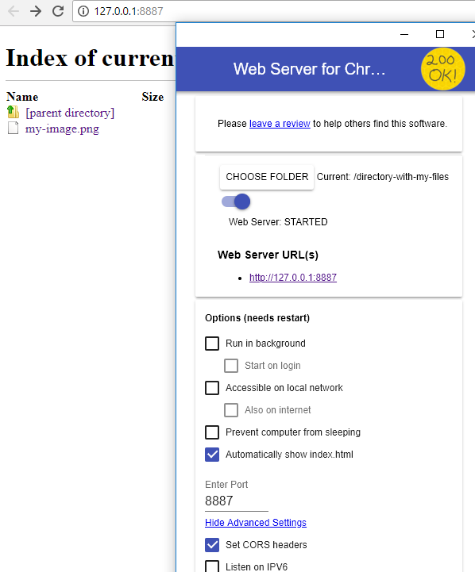

# Files

If the files are located locally on your computer, they must first be made available via a web server, since web browsers do not support direct access to files on your computer.


Alternatively you can upload the files using upload collections. Either upload all files first and then update the records using the CSV importer or import the data using the CSV importer first and then add the files using an upload collection.


One way to get around this limitation is to use an extension for the Google Chrome browser. This makes it possible to set up a web server on your computer with just a few clicks and access your files via it.


Please note, however, that the plugin is not a development of Programmfabrik GmbH. For importing larger amounts of data, we recommend setting up your own web server.


## Preparation

In order to import files that are located in the local file system using the CSV importer, it is necessary to make them available on a local server. The easiest and fastest way is to use the Google Chrome extension "[Web Server for Chrome](https://chrome.google.com/webstore/detail/web-server-for-chrome/ofhbbkphhbklhfoeikjpcbhemlocgigb)".

1. Install the extension and open it.&#x20;
2. Click on "Choose folder" and select the folder where the local files you want to import are located (e.g. "Pictures").&#x20;
3. Open the advanced settings and enable the "Set CORS headers" option.&#x20;
4. Restart the browser and open the extension again.&#x20;
5. Enter http://127.0.0.1:8887. This is where all the images are located. (Default port is 8887. This can be changed).

<figure><figcaption></figcaption></figure>

In your CSV file you then enter this URL, e.g. http://127.0.0.1:887/my-image.png.

## Example Files

| ID | TITLE  | CREATE DATE | FILE                                                                                                                                                       |
| -- | ------ | ----------- | ---------------------------------------------------------------------------------------------------------------------------------------------------------- |
| 1  | Rome   | 2020-01-01  | [https://upload.wikimedia.org/wikipedia/commons/c/c0/Rome\_Montage\_2017.png](https://upload.wikimedia.org/wikipedia/commons/c/c0/Rome\_Montage\_2017.png) |
| 2  | Laptop | 2007-02-01  | http://127.0.0.1:887/my-image.png                                                                                                                          |

If your data model allows multiple files to be uploaded per record, then enter all URLs into one cell separated by a break:

| ID | TITLE          | CREATE DATE | FILES                                                                             |
| -- | -------------- | ----------- | --------------------------------------------------------------------------------- |
| 1  | Trevi Fountain | 2020-02-17  | 
http://127.0.0.1:8887/Trevi-001.JPG http://127.0.0.1:8887/Trevi-002.JPG
 |

If in your FYLR the object and image information are managed in separate object types (e.g. "collection objects" and "images"), please import both information separately. Create a CSV file with all information about the objects incl. unique identifier and import it. In the second CSV file, enter all information about the images including the URL to the file and the unique identifier for the associated object and import it.

## Import Procedure

* first **open** the CSV importer&#x20;
* **upload** your CSV file&#x20;
* select "**1st Row**" for "CSV Field Names"&#x20;
* select the target **object type**, **pool** and the corresponding **mask**&#x20;
* switch to the tab "**Import Mapping**" and select the corresponding **target field** for the column containing the **URLs**&#x20;
* for "**Type**" select "**url**" to import new files&#x20;
* switch back to the tab "**Import Settings**" and select the "**Update Field**" if there are already records in the list that should be updated if necessary&#x20;
* click on "**Prepare**" and you will get an overview how many rows will be imported or updated&#x20;
* then the import / update can be started
