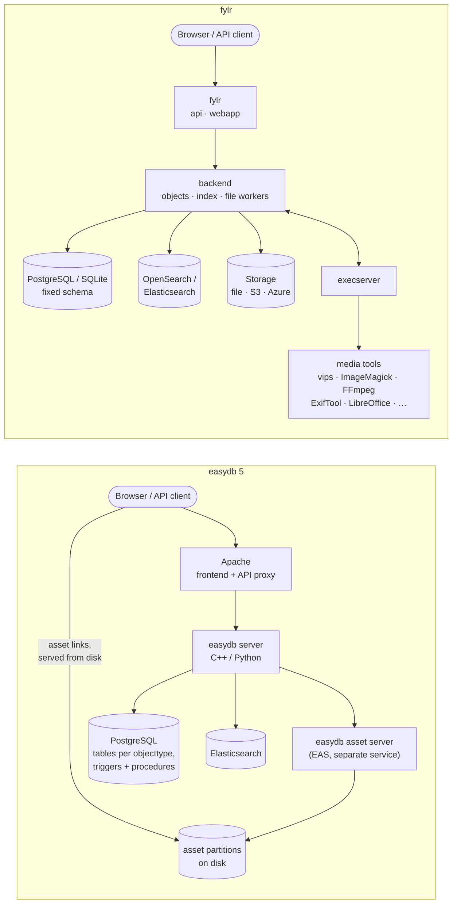
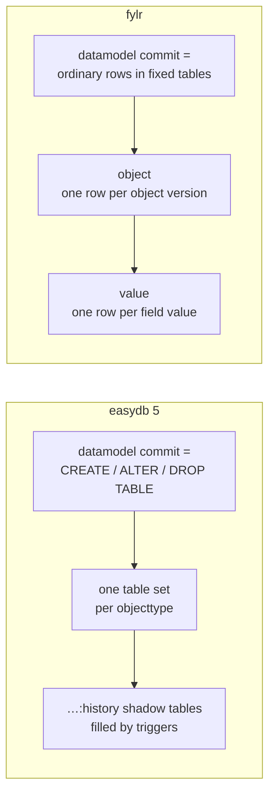

# Changes from easydb 5 to fylr

fylr is a complete rewrite of easydb 5. The server was rebuilt from scratch, but the API was deliberately kept compatible wherever possible: most API clients — including the easydb 5 web frontend, which fylr ships — continue to work without changes.

This page is aimed at developers and administrators who maintain API clients, plugins, or integrations, or who are planning a migration. It covers three areas:

1. [Architecture](changes-easydb5-fylr.md#architecture) — what changed under the hood
2. [Upgrading from easydb 5](changes-easydb5-fylr.md#upgrading-from-easydb-5) — the migration path and migration aids
3. [API changes](changes-easydb5-fylr.md#api-changes) — every known API-facing difference, by endpoint

## Architecture

### Server and deployment

The fylr server is written in [Go](https://go.dev) (easydb 5 was written in C++, with substantial Python components). fylr is a single binary that runs several services — **api/webapp**, **backend** and **execserver** — where easydb 5 needed a stack of separate components:

* Runs natively on Linux, Windows and macOS.
* Runs on Docker and Kubernetes; a [docker-compose file](../for-system-administrators/installation/linux-docker-compose.md) and a [Helm chart](../for-system-administrators/installation/helm.md) are available.
* Apache and the separate easydb asset server (EAS) are no longer needed. fylr serves HTTP itself, and everything that involves external programs runs through the **execserver**, a service for executing jobs such as image scaling and metadata extraction. The execserver is part of the `fylr` binary; it runs in-process by default and [can run standalone and be scaled to several instances](../for-system-administrators/installation/scaling-the-execserver.md).
* Several fylr instances can share one PostgreSQL and one OpenSearch behind a load balancer for horizontal scaling.

See [Architecture](../for-system-administrators/architecture.md) for how the fylr components work together.


Since fylr 6.35 the execserver connection uses a fylr-initiated transport (the [slot broker](execserver.md)); a standalone execserver must be upgraded together with the fylr server.


### Database

fylr supports [PostgreSQL](https://postgresql.org) as its database backend, plus [SQLite](https://sqlite.org), which is the out-of-the-box default and suited for development, testing and small installations. Since fylr no longer uses stored procedures or triggers (easydb 5 relied on both), additional backends can be added more easily.

The way data is stored has changed fundamentally:

* All objects are stored as generic rows in a fixed set of tables — an `object` row per object version, referencing one `value` row per field. Datamodel commits therefore write ordinary rows instead of running DDL, which makes them much lighter. It also lays the groundwork for pool-specific datamodel features (the first one, pool-specific standard masks, exists already).
* Schema updates are **not** reflected in the SQL schema anymore. The number of database tables in fylr is fixed and does not change with the user datamodel. In easydb 5, every datamodel commit created, changed or dropped tables.
* Object history is stored in the same tables — historic versions are ordinary rows next to the current one. easydb 5 kept history in separate `:history` shadow tables filled by database triggers.
* The datamodel, localizations, and mappings are stored in the database as well — fylr no longer keeps any of them as files on disk.
* Custom data (including external UUIDs) is stored space-efficiently: each datum is stored once and referenced, instead of being copied into every cell as in easydb 5. As a consequence, the custom data type updater refreshes the shared datum instead of rewriting every object that uses it.

### File storage

fylr stores file metadata in the database. Assets and previews can be stored on a traditional file system, on S3-compatible storage, or on Azure Blob storage.

Asset links are no longer served by Apache directly from disk — they are served through fylr and are therefore subject to rights management.

Files can also be *referenced* at a remote URL instead of being copied in (`rput` with `leave_on_remote`); referenced originals can still produce renditions.

### Search and indexing

* fylr uses OpenSearch as its primary search index, but also supports Elasticsearch (as easydb 5 did). Note that GeoJSON search requires OpenSearch or a licensed Elasticsearch.
* Events are indexed as well and can be searched through `/api/v1/search` (search type `event`, requires the system right `system.api.event[get]`). easydb 5 answered event queries from SQL only.
* "Suggest" is backed by a term splitter in the database, updated on every object save — the periodic suggest index rebuilds of easydb 5 are gone. (A reindex does not recalculate the term tables; that is a separate, on-demand operation.)
* Rights generation happens during normal object loading rather than in a separate database pass per objecttype after the search, so `generate_rights: true` no longer carries the large extra cost it did in easydb 5.

### File worker chain and the execserver

The file worker chain (formerly the easydb asset server) has been redesigned — see [The File Worker](file-worker.md):

* The chain is configured in the base config. The worker system can employ any program to generate any version of any file. Besides the standard setup for images, videos, audio and office files (plus 3D gaussian-splatting previews), you can extend it for previews of your choice, such as CAD formats.
* Everything that happens to files — format conversion, metadata extraction, OCR, IIIF tiling — is scriptable via YAML recipes.
* Metadata extraction also runs through the execserver (fylr's own `metadata` subcommand, which in turn calls ExifTool; it can be wrapped and extended) and can be configured per file type.
* The original file can be replaced during upload: a produce-config version named `original` converts the upload before it is stored.
* The exporter runs through the execserver as well, so external processors such as XSLT 3.0 (Saxon) can be used.
* Renditions can also be produced on demand at download time and streamed without being stored.

### Frontend and plugins

* The web frontend is the same as in easydb 5, with a new design.
* Frontend plugins are compatible with easydb 5. Server plugins must be adapted — see [Plugin](plugin.md).
* All plugin callbacks run through the execserver, so plugins can be written in any programming language. Server-side callbacks call back into the API with short-lived tokens minted per call. Hybrid plugins that serve easydb 5 and fylr from one codebase with shared Python code are possible (two manifests over the same sources).
* Plugins can be enabled and disabled in the base config, and can be installed directly from the frontend.
* Some plugins have moved into the core: OAI-PMH, [WebDAV](webdav.md), the hotfolder, and LDAP authentication. WebDAV now supports both read and write and is served by fylr directly — in easydb 5 it was an Apache `mod_dav` share used only to drop files into the hotfolder. (`COPY` is not supported and returns 405.)

### Authentication

Authentication has been rebuilt from scratch on top of [OAuth 2.0](api/oauth2.md), including OpenID Connect discovery (`/.well-known/openid-configuration`). The old `/api/v1/session` endpoint has been removed — see [API changes](changes-easydb5-fylr.md#api-v1-session) below.

### Export

Exports are generated in real time and no longer pre-produce their files to disk. When an export is started, only a list of files is computed; each file is generated on the fly when it is requested. Behavioral changes are listed under [API changes → /api/v1/export](changes-easydb5-fylr.md#api-v1-export).

### New features

Capabilities in fylr that have no equivalent in easydb 5:

* **IIIF support** built in (Presentation API 3.0; Image API 3.0 since fylr 6.34, 2.0 before). The tiler is configurable via the execserver — you can, for example, switch everything to JP2 or layered TIFFs. The integrated image zoom is mapped to the IIIF endpoint.
* **Polyhierarchies** are supported — see [Hierarchies and polyhierarchies](concepts/hierarchies-and-polyhierarchies.md).
* **Automatic numbering**, e.g. for building archival tectonics.
* **Inspect** (`/inspect`): a bare-metal database view of the structures and data in fylr, including a visual backup tool — see [The /inspect backend](../for-system-administrators/inspect/README.md).

## Upgrading from easydb 5

Upgrading from easydb 5 to fylr requires a complete backup and restore. The `fylr` binary provides a command line facility to export an easydb 5 (or fylr) instance and restore it into a fylr instance via the API — see the [Migration Tool](../for-system-administrators/migration/README.md) documentation.

The API has gained several extensions that are useful for migrations:

* UUIDs, system object IDs, and object IDs can be set externally (`_uuid`, `_system_object_id`, `_id` — settable while the object is version 1, immutable afterwards).
* Linked objects can be "deferred" — a promise that a linked object will be migrated later. The link lookup sets `_allow_defer: true` and must address the target by `_system_object_id` or `_uuid`; the link resolves automatically once the target is saved.
* `system.root` can set `_create_user` on objects (see [/api/v1/db](changes-easydb5-fylr.md#api-v1-db)).
* `skip_constraints` relaxes save-time checks: unique-key violations are tagged instead of rejected, and objects may be saved without a pool (see [/api/v1/db](changes-easydb5-fylr.md#api-v1-db)). Before fylr 6.27.0 this parameter was called `skipConstraints`.
* Further save parameters for bulk imports: `skip_index`, and `skip_plugins` / `skip_events` (both require `system.root`).
* easydb 5 password hashes survive the migration: `fylr backup` converts them into fylr's hash formats, so users keep their passwords.

## API changes

Most of the API is unchanged in fylr. In most cases, API clients — including the easydb web frontend — work as before. The differences are listed below.


Calling a removed endpoint such as `/api/v1/session` returns HTTP **400** with the API error `UnknownEndpointMethod` — not a 404.


### Removed at a glance

| Removed in fylr | Replacement |
| --- | --- |
| `/api/v1/session` | OAuth 2.0 + `/api/v1/user/session` |
| `/api/v1/session/change_password` | `/api/v1/user/change_password` |
| XML export format `easydb_flat` | the value is still accepted as an alias and produces the standard easydb XML |
| `format=xml` on `/api/v1/mask` and `/api/v1/schema` (the easydb 5 default) | JSON; `format=xml` is silently ignored |
| `search.highlight` | — |
| Search type `pool_management` | — |
| Aggregation type `asset` | Type `term` with `_linked._asset.` field prefix |
| `/api/v1/settings` subpaths `purgedata`, `restart`, `buildsuggest`, `updatecustomdata` | — |

### Rights management

* The `extensions` parameter of the `asset_upload` right is gone. Only `classes` can be configured; all extensions that the produce config assigns to a class are then allowed for upload.
* `collection.BAG_CREATE[inherit_owner]` is not supported. `inherit_owner` is always assumed: a new sub-collection without an owner inherits the parent's owner.
* The output of `_generated_rights` includes more rights than in easydb 5: `read`, `write`, `delete`, `acl`, `change_owner`, `unlink`, plus `owner` (easydb 5 reported only `read`, `write`, `delete`, `unlink`).

### `_standard` rendering

fylr does not store `_standard` with the object data — it is rendered from the current object values and the mask configuration. (For search output it is prerendered at index time and cached per object version and mask; `/api/v1/db` always renders it fresh.) Differences to easydb 5:

* If `_standard.1` has no data, the fallback `#<system-object-id>` is used, even if `_standard.2` or `_standard.3` is set. easydb 5 would not set `_standard.1` in that case.
* When rendering linked objects, the linked object's `_standard.1` text is merged into the level configured on the link field; for the file and geo standards, the linked object's same-numbered level is merged into the parent's level.
* Links are followed to any depth (recursion into already-rendered objects is stopped, so cycles are safe).
* Since fylr 6.10.2, the format configured on a value is always applied, regardless of the following value's format: a comma followed by square brackets renders `value1, [value2]`, where easydb 5 rendered `value1 [value2]`. Use the format `space` to restore the old look.
* New standard options: geo fields can be placed into the standard (`standard_geo`), `nested_standard_first_only` renders only the first row of a nested table, and `stop_if_set` stops collecting further values for a level once one is set.

### /api/v1/collection

* Deep links have changed: for type **collection**, login and password are swapped compared to easydb 5 (the secret is the login, the collection UUID is the password); **email** users log in with email & user UUID instead of email & ACL UUID.

### /api/v1/config

* `system` and `plugin` config are separated; there is a new object layer `config` wrapping each section.
* The config can be read filtered by path: `GET /api/v1/config/<path>`.
* Partial updates are supported via `POST /api/v1/config/<path>` — only the addressed path is patched. A plain `POST /api/v1/config` still replaces whole config sections, as in easydb 5. `DELETE /api/v1/config/<path>` resets the addressed part to its defaults.
* Reading the config no longer requires the `system.config` right — items the session may not see are filtered out. Writing still requires it.
* New: `GET /api/v1/config/list` returns the config schema, including plugin-contributed entries.

### /api/v1/db

Changes in format `full`:

* Empty fields are included (easydb 5 omitted them).
* `_changelog` contains different fields than in easydb 5: `batch_id`, `schema_version` and `groups` are gone, `latest_version` is new, and `user` is a full user object instead of a bare id. For versions, the changelog is complete (all versions up to the requested one).
* `base_fields_only` is not supported (in any mode).

Additional support:

* `"_version:auto_increment": true` — a separate boolean key next to `_version`.
* `_create_user`: setting it to a different user requires `system.root` (useful for migrations); setting it to yourself does not. `_create_user` is included in the output when the mask has owner read enabled.
* `skip_constraints` (called `skipConstraints` before fylr 6.27.0): skips unique-key enforcement — violations are tagged with `UNIQUE_KEY_VIOLATION` system tags instead of rejected — and permits objects without a pool, duplicate nested `_uuid` values, and multiple tags from one tag group.
* Further save parameters: `skip_index`, `skip_plugins`, `skip_events` (the latter two require `system.root`), `dry_run`, and `await_index` (blocks until the request's own index jobs are visible).
* Tag lookups (`_tags: [{"lookup:_id": {"reference": ...}}]`) accept only the key `reference`; easydb 5 also accepted other reference columns.

### /api/v1/db_info

* `/update`: `_available_tags` no longer includes `is_default` — with multiple pools, each pool defines its own tag defaults, so `/create` reports defaults per pool instead.
* The output of `_generated_rights` includes more rights than in easydb 5 (see [Rights management](changes-easydb5-fylr.md#rights-management)).
* Both `/create` and `/update` are pure permission probes — they never write.

### /api/v1/eas

* `class_version_extension` is no longer indexed.
* Metadata groups have a new `value` next to `print`.
* `_not_allowed` is not used; versions the user may not see are skipped instead.
* Formats: `short` no longer returns versions; the new format `standard` does — use `standard` for compatibility. `standard` is also the new default (easydb 5 defaulted to `long`); the easydb 5 format `status` is gone.
* `POST /eas/put` no longer supports `mapping` — use `GET /eas` instead.
* `GET /eas?mapping` always requires `objecttype` (and `mask`).
* `skip_extension_check` was replaced by `produce_versions=false`. fylr has no upload extension allowlist; `produce_versions=false` disables rendition production for the upload.
* `/eas/produce`: the `transform` body parameter is a single transform entry, no longer an array.
* New: `POST /eas/rput/bulk` for bulk remote uploads, and manual renditions — `version_names` + `id_parents` on put/rput upload a named version for an existing original.

### /api/v1/event

* URL parameter `base_type` was renamed to `basetype`.
* `POST /api/v1/event` is now symmetric: it receives the event as an object inside the top-level object's `event` property, matching the response shape.
* `DELETE /api/v1/event/list` (with the same filter parameters as `GET /api/v1/event/list`) and `DELETE /api/v1/event/<id>` are new; `DELETE /api/v1/event` (URL and body POST) was removed.
* URL parameter `background=1` writes the event in the background. Use this from within plugins that are called during a write transaction to avoid deadlocks on SQLite installations.
* New: `POST /api/v1/event/list` creates multiple events in one call, and `GET /api/v1/event/stream` streams pollable events over a WebSocket.
* `skip_constraints=1` (requires `system.root`) unlocks writing system event types and setting the event user — added for migrations.

### /api/v1/export

Exports are generated on the fly (see [Export](changes-easydb5-fylr.md#export) above). Details:

* `POST /export/<id>/stop` exists as in easydb 5 — but it was a no-op in fylr before 6.27.0. Since 6.27.0 it stops the running export, which then ends in status `failed`.
* In asset export attributes, `JSON` and `EASParentId` have no effect.
* New URL parameter `format` on `GET /export/<id>`: `long` (default) returns all of the export's events in `_log`, `standard` returns only the last run's `EXPORT_*` events, `short` omits `_log`. `_log` is now sorted ascending.
* CSV: the subfield separator changed from `#` to `.`.
* CSV: the field syntax changed; output into a combined nested-collection cell using `[]` is no longer possible — each row gets its own `field[0]`, `field[1]`, … column.
* CSV: the option `empty_columns` is no longer supported.
* `FILE_DOWNLOAD`, `FILE_DOWNLOAD_ERROR` and `OBJECT_DOWNLOAD` are new events (easydb 5 used `ASSET_DOWNLOAD` etc.). `event.info` can be passed via URL for additional log entries in the event's `info` field.
* Mapping can be used with `xml_one_file_per_object=false`, and mapping can be combined with XSLT processing.
* New: XLSX as an export format, and `tar_gz` as a packaged download next to `zip`.

### /api/v1/group

* `_ipv4_subnet_filter` was renamed to `_ip_subnet_filter`; IPv6 is now supported. Unparseable entries are silently ignored.

### /api/v1/mask

* `format=xml` is no longer supported (it was the easydb 5 default); responses are always JSON. New: `format=long` embeds each field's underlying `column` definition.
* The synthesized `_all_fields` mask can be fetched via `GET /mask/<version>/_all_fields`. It sets the text standard on the *first* text-type field, and the file standard (`standard_eas`, plus `standard_geo`) on the first files field.
* In object output, the system fields `_acl`, `_tags`, `_owner`, and `_published` are omitted if the mask configures them not to be shown. `_collections` is always included.

### /api/v1/objects

* `column` can also target nested fields — but not linked or reverse-linked fields. Column-based deep links require the base config switch `system.deep_link_access.allow_access_by_column` and error if the value matches multiple objects.

### /api/v1/objecttype

* New top-level attribute `_filename_replacements`: lists the available replacements for files (output only).
* New top-level attribute `_compiled_tags`; its entries carry `_origin`, showing where each tag comes from.
* New: `GET /objecttype/<id>/stats`.

### /api/v1/pool

* `_compiled_tags` has a new attribute `_origin`, which shows the origin of each tag (`tags`, `objecttype:…`, `pool:…`).

### /api/v1/right/preset

* New: a single preset can be fetched by ID.

### /api/v1/schema

* `format=xml` is no longer supported (it was the easydb 5 default); the graphical formats `svg` and `png` remain, JSON is the default.

### /api/v1/search

* `fields.with_path` is new, and collecting fields for path items has changed: each entry is an individual array with one element per path element, whereas easydb 5 returned all path elements in one big array.
* `sort.with_path` defaults to `false` (easydb 5: `true`).
* `include_deleted` is a new switch that also searches deleted objects.
* `changelog_range` accepts `query` to set the type of the comment search.
* New search type `event`: searches events (requires the system right `system.api.event[get]`). The keys of an event's `info` block are searchable and aggregatable via `event.info_key`; the `info` values themselves are not indexed.
* Removed: `class_version_extension` and `class_version_filesize`; also the asset-level date fields `date_created` and `date_inserted` — each file field offers the new daterange field `best_date` instead, next to `date_uploaded`.
* `technical_metadata.create_date` replaces the easydb 5 asset field `date_created`; `technical_metadata.date_time_original` is new.
* `_linked._asset` supports the same fields as regular file fields, and `_linked._asset` fields (such as date fields) are available in regular aggregations.
* Aggregation type `asset` was removed. Use type `term` with `_linked._asset.` as the field name prefix.
* `search.highlight` was removed.
* The `match` search type was renamed to `text`; `match` is kept as a compatibility alias.
* New subsearch feature for type `in`: use `field` for the field to fetch and `subsearch` for a subsearch that fills the `in` parameter.
* Type `range` has new options `from_equals` and `to_equals` (both default to `true`, i.e. inclusive bounds).
* New output formats: `standard_extended`, `long_inheritance`, `full_inheritance`.
* New `point_in_time` and `search_after` features for stable pagination.
* `language` was changed to `languages` (an array).
* The `linked_object` facet now includes `_linked_object`.
* `format` was removed from the `date_range` aggregation.
* New sort fields `_standard_parent` and `_standard_parents`.
* New geo support: search element types `geo_bounding_box` and `geo_shape`, and aggregation types `geo_bounds`, `geotile_grid` and `geohash_grid`.
* New top-level parameters: `timezone`, `generate_rights`, `best_mask_filter`, `file_url_expire`.

### /api/v1/session

This endpoint was **removed**. Use [OAuth 2.0](api/oauth2.md) and `/api/v1/user/session` instead.

### /api/v1/settings

`GET /api/v1/settings` itself still exists for compatibility, but all subpaths are gone: `purgeall`, `reindex` and `sendmail` moved to `/api/v1/system`; `purgedata`, `restart`, `buildsuggest` and `updatecustomdata` were dropped without replacement.

### /api/v1/system

New endpoint offering:

* `POST /purgeall`: purge all data and start over (accepts `set_password`). Requires `allowpurge` in both `fylr.yml` and the base config, and the actual root user.
* `POST /reindex`: initiate a reindex (accepts `blockFrontend`).
* `POST /sendmail` and `/sendmail/test`.
* `PUT /backup/new`, `GET|DELETE /backup/<id>`, `GET /backup/<id>/download`, `GET /backup/list`: backups, performed in the background (require the `system.backup` right).
* `GET /errortest`: store a test error.
* `GET /status`: status information about the server.
* `GET /openapi/spec.json`: the OpenAPI spec, plus storage location and share-link management routes.

### /api/v1/user

* The base config option `default_delete_policy` defaults to `ask` (easydb 5 had no delete policy for users).
* New endpoint `/api/v1/user/change_password` (moved from the former session endpoint). It requires the `system.user.change_password` right, takes `new_password` + `password` (the current password), and invalidates the user's tokens on success.
* `include_password=1` returns `_password_hash` as a single `method:hash` string (writable with `system.root`); easydb 5 returned `password_hash_method` and a separate salt. Both systems require `system.root` to read it.
* `GET /api/v1/user/session` returns the current session for the token.
* Renamed: `user.created_timestamp` → `_created_at`, `user.last_updated_timestamp` → `_updated_at`, and the list parameter `groupids` → `group_ids`.
* `_last_seen_at` is always included when set; the easydb 5 parameter `include_last_seen=1` (root only) is gone.

### OAI-PMH

OAI-PMH moved from a plugin into the core.

* New endpoint `/api/v1/oai` (easydb 5: `/api/v1/plugin/base/oai/oai`). Anonymous requests run as the system user `system:oai_pmh`.
* XSLT is applied once to the combined easydb XML of all records in the response, not to individual records.
* The easydb XML elements are no longer prefixed with `easydb:`. Instead, `xmlns` is set on the top-level easydb XML element.
* Collection sets are now reported in each record's header. Set names have changed: `tagfilter:<name>` became `tagset:<name>`, `objecttype_pool:<ot>:pool:<ids>` became `objecttype:<ot>:pool:<ids>`. The collection sets reported for each record are **not** filtered by the user's rights.
* Non-spec `limit` URL parameter (default 100, capped by the base config and at 10000).

### Custom data type updater

* The easydb 5 request fields `plugin_config` and `server_config` are gone — use the `%info.json%` command line replacement instead; its `config` key holds the compiled plugin config.
* Updater scripts can return event log information: `log` entries are added to the `CUSTOM_DATA_TYPE_UPDATER` event's `info.log`.
* New action `end_update` (easydb 5 had only `start_update` and `update`).
* The updater de-duplicates returned custom data by UUID: duplicate datums are merged and the affected objects reindexed.
