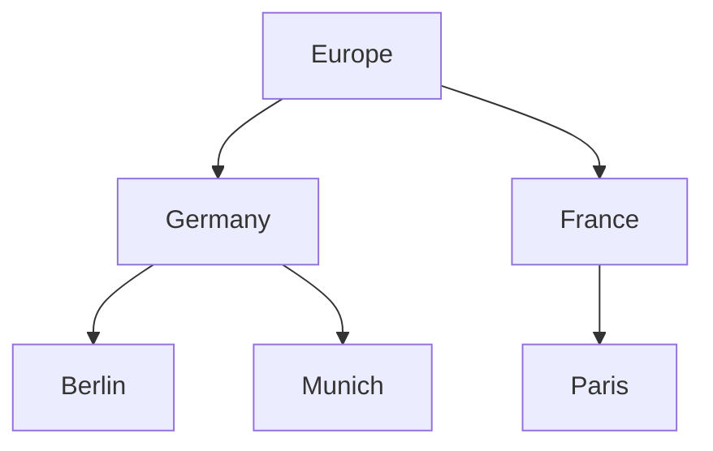
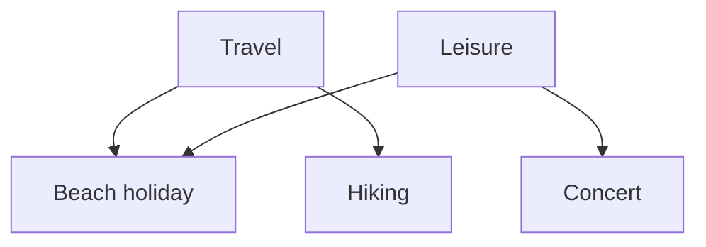

# Hierarchies and polyhierarchies

An objecttype can be configured so that its records stand in a parent relationship to one another, forming a hierarchy. fylr supports two forms.

## Two forms

A **hierarchical** objecttype gives each record at most one parent. Its records form a tree, each record sitting in one place: a location structure (Continent → Country → Region → City), an editorial structure (Imprint → Series → Title), a taxonomy where each term has one broader term.

A **polyhierarchical** objecttype gives each record any number of parents. The structure is still a hierarchy of parents and children, but a record can sit under several parents at once and so appears in more than one place in it: a subject "Beach holiday" under both "Travel" and "Leisure", an ingredient under both "Vegetable" and "Vitamin source", a subject heading under several broader headings.

An objecttype is hierarchical, polyhierarchical, or neither — never both.

**Hierarchy** — each record has exactly one parent, so the records form a tree:

**Polyhierarchy** — a record can have several parents, so it appears in more than one place — here _Beach holiday_ sits under both _Travel_ and _Leisure_:

## How parents are held

In a hierarchical objecttype, each record holds a single parent reference, pointing to one other record of the same objecttype, or to none if the record is at the root. Reading the record gives its parent.

In a polyhierarchical objecttype, each record holds a list of parents — zero, one or many. fylr maintains the list as parent references are added and removed.

The top level is itself a parent here. fylr provides a pseudo root node, and a record can be a child of that root and a child of other records at the same time — which is how a record appears at the top level and elsewhere simultaneously. Being at the top level is one of the parents a record holds, not the absence of a parent.

In both cases fylr also provides the reverse direction: given a record, it can list the records whose parent reference points to it. This reverse view drives tree-shaped pickers in the interface and traversal from the top of the structure downward.

## Polyhierarchy and per-record permissions

A polyhierarchical objecttype cannot also carry its own per-record permissions. The datamodel rejects an objecttype configured as both polyhierarchical and permission-bearing. Records of a polyhierarchical objecttype take their permissions from their pool.

So if records of an objecttype must carry their own permissions, that objecttype cannot be polyhierarchical.

## Choosing between them

The deciding question is whether a single record can belong to more than one parent in the real world.

- **Hierarchy** — when it cannot. Locations, departments, reporting structures, folder-shaped taxonomies where each term has one broader term.
- **Polyhierarchy** — when it can, and the record should be reachable from each of its parents. Subject headings, faceted classification, items that fall into several categories.

A third option is to use an ordinary link between records rather than a structural parent relationship. This gives up the tree-aware interface and the reverse view, and suits relationships closer to "see also" than "is a kind of".

## In the API

- In a hierarchical objecttype, the parent reference is the `_id_parent` field in the record's content.
- The reverse view — a record's children — appears as the record's `_reverse_nested:{objecttype}:_id_parent` list (see [Nested and reverse-nested tables](nested-and-reverse-nested.md)).

## See also

- [Records and objecttypes](records-and-objecttypes.md) — the objecttype these are configured on.
- [Nested and reverse-nested tables](nested-and-reverse-nested.md) — rows held inside a single record, a different kind of nesting.
- [Pools](pools.md) — pools also form a tree, with different mechanics.
- [Permissions](permissions.md) — why per-record permissions and polyhierarchy are mutually exclusive.
