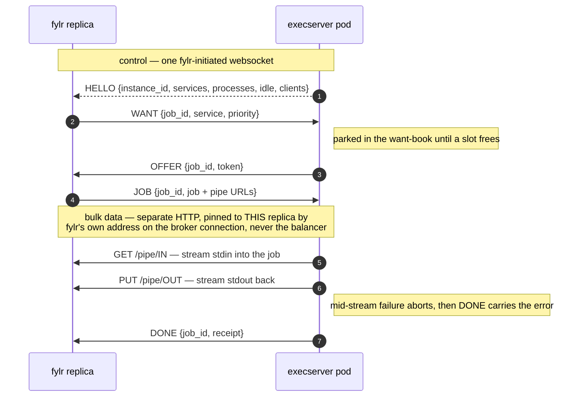

# Execserver slot broker

Replace both polling loops with a fylr-initiated websocket per execserver instance — and retire the token handshake, `tokenResponseSendServerIP`, and the "Token not found" incident class with it.

| Before | This design |
| --- | --- |
| One `SELECT` per second per file worker, even when idle. One `GET /token` per second per waiting job, against _every_ configured execserver, for up to `connectTimeoutSec`. Slot handshake breaks behind load balancers. | Zero execserver requests while idle. One message per state change. The execserver picks exactly one taker per free slot — by priority, across all connected fylr servers. No instance-affinity problems left to patch. |


Design document, July 2026, shipped in fylr 6.35 as the only execserver transport, together with the execserver's auto-balance and graceful drain. A few details below are marked where the implementation refined the original proposal.


## Problem

The execserver + client system ran on two polling loops:

* **DB polling.** Every file worker (`fylr.execserver.parallel` + `parallelHigh` goroutines) ran `SELECT … FOR UPDATE SKIP LOCKED LIMIT 1` on `file_queue` every second, even when the system was idle.
* **Execserver busy-polling.** A job that found all execservers busy re-polled `GET /token/{service}` on _every_ configured address once per second until `connectTimeoutSec` expired, then requeued +1 min.

On top of that, the 2-phase token handshake — `GET /token` reserves an in-memory, single-use token with a 10 s TTL; `PUT /job` redeems it — is **instance-local**: with several execserver replicas behind one address, the PUT can reach a different instance than the token issuer → `Token not found`. `tokenResponseSendServerIP` (re-addressing the PUT to the issuing pod's IP) and the `Connection: close` re-balance hack are patches on this weakness. Multi-replica execservers run in customer-managed Kubernetes clusters — the replacement must work with **zero cluster-side tuning**.

## The slot broker

The addressing stays as is: fylr.yml lists `execserver.addresses`; the execserver is never configured with fylr addresses. Because only fylr knows the peers, the channel is fylr-initiated — which makes presence trivial.


**Key inversion.** Connecting _is_ the registration; the connection dropping _is_ the goodbye. Crash-safe, no registration state, no TTL cleanup — and the traffic direction (outbound from fylr) matches the previous polling, so existing firewall and NAT topologies keep working.


Each fylr opens one persistent websocket per execserver instance (`GET /broker` on the execserver). The execserver keeps a **want-book** — in-memory, one list in arrival order per connection, volatile by design: a reconnecting fylr simply re-registers its parked wants.

When a slot frees, the execserver picks the taker in this order: highest `priority` class first, then **round-robin across connections** within that class, then FIFO within a connection. The implementation applies one filter before the order: only wants whose service fits the balancer's limits right now are candidates (see *Auto-balance*), so a heavy job at top priority never holds back the light wants behind it. Priority stays global — an interactive job beats background work regardless of origin — but within a class, slots are dealt like cards: a fylr with one parked want is served next even if a sibling parked a hundred wants ahead of it. Exactly one fylr is offered each slot — **no thundering herd, by construction**. An idle execserver grants an incoming `WANT` instantly: a parked want _is_ the standing "got work for me?" ask.


**New capability.** Cross-instance priority scheduling. Previously `file_queue` priority only ordered pickup within one fylr; at the execserver, a background resync and an interactive user request scrummed equally in the 1 s retry loop. With the want-book, an interactive job on fylr B beats a background job on fylr A for the next ffmpeg slot.


## Protocol

All control traffic is multiplexed over the one socket. A slot's life alternates directions:

`WANT` (fylr → exec) → `OFFER` (exec → fylr) → `JOB` (fylr → exec) → `DONE` (exec → fylr)

| Direction | Message | Meaning |
| --- | --- | --- |
| exec → fylr | `HELLO {instance_id, name, services, processes, idle, clients, draining, addr}` | Snapshot on connect, re-sent when its content changes (the connected-client count, the idle-slot count, the drain); also kills the per-job 404 service probing. `name` is the hostname, `addr` the address the execserver accepted this connection on. |
| fylr → exec | `REGISTER {backend_id, name, version, callback_url}` | Once per connection: who is on the other end and which callback base its jobs carry. The execserver checks that base and shows its clients by name; the connection itself stays the registration. |
| fylr → exec | `WANT {job_id, service, priority}` | A job is parked needing a slot. |
| exec → fylr | `QUEUED {job_id}` | The want found no free slot right now. Once every pod that serves the job has said so, fylr counts the address as under backpressure (see *Replicas behind one address*). |
| fylr → exec | `UNWANT {job_id}` | Got a slot elsewhere / gave up (requeue). |
| exec → fylr | `OFFER {job_id, token}` | A slot has been reserved for that job, held by a single-use token that expires after ten seconds unless a `JOB` redeems it. |
| fylr → exec | `JOB {job_id, service, subject, job}` | Acceptance: the job JSON (previously a URL query parameter on the PUT), carrying the token, rides the socket. |
| fylr → exec | `DECLINE {token}` | Surplus offer (another execserver was faster); slot freed in milliseconds. |
| fylr → exec | `CANCEL {job_id}` | The caller gave up on a running job (mirrors an aborted HTTP request). |
| exec → fylr | `DONE {job_id, receipt}` | Job receipt / error. |
| both | ping / pong | Liveness, half-open detection. |

The full life of one body-mode job — control frames over the shared websocket, bulk bytes over their own connections, each pinned back to the replica that placed the job:

## Job data and streams

The execserver cannot pull _the work itself_: a `file_queue` entry fans out into several exec calls for different services, and an exec call carries streams plus a response consumer inside a fylr worker goroutine. What it pulls is **a taker for a free slot**. The job JSON travels in the `JOB` message; all bulk bytes flow **execserver → fylr**.


**The asymmetry that makes it bullet-proof.** Execserver → fylr reachability is already mandatory for every deployment (the backend callbacks; inputs are fetched by URL). Fylr → _specific-execserver-instance_ reachability — what `tokenResponseSendServerIP` tried to manufacture — was never guaranteed. The design moves all affinity onto the guaranteed direction.


The body-mode call sites (stdin from the PUT body / stdout to the response body: IIIF tiles, on-demand rendition downloads, XSLT export, datamodel graph, metadata, plugin callbacks) switch to **one-time pipe endpoints** on the fylr backend: the execserver GETs stdin from an in-pipe and PUTs stdout to an out-pipe, each URL served exactly once, the random id being the credential — the same trust model as the other backend callback URLs.

That pipe lives **in memory on the replica that created the job**, so its callback URL is pinned to that replica — and so is `api_tx_url`, whose open write transaction lives there too. The implementation goes one step further than pinning the pipes: every callback of a replica is built from one base, its own address. fylr resolves it at startup — the backend listener's bind address when that names one, otherwise the address the kernel would send from towards a configured execserver — and corrects it from the broker socket's local address once a connection is up. A load-balanced backend address therefore can't route the GET/PUT to a sibling replica that has no such pipe, and no pod IP is configured. `callbackBackendInternalURL` and `callbackApiInternalURL` still set scheme and port, for a proxy in front of the listener, but no longer the host; `callbackBackendOwnURL` is taken verbatim, for NAT between fylr and the execserver. On connect the execserver fetches the announced base and checks that the replica answering is the one that registered, so a base that reaches a load balancer is reported at once.

A mid-stream failure becomes: the execserver aborts its stream request and sends `DONE` with the error. The receipt carries the decisive stderr line and a capped stdout prefix, so a structured error a command wrote (plugins report errors that way) survives to the caller; the execserver commits a stream only once the output outgrows a 4000-byte buffer, exactly like the HTTP transport's response buffering, so a command that fails with a small output never masquerades as an empty success.

## What gets deleted

Because reservation, job delivery and receipt all ride the instance-pinned socket, and streams flow in the guaranteed direction, no fylr → execserver request needs instance affinity any more:

* The token handshake over HTTP — `GET /token` and `PUT /job`. A slot is still held by a single-use token with a 10 s TTL, but it travels in the `OFFER` and comes back in the `JOB` over the same socket, so it always reaches the instance that issued it
* `tokenResponseSendServerIP` and `TokenResponse.ServiceURL`
* The `Connection: close` re-balance hack
* The 1 s busy-retry loop against every execserver address
* The "Token not found" incident class — structurally, instead of mitigated

## Replicas behind one address

Several execserver replicas commonly sit behind one load-balanced address — a Kubernetes `Service`, an external LB — and every fylr is handed that single address. One persistent broker websocket through the balancer reaches exactly one pod, so the other pods' want-books never see that fylr. The system has to spread one fylr's demand across the fleet while only ever addressing the one endpoint the operator published.


**Rejected: re-addressing the pods.** Two obvious fixes both breach the load balancer. `tokenResponseSendServerIP` (the legacy mechanism this design retires) had the chosen pod stamp its own IP into the token response so fylr could re-address the job straight to that pod. A DNS fan-out — resolving the address to every pod A-record and opening one socket per pod — needs the same per-pod reachability plus a headless service. Both defeat the reason an operator puts a balancer there: to expose one address and keep the pods private. The balancer must remain the only thing fylr addresses.


**Fleet enumeration.** Each configured address keeps a pool of connections that all dial that one address. At startup fylr opens connections in quick succession. Every pod announces its boot-generated `HELLO.instance_id`; a connection that reaches a pod already in the pool is closed again — so the execserver counts this fylr once and the claim share stays correct — and the enumeration ends once a run of consecutive attempts found nothing new. The run grows with the pods known, long enough that a pod still unfound is missed with odds of a tenth at most. A four-pod fleet is fully in view a second after startup, before any work arrives. fylr looks again at rest, doubling the interval while nothing changes (thirty seconds up to sixteen minutes) and dropping back to thirty seconds when a pod appears or a connection drops; under sustained backpressure it looks again within seconds — an autoscaler adding pods is exactly what a backlog causes — backing off the same way within one run of backpressure. A dropped connection simply reconnects through the balancer onto a live pod. The pool tracks the reachable fleet without ever learning a pod's address.

**Backpressure is fleet-wide.** A `WANT` that finds no free slot is answered `QUEUED` at once. Only when every pod that serves the job has answered so is the address under backpressure: one full pod while another may still offer is not pressure. fylr's own measure — a job still parked after a full second — never fires for a queue of short jobs, where each job gets a slot within seconds while someone is always waiting.


**Only the balancer.** No headless service, no per-pod DNS, no downward-API pod IPs, no Kubernetes API. fylr dials exactly the address the operator configured and lets the balancer hand it every pod. A directly addressed execserver is the fleet of one: its enumeration finds nothing but itself and backs off. Many fylr servers behind the balancer stay balanced for free — each keeps its own pool, one connection per pod.


## Heterogeneous fleets

The `HELLO` snapshot lists the services each execserver offers (`services`, a list of service names) and its pool size (`processes`). fylr parks a want only on a connection whose pod announced that service, so a mixed fleet — ffmpeg on specialised hardware behind the same balancer as general workers — routes correctly with no configuration: every want finds a pod that can run it. This also closes a latent gap in the old transport, which had no way to tell that an execserver did not offer a requested service and would fail the job against it; capability is now **declared**, not discovered by failure. The static per-service address filter of earlier versions (a `/job/<service>` path on a configured address) is refused at startup since 6.35.0.

## Multiple fylr servers, one instance

Horizontal fylr scaling — several fylr servers sharing one database and the same execserver pool — needs no fylr-to-fylr coordination, because each shared resource keeps exactly one arbiter:

* **Queue items → Postgres.** Claiming stays `FOR UPDATE SKIP LOCKED`: each `file_queue` item is claimed by exactly one fylr, which then registers the `WANT`s for it.
* **Slots → the want-book.** A fylr cannot grab slots at all — it can only express demand (`WANT`); assignment is always execserver-initiated, one `OFFER` per freed slot. Grants go priority-first, then round-robin across connections, so within a priority class every connected fylr gets an equal share of slots no matter how many wants each has parked. The execserver never needs to know which connections belong to the same instance — the connection is the unit of fairness.

Cross-fylr priority is emergent: a high-priority job claimed by fylr B outranks fylr A's earlier background wants at the execserver, something the token protocol could not express at all.

**Claim fairness.** Round-robin grants alone don't spread the _fylr-side_ work (feeding streams, processing responses, reindexing): if one fylr's dispatcher wakes first and claims the whole queue, its siblings idle even though slot allocation stays "fair" — all the parked wants are simply its own. So claiming is bounded to a share: `HELLO` carries the execserver's connected-client count, and each fylr's share becomes `ceil(capacity / clients)` summed over instances, plus a small pipelining headroom. Five fylrs on a 40-slot pool get a share of 10 each; when a fylr drops off, the count falls and the survivors' shares grow — self-healing, no configuration. The share plus the fylr's CPU count is the admission's base; the dispatcher adapts above it by what the fleet reports idle, see *Companion fix* below.

Claimed-but-parked items stay cheap (a goroutine, a book entry, a claimed row). A claim names the fylr that holds it, and its claims carry a **heartbeat**. A fylr that stops syncing is dropped from the backend registry after 20 seconds, and the surviving fylr servers requeue the claims it named within a minute of its death, once it has been missing for 10 seconds; claims without a name — made by a fylr before 6.35 — go stale after the heartbeat threshold and are requeued then. So no item is stranded — the startup sweep alone provably cannot catch this case, because the dead server's backend registration keeps its claims looking fresh. Several distinct instances (separate databases) sharing one execserver pool behave identically — fairness is per connection, and the want-book neither knows nor cares about database boundaries.

## Failure matrix

| Failure | Handled by |
| --- | --- |
| fylr crashes with parked wants | Its socket closes → execserver drops that connection's book entries and aborts the jobs it was running for it. |
| fylr crashes with claimed queue items | It leaves the backend registry → a surviving fylr requeues the claims that name it within a minute; unnamed claims when their heartbeat goes stale. |
| Execserver crashes | Parked jobs keep waiting on the other execservers; the reconnect re-registers current wants. A file job that was running there goes back into the queue when its input was not consumed yet. |
| `OFFER` never answered (conn drop) | The offer's token expires after 10 s → the slot goes to the next candidate. |
| Two `OFFER`s for one job race | First wins; the loser gets `DECLINE` immediately. |
| No slot within `connectTimeoutSec` | A file job goes back into the file queue with `start_after` +1 min and is tried again, as often as it takes — so a large batch of videos is worked through however long it waits for the slots; silent while waiting instead of polling. A request whose client waits for the job (a plugin callback, a custom download version) fails with an error. |
| No execserver reachable at all | Nothing waits out `connectTimeoutSec`: the file job is requeued, the request fails at once. fylr starts and serves without execservers and connects them as they come up. |
| Version mismatch (old execserver or old fylr) | No shared transport — the peer without the broker exchanges no jobs, and fylr counts an execserver whose broker messages it cannot decode as unreachable. There is no fallback; execserver and fylr are upgraded together (see *Migration*). |

Every failure collapses onto one primitive: connection lifetime.

## Companion fix: the file dispatcher

Slot events say nothing about queued work, so the DB side gets its own fix. With `parallel` / `parallelHigh` gone, the worker pool collapses into **one dispatcher goroutine per fylr server**: it claims queue items in priority order as long as admission allows and hands each item to its own goroutine. The original proposal split the admission — exec-bound work up to the claim share described above, local-bound work (`sync`, `checksum`, `copy_move`) on a semaphore derived from `NumCPU`. The implementation keeps one admission for every action, the claim share plus the CPU count, and drains the queue in priority order whatever the kind. The dispatcher never blocks on a slot itself, so the starvation scenario behind `parallelHigh` cannot occur; a part of the admission — a quarter of the CPU count, at least one — stays reserved for high-priority items, an internal concern, not configuration.

**Admission adapts to what the fleet absorbs.** The claim share assumes an item spends its life in an execserver slot. An item that spends most of it fetching its original from storage, writing versions and indexing holds its admission slot while the fleet idles — on a four-pod fleet with slow storage, one or two jobs ran per pod while a thousand images queued. So the room is measured where the slots are: the execserver's balancer keeps the least number of slots outside the fast reserve that stayed free of jobs through its last one-second window, and the broker puts that count into the `HELLO` as `idle`, re-broadcast when it changes. The dispatcher raises its admission by the fleet's idle count while the queue is deep and none of its own wants is parked — an idle pool slot may still not fit this fylr's service (memory, class caps, `maxSlots`), and then its wants queue — at most every three seconds, since the admitted items take a while to reach their exec phase. Parked wants beyond a few stragglers lower it by the excess at once. Both moves are made only while the in-flight set sits at the admission, so a lower is not counted twice while the set drains, and an empty queue decays the admission back to its base. `fylr.execserver.maxInFlight` caps it; 0 is automatic — four times the base, at least 32, at most twice `fylr.db.maxOpenConns`, since every item in flight may hold a database connection for a moment.

The original proposal added Postgres LISTEN/NOTIFY and a 15–30 s fallback poll; the implementation deliberately keeps a plain **1 s poll**, plus a wakeup the moment an item finishes so freed admission is refilled at once and the execservers see a steady stream rather than a burst per tick — one cheap indexed query per fylr per second or per completion replaces one query per worker per second, and the operational simplicity beats the last increment of idle silence. The dispatcher also maintains the claim heartbeats and requeues orphaned claims of crashed siblings.

## No more worker-pool configuration

`fylr.execserver.parallel` sized a static pool of file workers, each carrying one queue item synchronously — including _blocking_ inside the slot wait. The knob therefore conflated two unrelated bounds, and `parallelHigh` existed only because a fully-blocked pool starves interactive work. The broker dissolves both, so the worker counts are gone:

* **Exec-bound concurrency derives from the pool itself.** The `HELLO` snapshot carries each execserver's services, its pool size and its connected-client count, so fylr computes admission from actual capacity — it lives where the CPUs are. No execserver reachable → the share is zero and only the CPU count is claimed; an exec job then finds no execserver reachable and goes straight back into the queue instead of waiting out `connectTimeoutSec`.
* **Local-bound work sizes itself off the machine.** The CPU count in the admission's base covers it with no configuration.
* **Priority lanes are subsumed.** Parked wants don't occupy workers, so a high-priority job simply registers a higher-priority `WANT` and takes the next slot.

What remains in fylr.yml: `addresses`, the callback URLs, the timeouts, `maxInFlight` as the one ceiling on how many items a fylr holds in flight, and `parallel: 0`, which still switches file processing off on a node.

## Auto-balance

The execserver runs **one pool of slots** for every service (a slot is a unit of admission, not a core: a job holds one, however many threads it runs) and classifies each service _light_, _heavy_ or _unknown_ from its measured runtime: a service whose mean reaches `heavyThreshold` is heavy — and so is one with a job running longer than that, promoted mid-flight — and heavy jobs may never occupy the last `fastReserve` slots, so a burst of long conversions can never starve short interactive work (metadata, plugins, IIIF). Services without enough samples yet (three finished jobs) share at most `unknownShare` of the pool and stay out of the reserve like heavy ones until their first jobs classify them. A job is also admitted only while the learned memory footprints of the running jobs, its own included, fit the execserver's memory budget; a job on an otherwise idle execserver always runs. The learned per-service profile — an EMA of wall time and the memory footprint — is snapshotted to the execserver's `tempDir` (when one is configured) and restored on start as a head start: a restored service still counts as unknown until live jobs confirm it, a profile no live job has confirmed for a week expires, and a snapshot taken on different hardware (`GOOS`/`GOARCH` or a changed pool size) is discarded. A single service is held back with `maxSlots`, the most of its jobs that run at once.

## Graceful drain

On `SIGTERM` / `Ctrl-C` the execserver **drains**: it stops granting new slots, announces zero capacity and no services in its `HELLO`, answers `503` on `/readyz` (so a Kubernetes Service stops routing new connections to it, while `/healthz` stays `200`), and lets running jobs finish for up to `drainTimeoutSec` (default 20 s). A job still running at the deadline is interrupted and answered with a "stopped, retry later" receipt. fylr runs such a job again on another execserver at once when its input was not consumed yet and its slot wait has time left; otherwise a file job goes back into the queue, and a request waiting for the job is answered `503 ExecStopped`, so its client can retry. A rolling restart therefore does not fail file production, it only delays it.

## Migration

fylr 6.35 ships the broker as the **only** transport. The phased rollout the original proposal sketched — a broker with a polling fallback, then a later removal — was collapsed into one release:

* The `/broker` endpoint, want-book and job-over-websocket replace the token handshake, and every body-mode call site uses the pipe endpoints.
* The legacy `GET /token` / `PUT /job` path, `tokenResponseSendServerIP` / `TokenResponse.ServiceURL` and the `Connection: close` re-balance hack are **removed**, not deprecated. The worker counts `parallel` / `parallelHigh` are ignored and reported as deprecated; only `parallel: 0` keeps its meaning.
* There is no mixed-version fallback: an execserver and the fylr servers that use it must be **upgraded together**.

## Future extension: queue position

"3 video jobs running, 7 waiting — you are number 11." Unanswerable before: the line was a scrum of independent 1 s retry loops, so there was nothing to count. The want-book is the first time the line exists as a data structure, which turns position into a queryable fact:

* **Running + waiting live at the execserver.** A `QUERY {job_id}` → `POSITION {job_id, running, ahead, capacity}` message pair answers on demand: slots in use for the service, and — by replaying the grant rule (priority → round-robin → FIFO) over the current book — how many wants precede this one.
* **Unclaimed items live in the DB.** Claim-share bounding means some competitors may not be parked anywhere yet; fylr merges the DB count into the reported position.
* **ETA, optionally.** The execserver already keeps per-service job statistics; a rolling mean runtime turns position into "roughly N minutes". Always an estimate, never a promise — show the position as the hard number, the time as a hint.

***

_Design by Claude on behalf of Martin Rode, Programmfabrik, July 2026._
