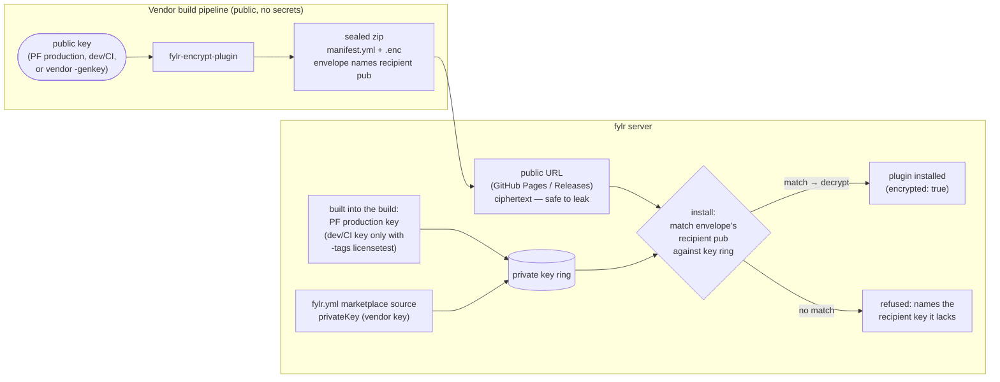

# Plugin marketplace and secure delivery

Deliver paid plugins to the customers entitled to them — discovered through a configurable marketplace, delivered as an encrypted (sealed) package, gated by the fylr license — instead of a hard-to-guess download link mailed per sale.

| Before | This design |
| --- | --- |
| A paid plugin is a plaintext ZIP behind a hard-to-guess link, emailed on each sale. The link is an unbound bearer secret: once it leaks it works forever, for anyone, and whoever holds it holds the source. | Plugins are discovered through a named source list in `fylr.yml`. A paid plugin is delivered as an authenticated, encrypted package published at a public URL; entitlement is carried by the signed license, so it installs from the marketplace with no secret to copy — and stays disabled until the license grants it. |


Implemented — tracked internally as ticket #80126, shipping together with license-gated plugins (#79211).


## The marketplace and its sources

`GET /plugin/marketplace` returns the catalog of installable plugins to an administrator holding `system.plugin` (or `system.root`). The interface uses it to present what can be installed.

The catalog is not a single baked-in file. It is a **named source list in `fylr.yml`** (`plugin.marketplace.sources`), editable by the system administrator. Each source has:

* a **name**, so the interface can attribute every offered plugin to where it came from;
* a **body**, which is either **inline** JSON listing plugins directly, or a **URL** that returns that same JSON.

`GET /plugin/marketplace` merges all configured sources into one offered list. Programmfabrik's curated catalog ships bundled with fylr as the default source; an organisation can add its own — a shared internal URL, or a few inline entries for plugins it develops itself. A source that fails to load is skipped with a warning, so one broken source never hides the rest.

Each catalog entry names the plugin (by its internal name, as shown in the plugin manager), its install URL, and three facts the marketplace machinery runs on:

* **`licensed`** — a paid plugin: installable by anyone, enabled only under a license that grants it;
* **`dependencies`** — internal names of plugins it requires;
* **`hidden`** — an entry that exists only as a dependency target (a library plugin): it resolves and installs, but is not browsed in the marketplace list.

## The catalog is the whitelist of paid plugins

Which plugins cost money is declared **in the catalog** (the `fylr licensed` column of the plugins sheet), not in every customer license — independent of where a release is hosted. The license then only ever carries **grants** (`plugins: {"name": {"enabled": true}}`) — never denials:

* a **`licensed`** catalog plugin can always be *installed*, but *enabling* it requires the license to grant it by name — unlisted means denied;
* a **free** plugin is unrestricted, unless a license explicitly mentions it without granting it.

This keeps old licenses working (their bought plugins were always granted by name), and introducing a new paid plugin is a catalog change — no license reissue, no enumeration of what a customer did *not* buy. `GET /plugin/marketplace` stamps every `licensed` entry with `license_enabled`, so the marketplace shows up front whether the instance's license grants it.

At install time the server matches the install URL against the catalog and records `licensed` on the plugin — sticky, so a paid plugin does not silently become free when a source is unreachable. The plugin manager shows both this and the delivery state (`encrypted`) per installed plugin.

## Encrypted (sealed) delivery

A sealed plugin is an **ordinary zip that keeps the plugin's folder convention**, with the manifest left plaintext and the whole plugin sealed beside it:

```
my-plugin_sealed.zip
└── my-plugin/
    ├── manifest.yml               # plaintext — readable identity, no key needed
    └── fylr-sealed-plugin.enc     # magic | version | recipient public key | sealed box(my-plugin.zip)
```

Sealing uses [`crypto_box_seal`](https://pkg.go.dev/golang.org/x/crypto/nacl/box) (X25519 + XSalsa20-Poly1305): **anonymous** — the release pipeline needs only the recipient's *public* key, so a public repository can seal without any secret — and **authenticated** — a tampered or substituted package fails to open instead of installing. An install URL may point at a **sealed or a plain zip**; fylr detects which it got and unpacks accordingly, recording the delivery as `encrypted` on the plugin.

The sealing tool and envelope format live in the public repository [`fylr-encrypt-plugin`](https://github.com/programmfabrik/fylr-encrypt-plugin); fylr imports the same `pluginseal` package to open packages, so sealer and server share one source of truth and cannot drift. [`fylr-plugin-example-licensed`](https://github.com/programmfabrik/fylr-plugin-example-licensed) demonstrates the whole pipeline: a public repo whose CI builds, seals and publishes the plugin to GitHub Pages — since the package is sealed, the URL is safe to publish, which retires the old "on request" secret-URL model.

## Where the keys live

The envelope **names its recipient public key** (like an age recipient stanza or a PGP key id). At install, fylr derives the public half of every private key it holds — the key ring — and picks the matching one deterministically; no key registry, no trial decryption, and a precise error naming the recipient when no key matches.

Three keypairs exist, and only public halves ever appear in pipelines:

| Keypair | Public half (seals) | Private half (opens) |
| --- | --- | --- |
| **Programmfabrik production** | passed to `fylr-encrypt-plugin -pubkey` in Programmfabrik release pipelines | baked into fylr **release** builds |
| **dev / CI** | the `fylr-encrypt-plugin` default — public example plugins seal with it | only in fylr builds with `-tags licensetest`; a release build rejects dev-sealed plugins, like a test-signed license |
| **marketplace source (vendor)** | generated by the vendor (`fylr-encrypt-plugin -genkey`), used in *their* pipeline | handed to the customer, configured as `privateKey` on the vendor's marketplace source in `fylr.yml` |




**What the encryption does, and does not, do.** It protects a plugin in _distribution and storage_: a download location on its own no longer yields the source. It does not — and by nature cannot — prevent a licensed operator from reading code their own server runs. A browser plugin's JavaScript is delivered to the browser to execute; a server plugin is decrypted to run. That boundary is governed by run-time entitlement and the license agreement; encryption governs distribution.


Licensed and encrypted are deliberately **two separate facts**: the catalog flag gates enabling, the sealed envelope protects distribution. In practice every paid plugin is delivered sealed, but the model does not require it.

## Dependencies

A plugin can require other plugins — by **name only**, no version constraints. Dependencies are declared in two places that meet in one union: the plugin manifest (`plugin.dependencies`, superseding the webfrontend-only list, which stays honoured) and the marketplace catalog entry.

The **marketplace resolves**: installing a plugin with missing dependencies offers to install them too, dependency-first, using the catalog — including `hidden` library entries. The **server enforces** the full lifecycle:

| Action | Rule | Error |
| --- | --- | --- |
| Install | all dependencies installed | `PluginDependencyNotInstalled` |
| Enable | all dependencies installed **and enabled** | `PluginDependencyNotEnabled` |
| Disable | no *enabled* plugin depends on it | `PluginRequiredByOthers` |
| Delete | no *enabled* plugin depends on it (a disabled dependent is inert; re-enabling it is refused until the dependency is back) | `PluginRequiredByOthers` |

***

_Design by Claude on behalf of Martin Rode, Programmfabrik. Tracked internally as ticket #80126._
