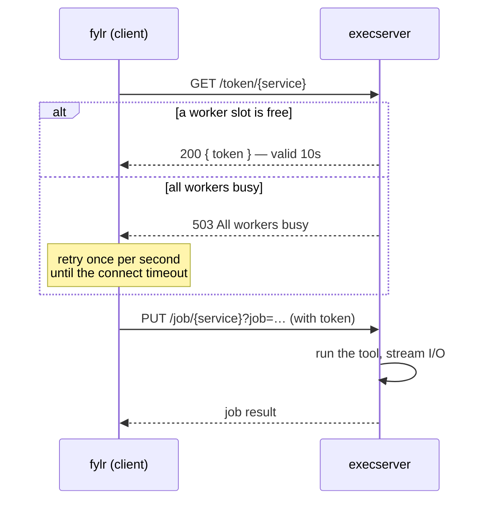

# Execserver

## Job protocol

A client runs a job on the execserver in two steps:

1. `GET /token/{service}` reserves a worker slot in the service's waitgroup. The response contains a one-time token, valid for 10 seconds. If all workers are busy, the execserver answers `503 All workers busy` and the client retries once per second until its connect timeout is reached.
2. `PUT /job/{service}?job={...}` presents the token and runs the job. The token is held in memory by the instance that issued it, so this request must reach the same instance.

If `tokenResponseSendServerIP` is configured on the execserver, the token response also contains a `service` URL with the instance's own address. A client must then send the job request to that address. This is what makes running multiple load-balanced instances possible — see [Scaling the execserver](../for-system-administrators/installation/scaling-the-execserver.md).

## File Queue

### Action: "metadata"

Runs `fylr_metadata`

