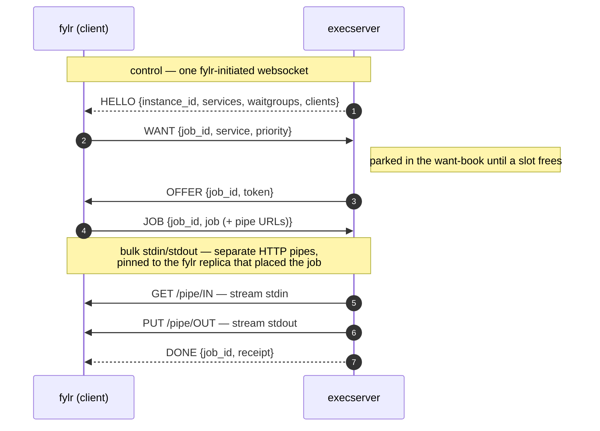

# Execserver

## Job protocol

fylr drives each execserver over a single **fylr-initiated websocket** — the *slot broker* — instead of the former `GET /token` + `PUT /job` polling handshake. Each fylr server opens one connection per configured execserver instance (`GET /broker`). The execserver keeps an in-memory **want-book** of the slots fylr is waiting for and pushes a job onto a free slot the moment one opens, so an idle system makes no execserver requests at all.

A slot's life alternates direction over that one socket:

`WANT` (fylr → exec) → `OFFER` (exec → fylr) → `JOB` (fylr → exec) → `DONE` (exec → fylr)

| Direction | Message | Meaning |
| --- | --- | --- |
| exec → fylr | `HELLO {instance_id, services, waitgroups, clients}` | Capability snapshot on connect, re-sent when it changes. fylr parks a `WANT` only on a connection whose execserver announced that service. |
| fylr → exec | `WANT {job_id, service, priority}` | A worker is parked, needing a slot. |
| fylr → exec | `UNWANT {job_id}` | Got a slot elsewhere / gave up (requeue). |
| exec → fylr | `OFFER {job_id, token}` | A slot has been reserved for that job. |
| fylr → exec | `JOB {job_id, job}` | Acceptance — the job JSON rides the socket. |
| fylr → exec | `DECLINE {job_id}` | A surplus offer (another execserver was faster); the slot is freed at once. |
| exec → fylr | `DONE {job_id, receipt}` | Job receipt or error. |
| both | ping / pong | Liveness / half-open detection. |

Bulk stdin/stdout for body-mode jobs (IIIF tiles, on-demand rendition downloads, XSLT export, datamodel graph, metadata, plugin callbacks) flow over one-time HTTP **pipe** endpoints on the fylr backend, each served exactly once. The pipe lives in memory on the fylr replica that created the job, so its callback URL is pinned to that replica — fylr fills in its own address as seen on the broker connection, so a load-balanced backend address still reaches the right replica, with no pod addressing configured.


The broker is the **only** transport as of fylr 6.35. The legacy `GET /token` / `PUT /job` endpoints, the polling fallback and `tokenResponseSendServerIP` are removed. An execserver without a broker connection to fylr receives no work, so **execserver and fylr must be upgraded together** — there is no mixed-version fallback.


For the full design — demand-driven connection pooling behind a load balancer, cross-instance priority scheduling and claim fairness across fylr servers — see the [Execserver slot broker white paper](concepts/white-papers/execserver-slot-broker.md).

## Concurrency

By default the execserver **auto-balances** concurrency: all services share one CPU pool sized to the host, and each service is classified light or heavy by its measured runtime, so long conversions never occupy the last `fastReserve` slots and short interactive jobs (metadata, plugins, IIIF) stay responsive. Configuring an explicit `waitgroups` block restores manually sized pools. See [performance tuning](../for-system-administrators/configuration/performance-tuning.md).

## File Queue

### Action: "metadata"

Runs `fylr_metadata`
