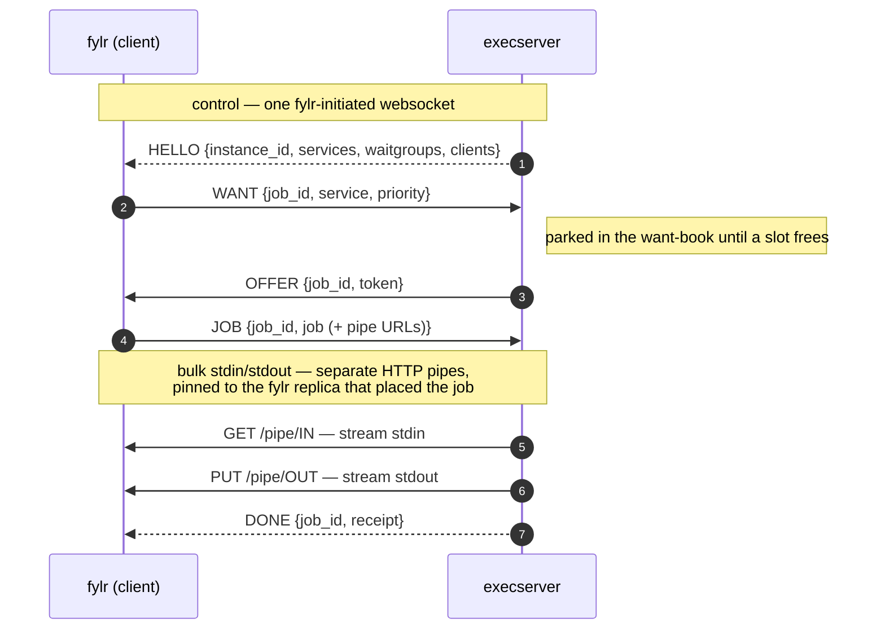

# Execserver

## Job protocol

fylr drives each execserver over a single **fylr-initiated websocket** — the *slot broker* — instead of the former `GET /token` + `PUT /job` polling handshake. Each fylr server opens one connection per configured execserver instance (`GET /broker`). The execserver keeps an in-memory **want-book** of the slots fylr is waiting for and pushes a job onto a free slot the moment one opens, so an idle system makes no execserver requests at all.

A slot's life alternates direction over that one socket:

`WANT` (fylr → exec) → `OFFER` (exec → fylr) → `JOB` (fylr → exec) → `DONE` (exec → fylr)

| Direction | Message | Meaning |
| --- | --- | --- |
| exec → fylr | `HELLO {instance_id, services, waitgroups, clients}` | Capability snapshot on connect, re-sent when it changes. fylr parks a `WANT` only on a connection whose execserver announced that service. |
| fylr → exec | `WANT {job_id, service, priority}` | A worker is parked, needing a slot. |
| fylr → exec | `UNWANT {job_id}` | Got a slot elsewhere / gave up (requeue). |
| exec → fylr | `OFFER {job_id, token}` | A slot has been reserved for that job. |
| fylr → exec | `JOB {job_id, job}` | Acceptance — the job JSON rides the socket. |
| fylr → exec | `DECLINE {job_id}` | A surplus offer (another execserver was faster); the slot is freed at once. |
| exec → fylr | `DONE {job_id, receipt}` | Job receipt or error. |
| both | ping / pong | Liveness / half-open detection. |

```mermaid
sequenceDiagram
    autonumber
    participant F as fylr (client)
    participant X as execserver
    Note over F,X: control — one fylr-initiated websocket
    X-->>F: HELLO {instance_id, services, waitgroups, clients}
    F->>X: WANT {job_id, service, priority}
    Note right of X: parked in the want-book until a slot frees
    X->>F: OFFER {job_id, token}
    F->>X: JOB {job_id, job (+ pipe URLs)}
    Note over F,X: bulk stdin/stdout — separate HTTP pipes,<br/>pinned to the fylr replica that placed the job
    X->>F: GET /pipe/IN — stream stdin
    X->>F: PUT /pipe/OUT — stream stdout
    X-->>F: DONE {job_id, receipt}
```

Bulk stdin/stdout for body-mode jobs (IIIF tiles, on-demand rendition downloads, XSLT export, datamodel graph, metadata, plugin callbacks) flow over one-time HTTP **pipe** endpoints on the fylr backend, each served exactly once. The pipe lives in memory on the fylr replica that created the job, so its callback URL must reach that replica — and so must `api_tx_url`, whose open write transaction lives there too.

fylr resolves one callback base for itself at startup, from the address the kernel would send from towards a configured execserver, and corrects it from the live broker socket. Every callback is built from that base, so no pod addressing is configured anywhere. `callbackBackendInternalURL` and `callbackApiInternalURL` still override scheme and port — for a proxy in front of the listener — but not the host: a Kubernetes Service name in either has no effect. `callbackBackendOwnURL` is the verbatim escape hatch for NAT between fylr and the execserver.


The broker is the **only** transport as of fylr 6.35. The legacy `GET /token` / `PUT /job` endpoints, the polling fallback and `tokenResponseSendServerIP` are removed. An execserver without a broker connection to fylr receives no work, so **execserver and fylr must be upgraded together** — there is no mixed-version fallback. See [Updating the execserver to 6.35](../for-system-administrators/installation/updating-the-execserver-to-6.35.md) for what an administrator has to change.


For the full design — demand-driven connection pooling behind a load balancer, cross-instance priority scheduling and claim fairness across fylr servers — see the [Execserver slot broker white paper](concepts/white-papers/execserver-slot-broker.md).

## Fleet topology

From version 6.35.0, `/inspect/system/topology` shows the whole installation on one page: every fylr server, every execserver, the load balancer when there is one, and the work moving between them — running jobs, jobs queued behind a full waitgroup, what finished and what failed, with throughput and bytes moved. It streams over a websocket; the same data is served as JSON at `/inspect/system/topology/data`.

Each fylr registers itself on every broker connection — backend id, name, version and the callback base it announces. The execserver fetches that base and checks that the server answering is the one that registered, so a callback address pointing at a load balancer in front of several replicas is reported on the page at connect time, instead of failing later inside a job.

An address that fronts a fleet is recognised from the connection itself: fylr's socket knows what it dialled and the execserver stamps its greeting with the address it accepted on. A Kubernetes Service is therefore shown as a Service even when a single pod is behind it.

## Concurrency

Every service draws from **one pool of slots**. A slot is a unit of admission, not a core: a job holds one while it runs, and a command that leased a temporary CPU allocation for a subprocess (see below) holds more. `slots: 0`, the default, sizes the pool to `GOMAXPROCS` — the core count on a bare host, the CPU limit inside a container, or the `GOMAXPROCS` environment variable. On a small container the pool may be set *above* the CPU limit so that short jobs overlap their downloads and uploads instead of waiting on each other.

The balancer classifies each service light or heavy by its measured runtime, and heavy jobs never take the last `fastReserve` slots, so short interactive work (metadata, plugins, IIIF) always finds one however busy the conversions are. `fastReserve: -1`, the default, is a quarter of the pool; `0` is no reserve, the right value for a fleet behind a load balancer, where the fleet is the headroom. A service that has not been measured yet is capped at `unknownShare` of the pool until its first jobs classify it.

One key isolates a single service: **`maxSlots`** on a service under `fylr.services.execserver.services` is the most slots that service holds at once, jobs and temporary CPU allocations together — the replacement for both the dedicated waitgroups of earlier versions and any global cap on a command's request. A dedicated execserver simply lists the services it offers; which execserver runs a service is what it announces on connect, and a `/job/<service>` path on an address — the routing filter of earlier versions — is refused at startup. The `waitgroups` block, the per-service `waitgroup` keys, per-service `commands` and `workDir` are reported by the config check as deprecated and ignored. See [performance tuning](../for-system-administrators/configuration/performance-tuning.md) for the settings and [Updating the execserver to 6.35](../for-system-administrators/installation/updating-the-execserver-to-6.35.md) for the migration.

## Execution limits

From **6.35.0** every command an execserver runs is supervised in three ways.

**Memory.** Jobs run within a budget derived from the host's RAM or the lower Linux container limit. The execserver learns each service's footprint and uses it when admitting jobs; a command that exceeds its own ceiling or the shared budget is aborted. Sampling runs once per second, so an operating-system memory limit remains the strict bound between checks. The budgets, footprints and sampled peaks are shown on `/inspect/system/execserver/`.

**Progress.** A command that makes no progress for ten minutes is stopped. CPU activity, transferred bytes, output and growing work files all count as progress. `fylr.services.execserver.stallTimeoutSec` changes the default, a recipe's `stallTimeout` duration overrides it per recipe, and `"0"` disables stall supervision. A recipe's `timeout` stays a wall-clock ceiling — `"0"` means unlimited — and the shipped long video encodes carry a 12-hour ceiling. Job receipts distinguish a timeout, a stall and a memory abort.

**CPU.** A command may ask for more CPUs from the shared pool while it runs a parallel subprocess: the execserver passes a loopback callback in `FYLR_EXEC_CONTROL_URL`, a `PUT` with a minimum and an optional maximum answers with the actual grant, `GET` reads it, and the extras return on request, when the command ends or when it is cancelled. `fylr convert` does this around FFmpeg — up to `FYLR_CONVERT_VIDEO_MP4_THREADS` CPUs for a video encode (unset: whatever the pool can spare), two for a single frame, one for AAC and MP3 — and honours a `-threads` cap in the operator's ffmpeg command arguments. Extras never take the `fastReserve` slots, and a lease is bounded by its service's `maxSlots`, the balancer booking the extras per service. The lease a program takes keeps its name, `cpus`, because that is what the program gets. Held extras show as `extra_cpus` in the broker status, on the topology page and in the `fylr_execserver_extra_cpus` gauge.

Every command carries `FYLR_EXEC_SUPERVISED=1`, and the helper programs `fylr convert` and `fylr metadata` start stay in the command's process group, so the memory and stall watchdogs see them and the kill at the end of a command reaps them — a converter step therefore counts toward the per-job memory ceiling. Active job directories are protected from the janitor's temp cleanup while the job runs.

## File Queue

### Action: "metadata"

Runs `fylr_metadata`
