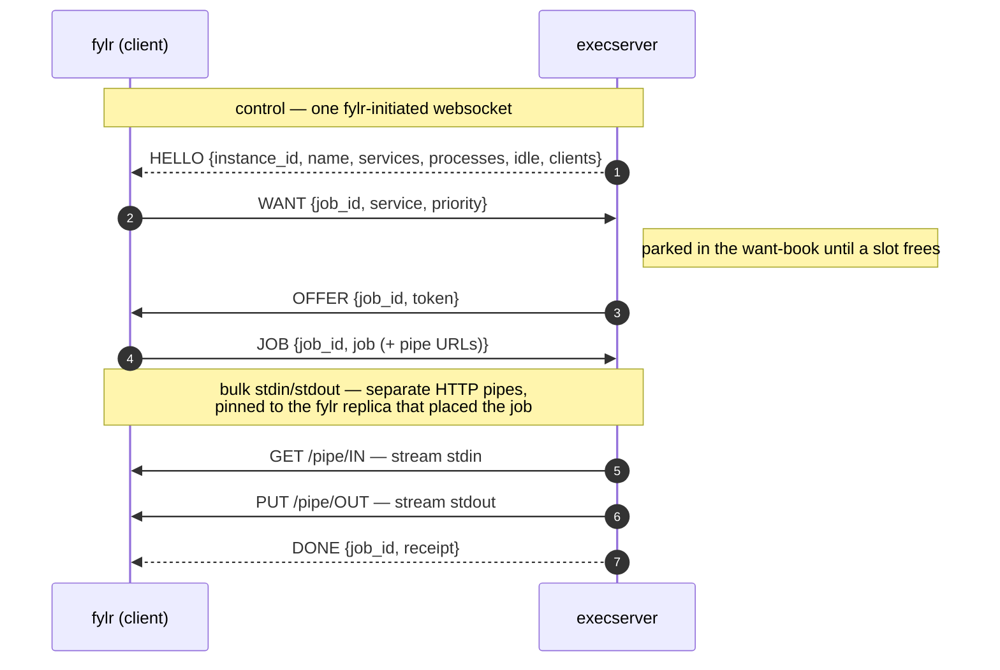

# Execserver

## Job protocol

fylr drives each execserver over a single **fylr-initiated websocket** — the *slot broker* — instead of the former `GET /token` + `PUT /job` polling handshake. Each fylr server opens one connection per configured execserver instance (`GET /broker`). The execserver keeps an in-memory **want-book** of the jobs waiting for a slot and offers a free slot to the next of them the moment one opens — highest priority first, then round-robin across the connected fylr servers — so an idle system makes no execserver requests at all.

A slot's life alternates direction over that one socket:

`WANT` (fylr → exec) → `OFFER` (exec → fylr) → `JOB` (fylr → exec) → `DONE` (exec → fylr)

| Direction | Message | Meaning |
| --- | --- | --- |
| exec → fylr | `HELLO {instance_id, name, services, processes, idle, clients, draining, addr}` | Capability snapshot on connect, re-sent when it changes; `name` is the hostname the inspect pages show, `instance_id` is fresh per process, `processes` is the pool size, `idle` the slots outside the fast reserve that stayed free through the last second, `addr` the address the execserver accepted this connection on. A draining execserver announces no services and no slots. fylr parks a `WANT` only on a connection whose execserver announced that service. |
| fylr → exec | `REGISTER {backend_id, name, version, callback_url}` | Once per connection: who the fylr server is and the callback base its jobs carry, which the execserver checks. |
| fylr → exec | `WANT {job_id, service, priority}` | A job waits for a slot. |
| exec → fylr | `QUEUED {job_id}` | The want found no free slot right now; the offer follows when one frees. |
| fylr → exec | `UNWANT {job_id}` | Got a slot elsewhere / gave up. |
| exec → fylr | `OFFER {job_id, token}` | A slot has been reserved for that job; the single-use token expires after ten seconds if no job redeems it. |
| fylr → exec | `JOB {job_id, service, subject, job}` | Acceptance — the job JSON, carrying the token, rides the socket. |
| fylr → exec | `DECLINE {token}` | A surplus offer (another execserver was faster); the slot is freed at once. |
| fylr → exec | `CANCEL {job_id}` | The caller gave up on a running job; the execserver aborts it. |
| exec → fylr | `DONE {job_id, receipt}` | Job receipt or error. |
| both | ping / pong | Liveness / half-open detection. |

```mermaid
sequenceDiagram
    autonumber
    participant F as fylr (client)
    participant X as execserver
    Note over F,X: control — one fylr-initiated websocket
    X-->>F: HELLO {instance_id, name, services, processes, idle, clients}
    F->>X: WANT {job_id, service, priority}
    Note right of X: parked in the want-book until a slot frees
    X->>F: OFFER {job_id, token}
    F->>X: JOB {job_id, job (+ pipe URLs)}
    Note over F,X: bulk stdin/stdout — separate HTTP pipes,<br/>pinned to the fylr replica that placed the job
    X->>F: GET /pipe/IN — stream stdin
    X->>F: PUT /pipe/OUT — stream stdout
    X-->>F: DONE {job_id, receipt}
```

Every exec job — file production and metadata, plugin callbacks, custom download versions, IIIF tiles, XSLT exports — waits for a slot at most `fylr.execserver.connectTimeoutSec` (120 as shipped, 60 when the key is unset or 0). Nothing is connected in that time; the name is historical. A file job that gets no slot goes back into the file queue and is tried again a minute later, as often as it takes; a request whose client waits for the job (a plugin callback, a custom download version) fails with an error instead. When no configured execserver is reachable at all, a job does not wait this out: the file job is requeued, the request fails at once. How long a plugin callback may run once it has its slot is a separate limit, `fylr.execserver.pluginJobTimeoutSec`, unless the callback sets its own timeout.

Bulk stdin/stdout for body-mode jobs (IIIF tiles, on-demand rendition downloads, XSLT export, datamodel graph, metadata, plugin callbacks) flow over one-time HTTP **pipe** endpoints on the fylr backend, each served exactly once. The pipe lives in memory on the fylr replica that created the job, so its callback URL must reach that replica — and so must `api_tx_url`, whose open write transaction lives there too.

fylr resolves one callback base for itself at startup — the backend listener's bind address when that names one, otherwise the address the kernel would send from towards a configured execserver — and corrects it from the live broker socket. With several execservers that reach fylr on different addresses, a reachable address wins over loopback: it serves an execserver next to fylr as well, while `localhost` would fail every callback of one on another machine. Every callback is built from that base, so no pod addressing is configured anywhere. `callbackBackendInternalURL` and `callbackApiInternalURL` still override scheme and port — for a proxy in front of the listener — but not the host: a Kubernetes Service name in either has no effect. `callbackBackendOwnURL` is the verbatim escape hatch for NAT between fylr and the execserver.


The broker is the **only** transport as of fylr 6.35. The legacy `GET /token` / `PUT /job` endpoints, the polling fallback and `tokenResponseSendServerIP` are removed. An execserver without a broker connection to fylr receives no work, so **execserver and fylr must be upgraded together** — there is no mixed-version fallback. See [Updating the execserver to 6.35](../for-system-administrators/installation/updating-the-execserver-to-6.35.md) for what an administrator has to change.


For the full design — fleet enumeration behind a load balancer, the admission that adapts to what the fleet absorbs, cross-instance priority scheduling and claim fairness across fylr servers — see the [Execserver slot broker white paper](concepts/white-papers/execserver-slot-broker.md).

## Fleet topology

From version 6.35.0, `/inspect/system/topology` shows the whole installation on one page: every fylr server, every execserver, the load balancer when there is one, and the work moving between them — running jobs, jobs waiting for a slot, what finished and what failed, with throughput and bytes moved. It streams over a websocket; the same data is served as JSON at `/inspect/system/topology/data`.

Each fylr registers itself on every broker connection — backend id, name, version and the callback base it announces. The execserver fetches that base and checks that the server answering is the one that registered, so a callback address pointing at a load balancer in front of several replicas is reported on the page at connect time, instead of failing later inside a job.

An address that fronts a fleet is recognised from the connection itself: fylr's socket knows what it dialled and the execserver stamps its greeting with the address it accepted on. A Kubernetes Service is therefore shown as a Service even when a single pod is behind it.

## Concurrency

Every service draws from **one pool of slots**. A slot is a unit of admission, not a core: a job holds one while it runs, however many threads its command uses. `slots: 0`, the default, sizes the pool to `GOMAXPROCS` — the core count on a bare host, the CPU limit inside a container, or the `GOMAXPROCS` environment variable. On a small container the pool may be set *above* the CPU limit so that short jobs overlap their downloads and uploads instead of waiting on each other.

The balancer classifies each service light or heavy by its measured runtime, and heavy jobs never take the last `fastReserve` slots, so short interactive work (metadata, plugins, IIIF) always finds one however busy the conversions are. `fastReserve: -1`, the default, is a quarter of the pool, at least one slot; `0` is no reserve, the right value for a fleet behind a load balancer, where the fleet is the headroom. Services that have not been measured yet share at most `unknownShare` of the pool until their first jobs classify them. The execserver offers a slot only to a job whose service fits these limits right now, so a heavy job at top priority does not hold back the light jobs behind it.

One key isolates a single service: **`maxSlots`** on a service under `fylr.services.execserver.services` is the most jobs of that service that run at once — the replacement for the dedicated waitgroups of earlier versions. A second, **`threads`**, is the thread count of the service's jobs (see CPU below). A dedicated execserver simply lists the services it offers; which execserver runs a service is what it announces on connect, and a `/job/<service>` path on an address — the routing filter of earlier versions — is refused at startup. The `waitgroups` block, the per-service `waitgroup` keys, per-service `commands` and `workDir` are reported by the config check as deprecated and ignored. See [performance tuning](../for-system-administrators/configuration/performance-tuning.md) for the settings and [Updating the execserver to 6.35](../for-system-administrators/installation/updating-the-execserver-to-6.35.md) for the migration.

## Execution limits

From **6.35.0** every command an execserver runs is supervised for time, progress, memory and CPU.

**Time.** A recipe exec's `timeout` is a duration string such as `"30m"` or `"12h"`: the wall-clock ceiling of that execution, which progress does not extend; `"0"` removes it. The legacy `timeout_sec` still works, an explicit `timeout` takes precedence, and an invalid duration is rejected. On-demand downloads, XSLT exports and IIIF tiles keep an explicit recipe timeout and fall back to their own ceilings only when the recipe sets none. The shipped long video encodes carry a 12-hour ceiling.

**Progress.** A command that makes no progress for ten minutes is stopped. It makes progress when it transfers bytes, writes to stdout or stderr, grows files in its work directory, or keeps its process group busy with at least 5% of one CPU core; a wrapper that only waits for a hung helper stays below that. `fylr.services.execserver.stallTimeoutSec` changes the default (see the [example configuration](../for-system-administrators/configuration/fylr.example.yml.md)), a recipe's `stallTimeout` (for example `"20m"`) overrides it for that exec, and `"0"` disables stall supervision for it.

**Memory.** Jobs run within a budget derived from the host's RAM or the lower Linux container limit. The execserver learns each service's footprint and uses it when admitting jobs; a command whose process group exceeds its own ceiling or the shared budget is aborted. Sampling runs once per second, so an operating-system memory limit remains the strict bound between checks; the calculation is described in the [example configuration](../for-system-administrators/configuration/fylr.example.yml.md). Budgets, footprints and sampled peaks are shown on `/inspect/system/execserver/`.

**CPU.** Every command gets `FYLR_CONVERT_THREADS`, the `threads` of its service resolved to a number on the executing server: `0` is every CPU (`GOMAXPROCS`), `N` is N, `-N` every CPU but N, `N%` that share of the CPUs and `-N%` every CPU but that share, at least one. The count is fixed: it does not depend on what else runs, the job holds one slot whatever it is, and the operating system shares the CPUs between all running commands. It is the environment of `fylr convert --threads`, so far used for the MP4 encode's decoder, encoder and filter threads; the flag on the command line wins. A `FYLR_CONVERT_THREADS` in the configured `env` is replaced, and fylr warns about it. Its other FFmpeg runs keep fixed counts: one thread for AAC and MP3, two for a single frame. The shipped `ffmpeg` service runs two encodes at a time (`maxSlots: 2`), each on every CPU (`threads: 0`). With `-v`, as in the shipped video recipes, `fylr convert` writes `FFmpeg threads: N` to its stderr, which the receipt of the version's `FILE_PRODUCE` event keeps. No command calls the execserver back. `FYLR_CONVERT_VIDEO_MP4_THREADS` and `--video-mp4-threads` are gone, and fylr warns where the variable is still set.

Every command carries `FYLR_EXEC_SUPERVISED=1`, and the helper programs `fylr convert` and `fylr metadata` start stay in the command's process group, so the memory and stall watchdogs see them and the kill at the end of a command reaps them — a converter step therefore counts toward the per-job memory ceiling. Active job directories are protected from the janitor's temp cleanup while the job runs.

Job receipts distinguish a wall-clock timeout (`TimedOut`), a stall (`Stalled`), a memory abort (`OutOfMemory`) and an operational interruption (`Stopped`); `PeakMemory` is the highest sampled resident memory of the process group in bytes. Cancelling an execution also cancels its transfers.

## File Queue

### Action: "metadata"

Runs `fylr_metadata`
