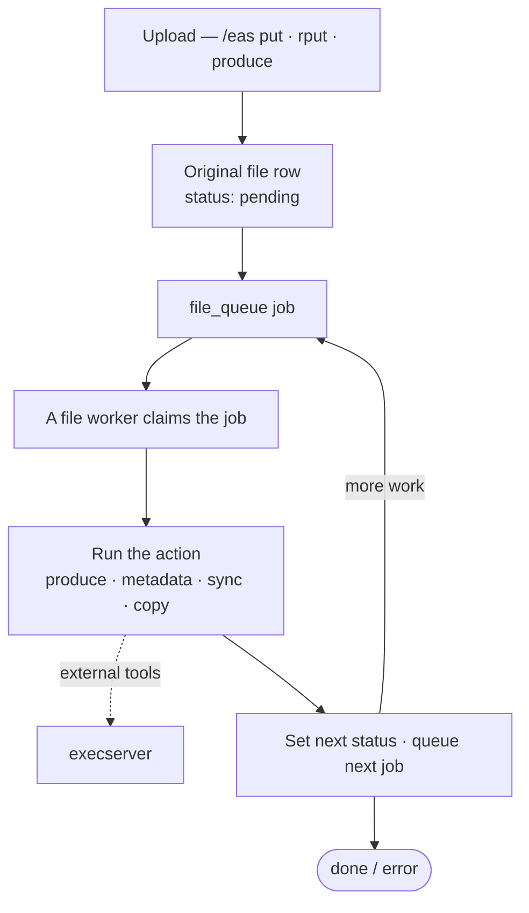
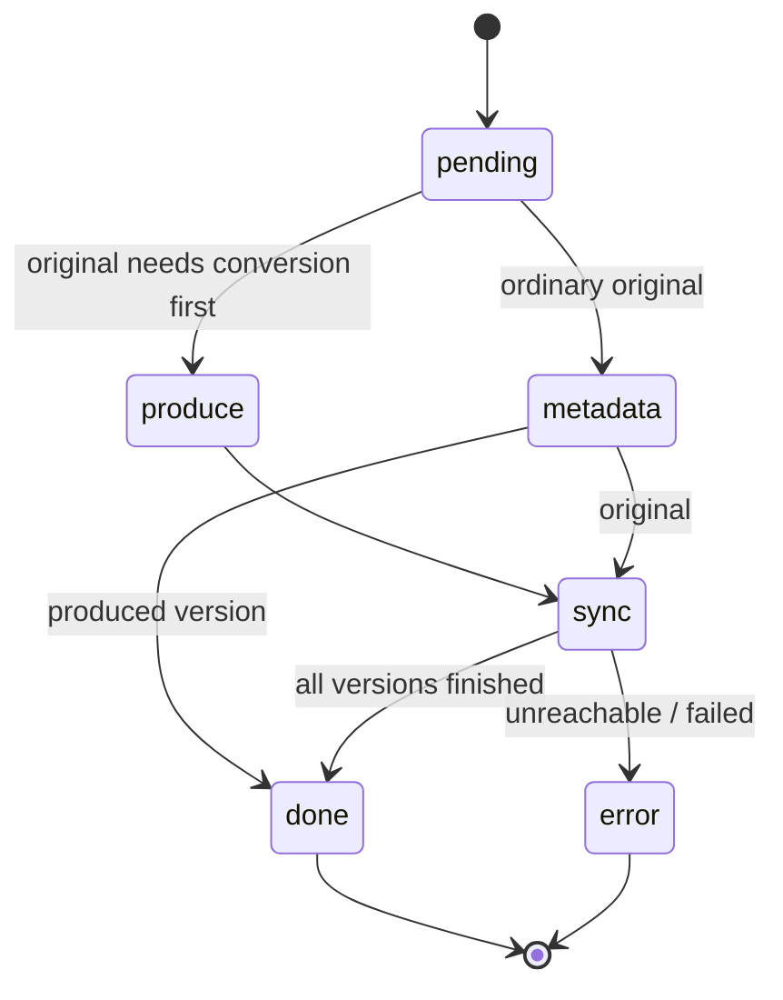

# File Worker

When a file is uploaded, fylr does not process it inside the request. The request only stores the bytes and records the work to be done; a pool of background **file workers** then picks the work up and runs it — producing renditions, extracting metadata, copying remote files into storage — until every part of the file is finished.

This page follows one file through that pipeline end to end. It is the technical companion to the vocabulary-level [Files and assets](concepts/files-and-assets.md) concept and the operational [Files and version production](../for-system-administrators/inspect/files.md) page (the `/inspect/files` UI). The building blocks it references have their own pages: the [Exec server](execserver.md) protocol and the [File versions](fileversions/) row model.

## The pipeline at a glance



Everything the worker needs is on the `File` row and in the `file_queue` table; there is no in-memory job state. That is what lets the workers restart, run in parallel, and scale across instances.

## 1. Upload — entering the pipeline

A file enters through the `/eas` endpoints:

* [`/eas/put`](api/endpoints/eas/put.md) — a direct binary upload. fylr streams the body into storage (hashing it as it goes) and **copies** the file into its own store.
* [`/eas/rput`](api/endpoints/eas/rput.md) — register a file at a **remote URL**. The URL is checked against the SSRF blocklist (`fylr.eas.rput.blockedHosts`) before any fetch. The file is either copied in or, with `leave_on_remote`, kept as a reference only.
* [`/eas/produce`](api/endpoints/eas/produce.md) — derive a **modified original** (a rotated or cropped copy) from an existing original.

Each creates a `File` row — an **original** (`is_original = true`) or a named **version** — with status `pending`, allocates a storage key, and then queues the first job. Which job depends on the file:

* an original that must first be converted before it can even be an original (for example a TIFF that fylr delivers as a JPEG) starts with a **produce** job;
* an ordinary original starts with a **metadata** job;
* a copied remote file starts with a **copy** job; a `leave_on_remote` file may go straight to `done` (or to metadata, if metadata was requested).

## 2. The worker pools and the queue

Work is a row in the `file_queue` table. Two pools of workers drain it, started at boot:

* **normal** workers — `fylr.execserver.parallel` of them;
* **high-priority-only** workers — `fylr.execserver.parallelHigh` of them.

The startup line `file worker: 18 normal and 10 high priority started` is just these two numbers. Each worker polls about once a second and, per tick, claims one job with roughly:

```sql
SELECT … FROM file_queue
WHERE status = 'new' AND start_after < now()
  -- high-priority workers additionally: AND priority % 2 != 0
ORDER BY priority DESC, id ASC
LIMIT 1 FOR UPDATE SKIP LOCKED;
```

`FOR UPDATE SKIP LOCKED` (PostgreSQL) lets many workers pull from the same queue without stepping on each other. **High-priority jobs have an odd priority**, which is exactly what the high-priority workers filter on — so interactive work (an upload someone is watching) is never stuck behind a big background reprocessing run. The priority bands are `background` (−2), `normal` (0), `interactive` (2) and `synchronous` (4); each has a `+1` "high" variant.

A worker loads the full `File` (parent, children, metadata, source) and runs the job's **action**. On success the queue row is deleted; a _requeueable_ failure (for example an execserver that is momentarily busy) reschedules the row a minute later; a hard failure sets the file to `error` and re-indexes the objects that carry it.

The actions are `metadata`, `produce`, `sync`, `sync_check`, `copy_move`, `copy_move_produce`, `produce_versions` and `checksum`. They are documented from the execserver's side in [Exec server → File Queue](execserver.md#file-queue).

## 3. The state machine

A file moves through a set of internal states. The important transitions:

1. **`pending`** → an original is set to _pending original-produce_ or _pending metadata_ before the first job is queued.
2. **produce** (on an original) → on success the file goes to **`sync`** and a **sync** job is queued.
3. **metadata** → an original goes to `sync`; a produced version goes straight to `done`.
4. **sync** → creates the version rows and, once every child version is `done` or `error`, sets the original to **`done`** (or `error` if a `leave_on_remote` URL turned out to be unreachable) and re-indexes the objects.



The public API does not expose the internal states verbatim. It collapses them:

| internal                                                   | API `status` |
| ---------------------------------------------------------- | ------------ |
| `pending`                                                  | `pending`    |
| `pending_*produce*`, `pending_metadata`, `processing`      | `processing` |
| `sync`, `pending_copy`, `pending_checksum`, `pending_move` | `sync`       |
| `done`                                                     | `done`       |
| `error`                                                    | `failed`     |

A file may be **exported** only in `sync`, `pending_checksum` or `done` — early enough that the bytes exist, before every last rendition is necessarily finished.

## 4. Recipes, cookbooks and the produce configuration

What a worker actually _does_ to a file is decided by the **produce configuration**, which binds file **classes** to **recipes**.

* A **recipe** is one production step: which input `class` and `extensions` it accepts, which `produce_class` it outputs, its `params`, the external-tool `execs` it runs, and any metadata files it reads back. Its fully-qualified name is `cookbook:recipe` (or `plugin:cookbook:recipe`).
* A **cookbook** is a named group of recipes for a kind of file, loaded from YAML. The shipped cookbooks are `imageconverter`, `officeconverter`, `pdfconverter`, `video`, `audio`, `iiif`, `metadata`, `produce`, `xslt` and `dot`; plugins can contribute more.
* The **produce configuration** maps, per class, a set of named **versions** (renditions) to the recipe that produces each. A version carries its `name`, the `recipe`, the recipe `params` (format, size, quality, colour profile, watermark…), an optional `source_version` (empty = built from the original, otherwise chained off another version), whether it is part of `_standard`, and a front-end `group` (`thumbnail` / `preview` / `huge`).

The produce configuration is **layered**, compiled in this order:

1. the **system** config (internal recipes such as metadata read, IIIF, XSLT);
2. the instance's **base-config** produce config (the admin's `produce_config`);
3. each enabled **plugin's** produce config.

The shipped **default** configuration defines the `image`, `office`, `audio` and `video` classes with versions like `small` (250 px), `preview` (1000 px), `huge` (2000 px), `zoom`, `full`, `pages`, `pdf` and the video renditions. An instance overrides and extends this in its base configuration, and recipes can be set per objecttype and per pool, so different records produce different renditions. See [File Worker](../for-administrators/readme/file-worker/) (base-config side), [Preview Configuration](../for-administrators/readme/file-worker/preview-configuration.md) and [Custom .icc Color Profiles](../for-administrators/readme/file-worker/custom-.icc-color-profiles.md).


The produce configuration is validated when it is compiled, but leniently at startup: a version whose recipe does not support a configured extension is dropped with a warning rather than failing the whole compile, so a stale custom config cannot take the instance down. A misconfigured version that silently disappears is worth checking for in the logs.


## 5. Originals and versions

The parent/child model is on the `File` row (`id_parent`, `id_source`, `is_original`, `version_name`, `version_autogenerated`, `produce_hash`). The [File versions](fileversions/) page has the full matrix; in short:

* **Auto-generated versions** are created by the _sync_ action from the produce configuration. Each carries a `produce_hash` (version name + the exec's hash). That hash makes syncing **idempotent**: a child that already matches is not re-produced, and a child whose hash is no longer wanted is deleted. Versions can chain — a watermarked preview is produced from the plain preview, not from the original.
* **Manual versions** are uploaded with a `version_name` onto an original (not allowed while that original auto-produces versions).
* A **modified original** (`/eas/produce`) is a _new original_ (`is_original = true`) derived from another, carrying the rotate/crop/format options — a "produced original".

## 6. Metadata extraction

Metadata is itself a recipe (`_metadata:_read`), run by the **metadata** action. It shells out to **ExifTool**, writing an `fylr_metadata.json` that fylr merges into the `File` row's `metadata` and `technical_metadata` columns; `filesize`, `hash` and `mimetype` are taken from the parsed technical metadata.

From **6.35.0**, the read also recognizes **360° media**: a spherical video or a panoramic image gets the technical-metadata key `projection_type`, for example `equirectangular`. It is compiled from the Spherical Video metadata — the V1 XML block ExifTool reports as `XMP-GSpherical`, plus the V2 `sv3d` box and the Matroska `Projection` element, which fylr reads from ffprobe's stream side data — and from the XMP GPano tags for images. Flat media has no such key. Only the **original** carries it: transcoding drops the spherical metadata, so produced versions are unmarked and a 360° viewer has to read the projection from the original.

The read also produces the file's **full-text** (OCR text and embedded textual metadata), capped by `fylr.elastic.metadataFulltextLimit`. This text is indexed under a record's `metadata_fulltext`, kept separate from the ordinary `_fulltext`. It participates only in **full-text / expert `match`** queries — which is why, from **6.34.0**, a file's extracted content is searchable only when the file field has its expert search enabled (see [Search in Text of Images or Office Files](../help/tutorials/for-administrators/search-text-in-images-or-office-files.md)). OCR is an opt-in recipe (`tesseract`) enabled per extension.

## 7. The execserver

The external tools — `magick`/`libvips` (images and the `fylr convert` command), LibreOffice (`soffice`), `ffmpeg`, ExifTool, the OCR engine, the PDF-to-pages and IIIF converters — do not run in the fylr process. They run on the **execserver**, which fylr calls per job over a two-step token handshake (reserve a slot, then run the job). Concurrency is bounded per service by waitgroup semaphores, and the execserver can run standalone and be scaled to several load-balanced instances. The protocol and the per-action jobs are documented on the [Exec server](execserver.md) page and, for scaling, [Scaling the execserver](../for-system-administrators/installation/scaling-the-execserver.md).

## 8. Storage and the produce cache

Produced files are written to a **storage location** — a local `file` directory, S3 or Azure (S3/Azure secrets can be encrypted with `fylr.encryptionKey`). Originals and versions go to separate logical buckets. A `leave_on_remote` file is never copied in; fylr keeps only the reference and re-checks that the remote URL is reachable at the end of the sync, marking the file `error` if it is not.

The execserver keeps a **produce cache** for expensive intermediates (for example the large bitmap behind an IIIF zoom). Cached outputs are written **atomically**: the tool produces into a temporary sibling file that is renamed into place only on success, so an interrupted production (a worker killed mid-render) never leaves a partial file for a later request to pick up; concurrent producers of the same cache key are serialized by a file lock. See the _File-production cache_ note in the 6.34.0 release for the customer-visible effect.

## 9. On-demand renditions

Not every rendition is pre-produced and stored. A download can ask for a **custom rendition** that is produced **at request time and streamed straight to the response, never stored** — the download dialog's custom-version options, and the named [Custom Version Presets](../for-administrators/readme/file-worker/custom-version-presets.md) that package them. On-demand production reuses the same recipes; it simply directs the tool's output to the HTTP body instead of a storage key.

## 10. Configuration reference

**`fylr.yml`**

| Key                                         | Effect                                                              |
| ------------------------------------------- | ------------------------------------------------------------------- |
| `fylr.execserver.parallel` / `parallelHigh` | number of normal / high-priority file workers                       |
| `fylr.execserver.addresses`                 | execserver URLs (round-robin, busy-failover)                        |
| `fylr.execserver.connectTimeoutSec`         | how long a client retries a busy execserver                         |
| `fylr.eas.rput.blockedHosts`                | SSRF blocklist for `/eas/rput` targets                              |
| `fylr.elastic.metadataFulltextLimit`        | byte cap on a file's indexed full-text                              |
| `fylr.services.execserver.*`                | the execserver's own definition (tools, waitgroups, tempDir, cache) |

**Base configuration** (admin-editable): `produce_config` (classes → versions → recipe + params, allowed upload extensions, max file size), `custom_version_presets` (on-demand download presets), `colorprofiles` (custom ICC profiles referenced by recipe params). Cookbooks and recipes are also extended by enabled plugins.

## See also

* [Files and assets](concepts/files-and-assets.md) — the concept: records, files, variants, originals and renditions.
* [Files and version production](../for-system-administrators/inspect/files.md) — the `/inspect/files` operations view: states, actions, the queue.
* [File versions](fileversions/) — the file-row types and their columns.
* [Exec server](execserver.md) — the job protocol and the per-action jobs.
