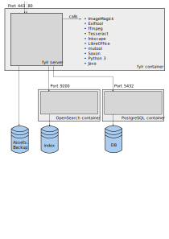

# Architecture

fylr is build on top of open source technologies:

* PostgreSQL
* OpenSearch (or Elasticsearch)
* Linux

It can either be run [on Windows](installation/windows.md) or, more commonly, in Linux containers: ([docker](installation/#linux) or [kubernetes](installation/helm.md))

<figure><figcaption></figcaption></figure>
