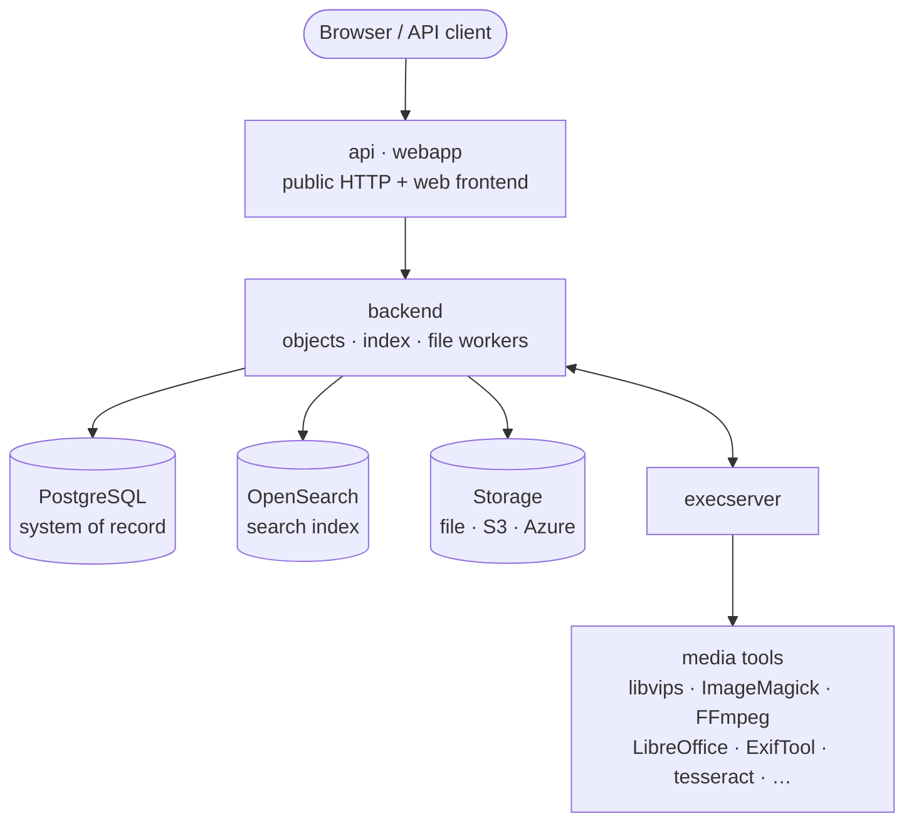
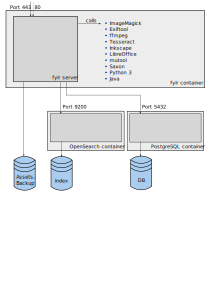

# Architecture

fylr is a single [Go](https://go.dev/) program that runs several **services**, backed by two datastores and a set of media-processing tools. It runs on Linux, [Windows](installation/windows.md) and macOS, and under Linux is usually deployed in containers via [Docker](installation/#linux) or [Kubernetes](installation/helm.md).

## Components

```mermaid
flowchart TD
    Client(["Browser / API client"])
    Client --> API["api · webapp<br/>public HTTP + web frontend"]
    API --> BE["backend<br/>objects · index · file workers"]
    BE --> PG[("PostgreSQL<br/>system of record")]
    BE --> OS[("OpenSearch<br/>search index")]
    BE --> ST[("Storage<br/>file · S3 · Azure")]
    BE <--> EX["execserver"]
    EX --> TOOLS["media tools<br/>libvips · ImageMagick · FFmpeg<br/>LibreOffice · ExifTool · tesseract · …"]
```

**Services** (configured under `fylr.services` in `fylr.yml`):

* **api / webapp** — the public HTTP surface: the JSON API under `/api/v1` and the web frontend. Clients authenticate here ([OAuth2](../for-developers/api/oauth2.md)) and send their requests.
* **backend** — does the actual work: reads and writes objects in PostgreSQL, keeps the OpenSearch index in sync, and runs the [file workers](../for-developers/file-worker.md). It also serves the unauthenticated [`/inspect`](../for-developers/inspect.md) surface, so it must stay on a private network.
* **execserver** — runs the external media tools out-of-process, on demand, over a token-guarded protocol (see [Exec server](../for-developers/execserver.md)). It can run standalone and be scaled to several instances.

**Datastores:**

* **PostgreSQL** — the system of record for every object, the datamodel, users, rights and configuration.
* **OpenSearch** (or Elasticsearch) — the search and aggregation index, kept in sync from PostgreSQL.
* **Storage** — original files and their produced renditions, in a local `file` directory, S3 or Azure.

**Media tools** — libvips, ImageMagick, FFmpeg, LibreOffice, ExifTool, tesseract, mutool and more, invoked by the execserver to produce previews and extract metadata. The full list is on [Install from source](installation/from-source.md).

## Deployment

A single instance runs every service together. For horizontal scaling the [execserver can run separately](installation/scaling-the-execserver.md), and several fylr instances can share one PostgreSQL and one OpenSearch — load-balanced in front, equally privileged.

<figure><figcaption>
fylr deployment overview
</figcaption></figure>

## See also

* [Install from source](installation/from-source.md) — the build and the third-party tools.
* [Exec server](../for-developers/execserver.md) — how fylr runs the media tools.
* [The File Worker](../for-developers/file-worker.md) — the file-production pipeline.
* [The /inspect backend](../for-developers/inspect.md) — the introspection surface on the backend.
* [Scaling the execserver](installation/scaling-the-execserver.md).
