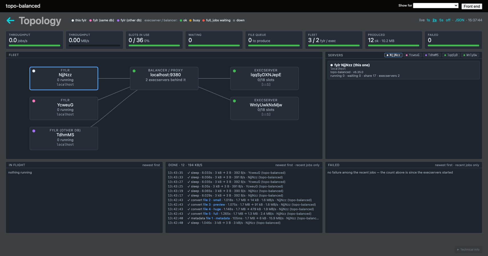

# System

The **System** page (`/inspect/system/`) is the maintenance dashboard for a running instance. It surfaces the runtime state and hosts the two most consequential actions — **re-index** and **purge**.


Re-index and purge are **instance-wide** and, on the backend port, **unauthenticated**. Keep the backend port on a private network. In the browser (webapp port) they require `system.root`.


## Actions

### Re-index

Rebuilds the search index for every object from the database. Reachable as `GET /inspect/system/?reindex=1`; add `&blockFrontend=1` to put the instance into the `reindex` status — only `/inspect/` stays reachable — until the new index is built and switched in. Use it after a change that alters what is indexed (the release notes call these out) or to recover a corrupted index.

### Purge

`POST /inspect/system/purge` **permanently wipes all data** — objects, datamodel, users, configuration, everything. The button appears only when `fylr.allowpurge` and the base-config purge flag are both set, but the endpoint itself has no auth on the backend port. There is no undo.

## Status & subpages

The dashboard also links the read-only runtime views:

| Subpage | Shows |
| --- | --- |
| `system/janitor/` | the clean-up janitor's state — file deletion, trash draining, idle-user archiving |
| `system/queues/` | the file and index job queues |
| `system/execserver/` | this process's own execserver when it runs one ("This execserver"), and the connected execservers with their services and — in auto-balance mode — the learned class and mean runtime per service |
| `system/topology/` | from 6.35: the whole installation on one live page — see [Fleet topology](#fleet-topology) below |
| `system/locations/` | the storage locations and their status |
| `system/backups/` | the on-disk backups |
| `system/console/` (+ `/stream`) | a live server-log console |
| `system/status/` | server statistics |

## Fleet topology

`/inspect/system/topology/` (from version 6.35) shows the whole installation on
one page: every fylr server, every execserver, the load balancer when there is
one, and the work moving between them — jobs running, jobs parked waiting for a
slot, what finished and what failed, with throughput and bytes moved. The page
streams over a websocket and updates itself; the same data is served as JSON at
`/inspect/system/topology/data`.

<figure><figcaption>
Three fylr servers — two replicas and one of another installation — sharing two execservers, reached through one load-balanced address. The counters across the top are installation-wide; the lists below are the jobs running, finished and failed right now.
</figcaption></figure>

Every box leads with its role — **fylr**, **fylr (other db)** for a fylr of
another installation that shares an execserver, **execserver**, **balancer /
proxy** for whatever rewrote the destination on the way (a Kubernetes Service,
a load balancer, a port-forward) — and one dot in its corner carries the colour
the legend in the header explains: white is the fylr serving the page, pink a
fylr on the same database, purple one on another database; an execserver is
green, yellow when busy, red when full with jobs waiting, grey when down or
unreachable. The same dot marks the chips in the server list and the cards.
Execservers are shown by their hostname, the one thing about them that
survives a restart; the instance id, fresh with every process, stays next to
the address. An address nothing answers on is drawn as its own box, with the
error on its card.

It is the page to open when the installation has more than one moving part:

* **Is every execserver actually connected?** An execserver that fylr cannot reach receives no work at all in 6.35 — there is no polling fallback that would eventually pick the job up.
* **Does a load-balanced address reach the whole fleet?** An address that fronts several instances is recognised as such from the connection itself, so a Kubernetes Service is shown as a Service even while only one pod is behind it.
* **Will the callbacks come back to the right process?** Every fylr registers the callback base it announces, and the execserver checks at connect time that the server answering it is the one that registered. A callback address pointing at a load balancer in front of several fylr replicas is reported here, at connect time, instead of failing later inside a job.

## See also

* [The /inspect Backend](README.md) — the console overview and auth model.
* [Files and version production](files.md) — the file queues in depth.
* [Backups & Restore](../backup.md).
* [Updating the execserver to 6.35](../installation/updating-the-execserver-to-6.35.md) — what the topology page is checking, and how to fix what it reports.
