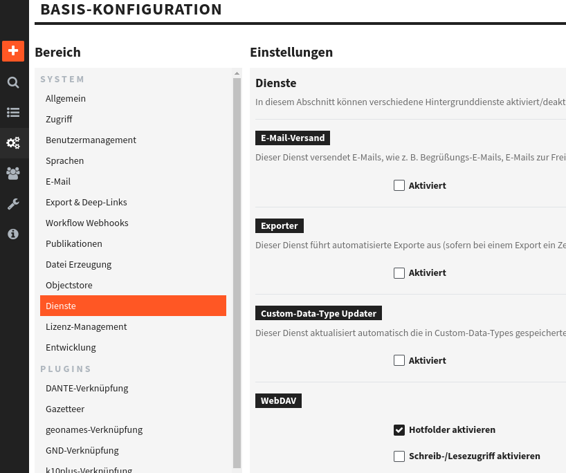

Assuming you use a docker-compose.yml file and your hotfolder will be located at `/srv/fylr/_hotfolder`:


1. Create on your fylr instance the directory and change its permissions. The user permissions must be the same as the one your fylr runs.
```bash
mkdir /srv/fylr/_hotfolder
chown 1000 /srv/fylr/_hotfolder
```

2. Map the folder into the fylr container.
   
docker-compose.yml:
```yaml
services:
  fylr:
    volumes:
      - "/srv/fylr/_hotfolder:/fylr/_hotfolder"
```

3. Set `webdavhotfolderpath` in your fylr.yml. Note this path is inside the container.

```yaml
fylr:
  services:
    api:
      webdavhotfolderpath: "/fylr/_hotfolder"
```

4. Visit the fylr frontend and activate the Hotfolder:
   

