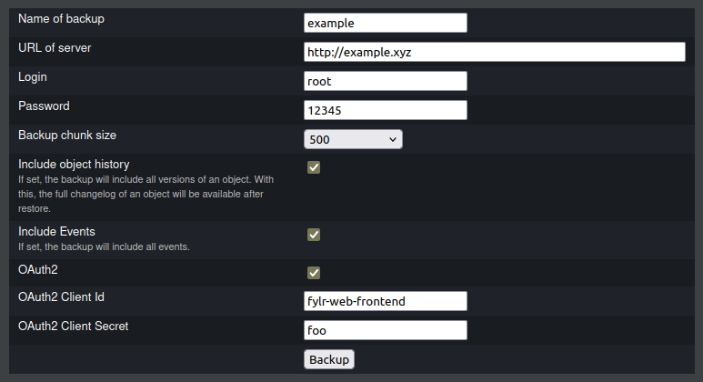
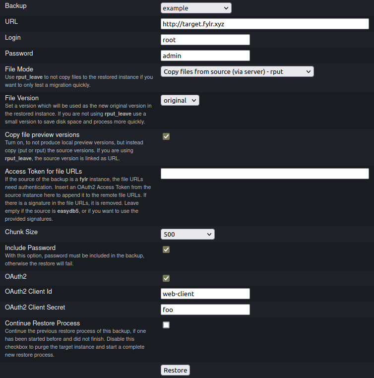

# Using the fylr inspect page for migrations

The migration using the `fylr backup` and `fylr restore` commands can also be performed in the inspect page for migrations (open `<fylr url>/inspect/migration/` in the browser). This provides a graphical overview to run these commands.

The source instance for the backup can be any **easydb5** or **fylr** instance, even the current **fylr** instance. The same is true for the target instance of the restore, this can theoretically be the same **fylr** instance, although this is not recommended and you should use another target instance.

The following example shows how a backup with the name *"example"* would be migrated from server *"http://example.fylr.xyz"* to server *"http://target.fylr.xyz"*.

The backup and restore processes are performed in the background. They run on the server and are independant of the browser window. The progress can be checked by opening the status page of a backup / restore process (see below).

## Backup

This uses `fylr backup` to create a backup on the **fylr** instance. Not all parameters can be set here. Some parameters are automatically set with a useful default.

See also: [Backup Parameters](backup.md#parameters)

<figure><figcaption></figcaption></figure>

### Parameter settings

#### Name of backup

* choose a name to identify the backup
* This sets `--dir example/`

#### URL of server

* URL of the source server **without** API base endpoint
* This sets `--server 'http://example.fylr.xyz/api/v1/'`

#### Login

* Username in the source instance
* This sets `--login root`

#### Password

* Password in the source instance
* This sets `--password '12345'`

#### Backup chunk size

* Select the batch size for GET requests
* Choose between: `100`, `500`, `100`, `1000`, `5000`, `10000`
  * For **easydb5** source instances, choose a **maximum of `1000`!**
* This sets `--chunk 500`

#### Include object history

* If set, the backup will include all versions of an object
* With this option, the full changelog of an object will be available after restore
* This option is enabled by default
* This sets `--all-versions true`

#### OAuth2

* Select only of the source instance uses OAuth2
* **easydb5** does not use OAuth2
* this enables the following options:
  * *OAuth2 Client Id*
    * Client Id of the source instance
    * This sets `--client-id fylr-web-frontend`
  * *OAuth2 Client Secret*
    * Client Secret of the source instance
    * Leave empty if the source instance is public
    * This sets `--client-secret foo`

### Fixed parameters

The following parameters are set in the background:

```
  --size 1000                \
  --limit 0                  \
  --compression 9            \
  --log 'example/backup.log' \
  --purge
```

### Progress

Click on **Backup** to start the backup process in the background. To see the progress of the backup, select the backup in the overview **List of backups**. This opens a page where you can see the status and the backup log. The generated payloads are listed under the log.

You can also access this page directly under `<fylr url>/inspect/migration/<backup name>`, so in this example under `<fylr url>/inspect/migration/example`.

## Restore

After a backup was finished, it can be restored to a target **fylr** instance.

This uses `fylr restore` to upload the payloads to the **fylr** instance. Not all parameters can be set here. Some parameters are automatically set with a useful default.

See also: [Restore Parameters](restore.md#parameters)

<figure><figcaption></figcaption></figure>

### Parameter settings

#### Backup

* Select one of the backups
* This sets `--manifest 'example/manifest.json'`

#### URL

* URL of the target server **without** API base endpoint
* This sets `--server 'http://target.fylr.xyz/api/v1/'`

#### Login

* Username in the target instance
* This sets `--login root`

#### Password

* Password in the target instance
* This sets `--password '12345'`

#### File Mode

* Method used to upload files, leave empty to not upload files (this is the default)
  * *Copy files from source (through browser) - `put`*
  * *Copy files from source (via server) - `rput`*
  * *Use files from source - `rput_leave`*
    * The target server stores remote URLs, no data is copied to storage
    * Use `rput_leave` to not copy files to the restored instance if you want to only test a migration quickly
* This sets `--file-api rput`

#### File Version

* Set a version which will be used as the new original version in the restored instance
  * *original* (the original asset, no version. This is the default)
  * *preview*
  * and other version names (depend on configurations)
* If you are not using `rput_leave` use a small version like `preview` to save disk space and process more quickly
* This sets `--file-version original`

#### Copy file preview versions

* Enable this checkbox to not produce local preview versions, but instead copy the source versions (via `put` or `rput`)
* If you are using `rput_leave`, the source version is linked as URL
* This sets `--upload-versions`

#### Access Token for file URLs


This is available in fylr from version **v6.10.0**.


This is only needed if the source instance of the backup is a **fylr** and there are files that should be uploaded to the target instance. **fylr** requires all requests to be authenticated. So during the restore process the file URLs need to be accessed in the source fylr, but this will fail if there is no authentication.

During the backup, **fylr** adds a signature parameter to the file URLs (`x-fylr-signature`) which can be used to authenticate the request. But this signature is temporary and expires after a fixed time which is configured in the source instance. If you try to restore after a certain time the signatures can be expired and the source instance will not allow access to the files anymore.

To override the signature, you can get an OAuth2 Access Token from the source instance which has read rights on these files. If this token is passed, the restore tool will parse the file URLs and remove the signature parameter, and set the `access_token` parameter instead.

This sets `--file-api-access-token <token>`

#### Chunk size

* Select the batch size for POST requests
* Choose between: `100`, `500`, `100`, `1000`, `5000`, `10000`
* This sets `--chunk 500`

#### Include Password

* Enable this checkbox to include user password hashes
* If this option is `true`, the restore tool checks if there is at least one user where a password hash is present
* This sets `--include-password`

#### OAuth2

* Select only of the target instance uses OAuth2
* **easydb5** does not use OAuth2
* this enables the following options:
* *OAuth2 Client Id*
  * Client Id of the target instance
  * This sets `--client-id web-client`
* *OAuth2 Client Secret*
  * Client Secret of the target instance
  * Leave empty if the target instance is public
  * This sets `--client-secret foo`

#### Purge or Continue


This is available in fylr from version **v6.10.2**.


* **Purge**
  * The target instance is purged and a new restore process is started
  * This uploads the base config and the data model
  * This sets `--purge`
* **Continue**
  * A previous restore process of this backup is continued
  * This sets `--continue`
* **No Purge**
  * Does not purge the target instance but uploads the data model
  * Use this after manually purging the target and manually uploading or adjust the base config settings
  * This sets neither `--purge` nor `--continue`, but `--base-config=-`

See also: [Best Practice > Restoring with and without purge](best-practice.md#restoring-with-and-without-purge)

### Fixed parameters

The following parameters are set in the background:

```
  --chunk 1000                      \
  --limit 0                         \
  --skip-constraints                \
  --max-parallel-upload-files 4     \
  --upload-ignore-files-with-errors \
  --timeout-min 15                  \
  --log 'example/restore.log'       \
  --purge
```

### Progress

Click on **Restore** to start the restoring process in the background.

Confirm the message *This will destroy all data on "http://target.fylr.xyz"!*. Be sure you want to **delete all data and the complete datamodel** on the target instance. The restore process is always performed with `--purge`.

The progress of the restore is the shown in a new page where you can see the log. You also access this page directly under `<fylr url>/inspect/migration/<backup name>`, so in this example under `<fylr url>/inspect/migration/example`.

