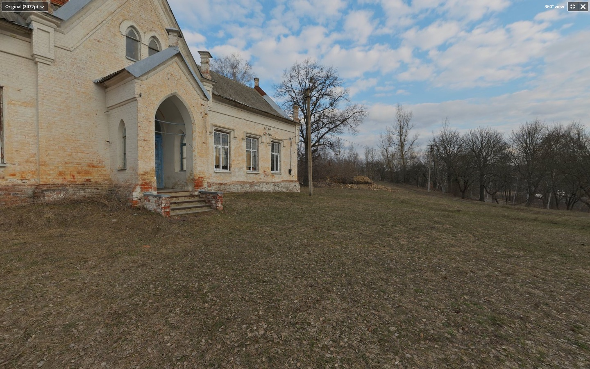
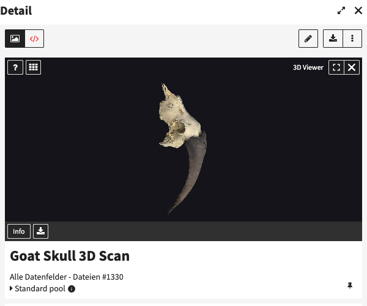
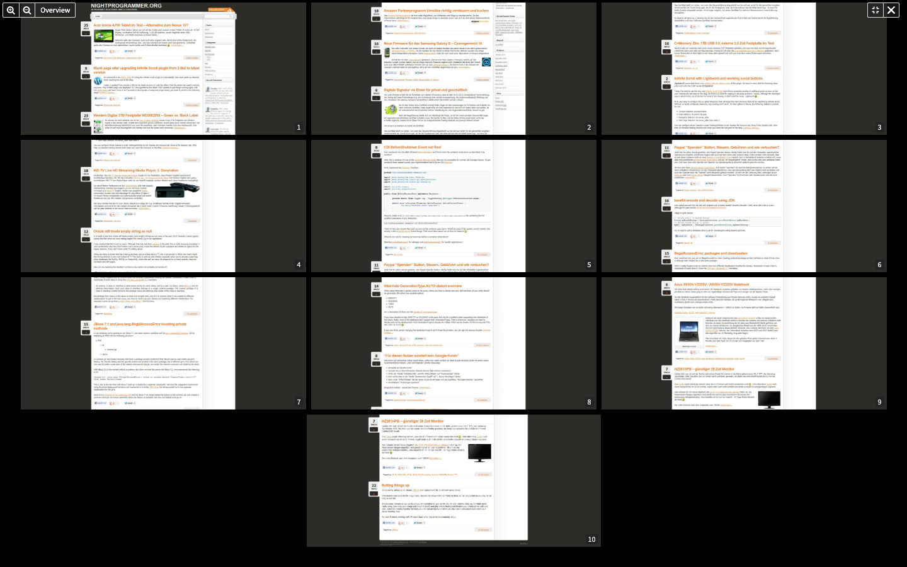
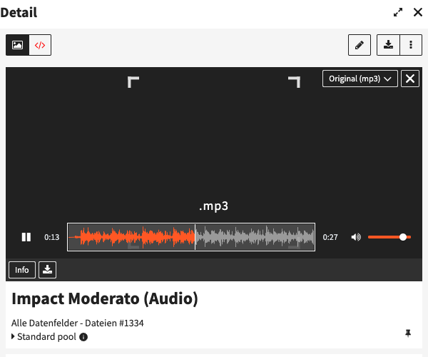

# Additional Features

## 360° and 3D viewers


From fylr **6.35.0**.


A **spherical video or panoramic image** — one the server recognised as 360° media — opens in a built-in 360° viewer instead of the flat player: drag to look around (dragging left shows more of the right, as on the map), wheel to zoom, click a video to play or pause. Videos get the usual controls bar, and a select switches between the original and the produced renditions that keep the 360° marker; switching keeps the view and, for videos, the playback position.

<figure><figcaption>A panoramic image in the 360° viewer</figcaption></figure>

A **3D asset** — a gaussian splatting scene or a polygon mesh the server could decode — opens in a built-in 3D viewer: drag to orbit the camera on all three axes, wheel to zoom, trackpad to pan, a grid floor to toggle, and a help overlay listing the controls. In the editor the current camera can be stored as the viewpoint for the asset's produced preview images, the way a custom video thumbnail is stored. The viewer pans with the right mouse button, so the context menu stays away there.

<figure><figcaption>A 3D scan in the 3D viewer</figcaption></figure>

A **multi-page image** — a TIFF scan with several pages — opens in the paged viewer that office documents have, so it reads page by page.

<figure><figcaption>A multi-page TIFF in the paged viewer</figcaption></figure>

**Audio** plays with fylr's own transport bar — play/pause, elapsed and total time, mute and volume — whose seek area shows the waveform of the file.

<figure><figcaption>The audio player with its waveform</figcaption></figure>
