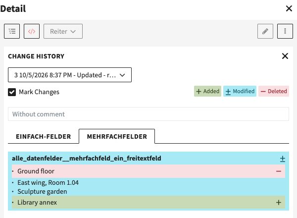

# Change History

Access a records change history in the 3dot menu in the detail view.

Browse through historic versions of a record, see who modified the record how exactly by choosing highlight modes.

### Required Permissions

The following permissions enable users to access the Change History from the fylr detail view.

Available under a users or groups **System Rights > Frontend Features**.

Permission **Access Change History**:

* Allows users to see change history
  * If only view permissions for record are present, Usernames are not shown in change history
  * If edit permissions are present usernames are shown in change history

Permission **Access Change History (Always Including the User)**:

* User always has access to change history **and** usernames

#### Highlighting Changes

With **mark changes**, the change history highlights what changed. From fylr **6.35.0**, the rows of a nested field are compared one by one, also inside nested rows: a removed row is shown again where it was and marked red, an added row green, and a changed row as modified, instead of the whole field being marked.

<figure><figcaption>The change history marking a changed nested table</figcaption></figure>

#### Restore Versions

If a user has the permissions to **edit the record and access the change history**, this user can restore historic versions by opening the change history while editing in the detail view.

After restoring, saving is still required.

 
