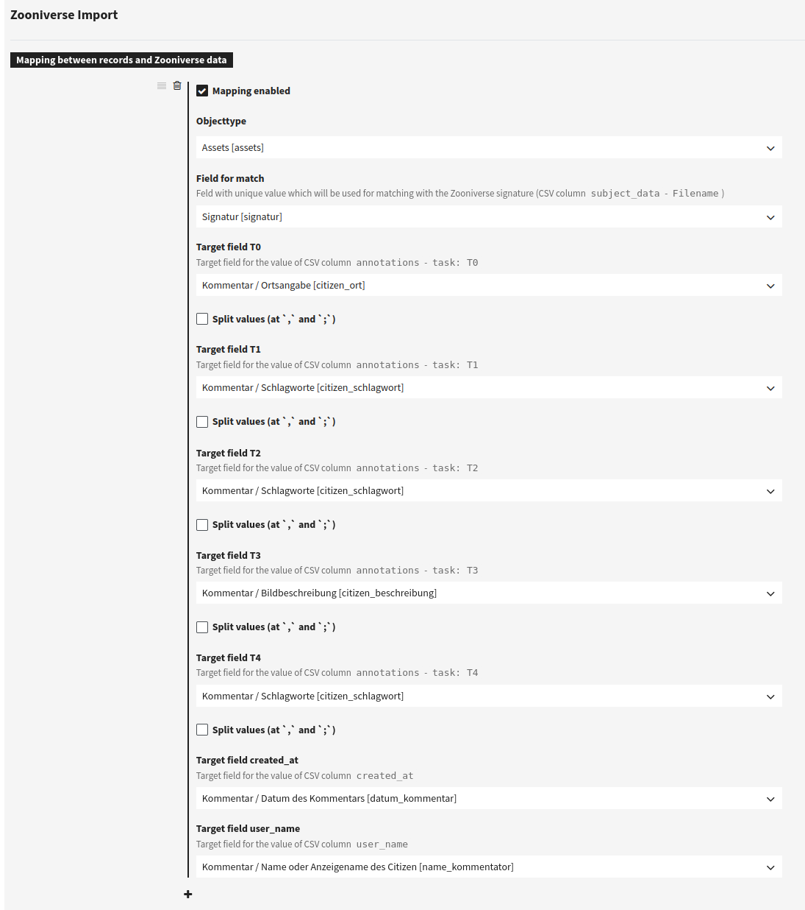
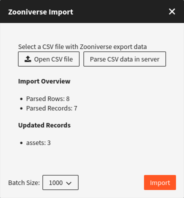

# Zooniverse


Please note: this plugin is licensed as a separate module. If in doubt, please check your license agreement.


## About

[Zooniverse](https://www.zooniverse.org/) is a platform for people-powered research. This research is made possible by volunteers — more than a million people around the world who come together to assist professional researchers. It offers a CSV export of data, which then can be imported to fylr.

## Adding the Plugin

First, make sure the plugin is added to your fylr and enabled by checking the [Plugin Manager](../../for-administrators/plugin-manager.md). If not, add the plugin. To license and get the plugin, please get in touch with Programmfabrik GmbH.

## Data Model

Depending on the data you want to copy from Zooniverse, you have to create the corresponding fields in your data model.

## Configuration

After adding and enabling the plugin, go to the [base configuration](../../for-administrators/readme/). There you'll find the "Zooniverse Import" (under "Plugins").

<figure><figcaption></figcaption></figure>

The synchronization is carried out using the file name of the file in the Zooniverse export, which is read from the CSV file without the file extension. A text field for matching must be selected in the Base Configuration. The plugin searches the system for corresponding data records for which the matching field corresponds to the file name.

The assigned fields for the various Zooniverse values (T0, T1, T2, T3, T4) are inserted in the data records found. Simple fields or links are overwritten if they exist. Fields in multiple fields are added if they do not already exist. You can also select that the values from the CSV file are to be separated by , or ; and split over several lines.

If the target fields for created\_at and user\_name are in the same multiple field, they are grouped together.

Values for linked data records are also searched for in the system. If necessary, new data records are created for values for which no data record exists yet.

## Import

After you set up the [configuration](zooniverse.md#configuration), go to "Tools" > "Zooniverse Import" to import the CSV file.&#x20;


Please refer to the [Zooniverse documentation](https://help.zooniverse.org/next-steps/data-exports/) for exporting the CSV file.


<figure><figcaption></figcaption></figure>

Click on "Open CSV file" button and choose the desired CSV file and then click on "Parse CSV data in server" so the data is sent to the backend. The data is processed there and compared with the existing data in the system.

Following the (successful) processing, the server sends the updated or new data records, depending on the mapping, as well as an overview of the processed data and affected data records. These are listed in the dialog box.

The updated or new data records to be created are then imported using the "Import" button. The data records are sent to the server in batches in the background. The size of the individual batches can be adjusted as required.
