# Mobile App

## General Introduction

The **fylr mobile app** allows you to connect to one or more **fylr instances**, browse collections, and upload files directly from your mobile device. To use the app, you must have access to a **running fylr installation** that you can connect to.

You can connect to multiple fylr systems by entering their **URL** on the home screen and logging in with a valid user account.

To use the app, your **license must include the fylr app component**, and your user account must have access to **collections** as well as permission to **upload files**.

Uploading files through the app is only possible via **collections**. You can upload files to existing collections that are enabled for uploads or create new collections directly in the app.

## Screens


{% column width="33.33333333333333%" %}
<figure>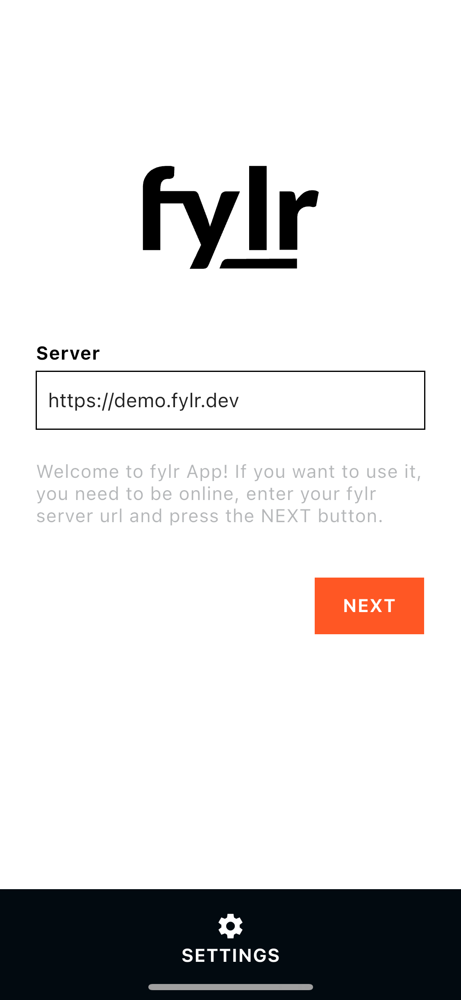<figcaption></figcaption></figure>


{% column width="66.66666666666667%" %}
####

#### Connecting to fylr

To connect to a fylr instance, enter the **URL** on the home screen and log in using your account credentials on the next screen. Once authenticated, the app establishes a connection to the selected fylr instance.




{% column width="33.33333333333333%" %}
<figure>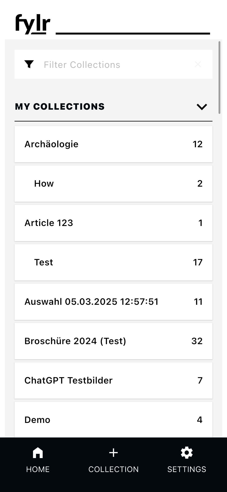<figcaption></figcaption></figure>


{% column width="66.66666666666667%" %}
####

#### Collection List

After logging in, the **collection list** is displayed. All collections you have access to are shown in **alphabetical order** and grouped into **My Collections** and **Shared Collections**.

You can search collections by **name** or **description**. Tap on a collection to view the records it contains. New collections can be created by tapping **“+ Collection”** in the footer.




{% column width="33.33333333333333%" %}
<figure>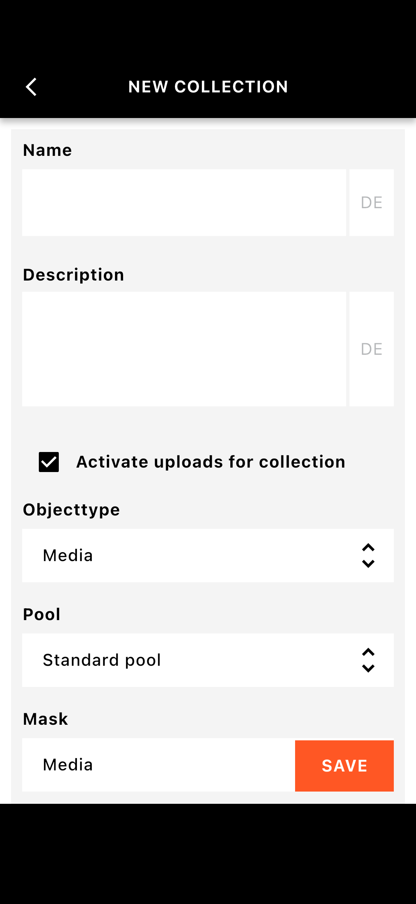<figcaption></figcaption></figure>


{% column width="66.66666666666667%" %}
####

#### New Collection

A collection must have a **name** and may include a **description**. Collections created in the app are automatically **enabled for uploads**. This setting should not be changed if you intend to upload files from the app.

Depending on your system configuration, you may also need to select an **Object Type**, **Pool**, **Mask**, and a **file field**. After saving the collection, it is ready for uploading files.





{% column width="33.33333333333333%" %}
<figure>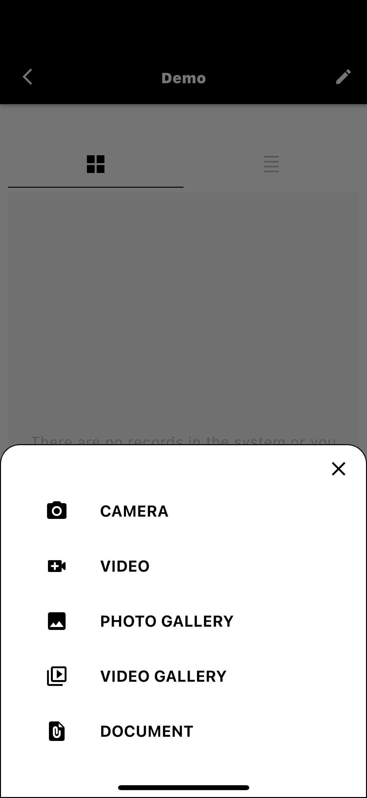<figcaption></figcaption></figure>


{% column width="66.66666666666667%" %}
####

#### Uploading

To upload files, open a collection and tap the **upload icon** in the footer. You can choose files from the **camera**, **video recorder**, **photo gallery**, **video gallery**, or **document browser**.




{% column width="33.33333333333333%" %}
<figure><figcaption></figcaption></figure>


{% column width="66.66666666666667%" %}
####

#### Upload Status

After selecting files, the **upload status** screen shows the progress of each upload. Once all uploads are complete, tap **Finish** to return to the collection.





{% column width="33.33333333333333%" %}
<figure>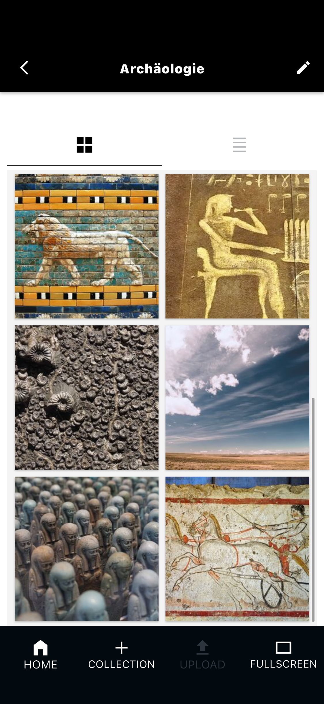<figcaption></figcaption></figure>


{% column width="66.66666666666667%" %}
####

#### Collection Standard View

By default, records in a collection are displayed as **square thumbnail previews**. Tap a record to open a larger preview and view details, or tap **Fullscreen** to view the file in full screen mode.





{% column width="33.33333333333333%" %}
<figure>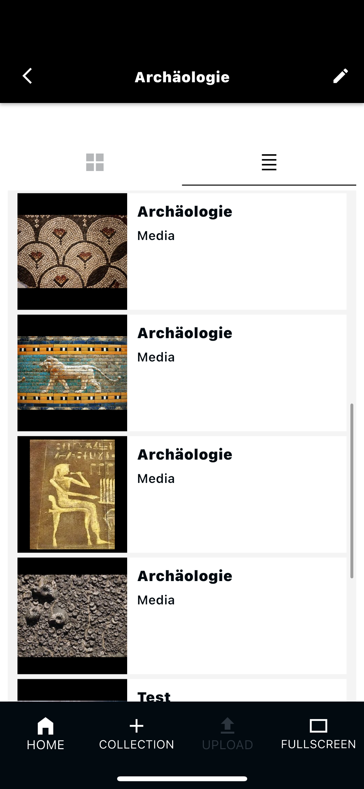<figcaption></figcaption></figure>


{% column width="66.66666666666667%" %}
####

#### Collection List View

You can switch to the **List View** to display records with their **standard information**.





{% column width="33.33333333333333%" %}
<figure>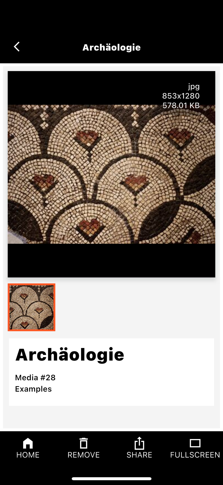<figcaption></figcaption></figure>


{% column width="66.66666666666667%" %}
####

#### Record Detail

The **record detail view** displays the standard information of the record. From here, you can remove the record from the collection (the record itself remains in fylr), share the file using your device’s sharing options, or open the file in full screen mode.





{% column width="33.33333333333333%" %}
<figure><figcaption></figcaption></figure>


{% column width="66.66666666666667%" %}
####

#### Record Full Screen

In **full screen mode**, you can zoom into images or play videos. This view also provides access to **technical file information** and sharing options.





{% column width="33.33333333333333%" %}
<figure>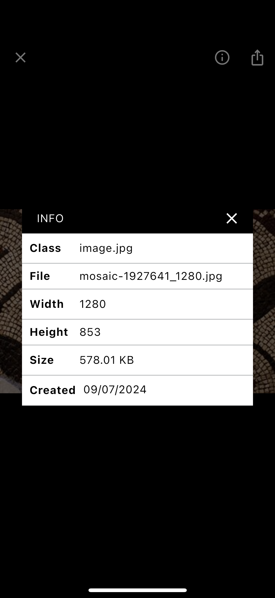<figcaption></figcaption></figure>


{% column width="66.66666666666667%" %}
####

#### File Info

Technical details about the file, such as format and dimensions, can be accessed from within the **full screen view**.





{% column width="33.33333333333333%" %}
<figure>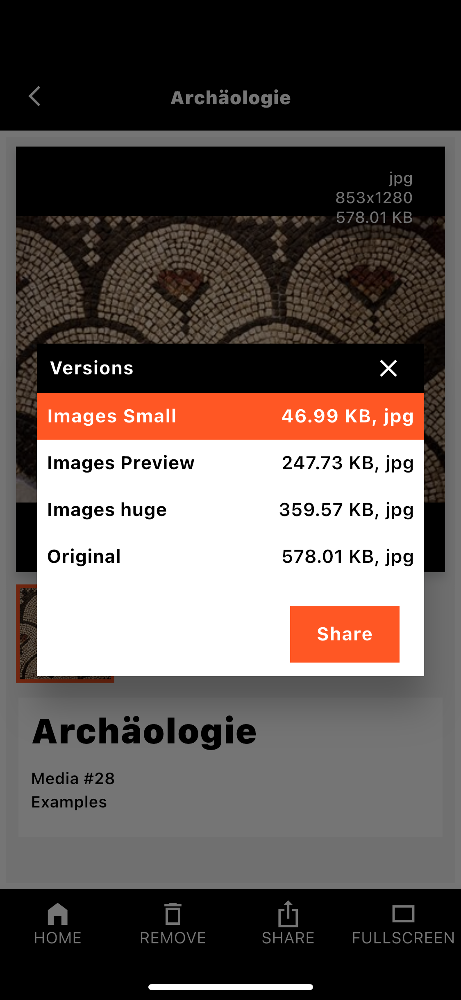<figcaption></figcaption></figure>


{% column width="66.66666666666667%" %}
####

#### Share / Download

Files can be shared or downloaded either from the **record detail view** or the **full screen view**. All configured **preview versions** are available for sharing.





{% column width="33.33333333333333%" %}
<figure>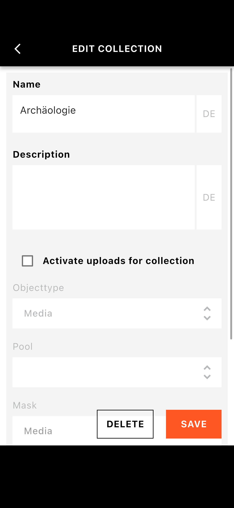<figcaption></figcaption></figure>


{% column width="66.66666666666667%" %}
####

#### Edit Collection

Collections can be edited from the **collection detail view** by tapping the **pencil icon** in the upper-right corner. You can change collection settings or delete the collection. Deleting a collection does **not** delete the records; they remain available in fylr.





{% column width="33.33333333333333%" %}
<figure>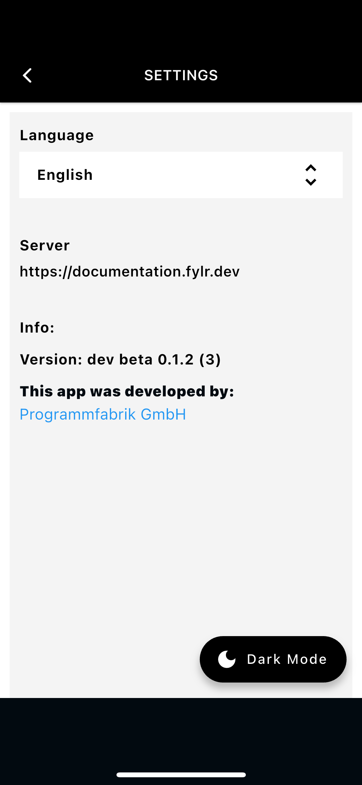<figcaption></figcaption></figure>


{% column width="66.66666666666667%" %}
####

#### Settings

From the home screen, you can access the **Settings** menu. Here you can change the **language**, view the **connected server**, check the **app version**, and switch between **light and dark mode**.




