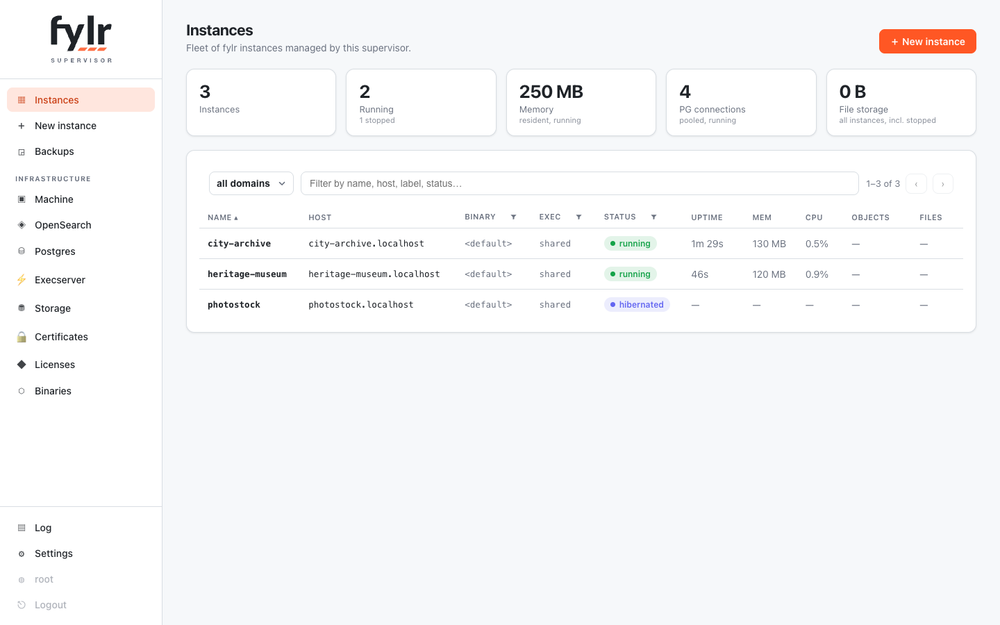

# Supervisor

The fylr supervisor turns one machine into a managed fleet of fylr instances. One `fylr supervisor` process provisions each instance's PostgreSQL database, spawns and supervises ordinary `fylr server` child processes, routes public traffic to them by hostname, and serves a web UI plus a JSON management API.

<figure><figcaption><p>The fleet dashboard: every instance with its live status, memory, CPU and content statistics</p></figcaption></figure>

The fylr server code is untouched: children are unmodified fylr servers, spawned by re-executing the same binary with a generated per-instance configuration. Supervisor and children therefore never have version skew — unless an instance deliberately follows a different build from the [binaries registry](binaries.md).

## Architecture

```
minimal supervisor.yml (bootstrap) ─▶ control DB (desired state) ─▶ reconcile loop ─▶ child fylr processes
                                            ▲                            │
                                  web UI + JSON API ────────────────────┼─▶ Host router  (Host → instance)
                                                                         ├─▶ provisioner  (CREATE DATABASE + child self-init)
                                                                         └─▶ shared execserver (one, serves all instances)
```

* **Control database** — SQLite by default. It holds the *desired* state of the fleet and every supervisor setting; runtime state (PIDs, ports, live status) lives in memory. Only the control-DB connection itself is configured in the YAML file — everything else is edited at runtime through the Settings page or `PUT /api/settings`, and applies live without a supervisor restart.
* **Reconciler** — drives actual state toward desired state: it provisions and spawns instances that should run, stops those that should not, re-adopts running children after a supervisor restart (children survive it), and restarts crashed children with backoff.
* **Router** — a reverse proxy mapping the request `Host` to a healthy replica of the owning instance, with sticky sessions, [TLS](router.md#tls-certificates), per-IP and per-instance [rate limits](router.md#rate-limits) and an [abuse shield](router.md#abuse-shield) in front of everything.
* **Shared services** — one PostgreSQL cluster, one OpenSearch and (by default) one shared execserver serve the whole fleet; each is surfaced on its own [infrastructure page](infrastructure.md).

## Chapters

* [Installation](installation.md) — bootstrap a machine, systemd, first boot
* [Instances](instances.md) — create, copy, operate, hibernate
* [Storage](storage.md) — disk and S3 locations, fleet default, per-instance override
* [Backups & copies](backups.md) — the backup store, restores, instance copies
* [Router, TLS & protection](router.md) — host routing, certificates, rate limits, abuse shield
* [Binaries & managed instances](binaries.md) — the build registry, CI pushes, provisioning presets
* [Licenses](licenses.md) — central license store and inheritance
* [Infrastructure pages](infrastructure.md) — machine, OpenSearch, Postgres, execserver
* [Settings reference](settings.md) — every control-DB setting
* [Management API](api.md) — the JSON API behind the UI
