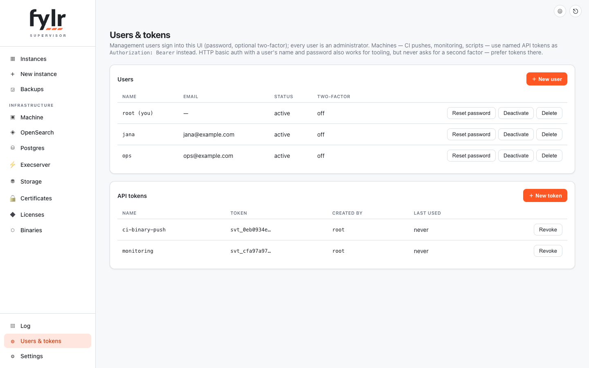

# Management access

The management API and UI authenticate against a user table in the control database. Authentication is always on — there is no configuration that turns it off, and the fleet is never without a user.

There is exactly **one role**: every management user is an administrator of the whole fleet. Permissions *inside* an instance are that instance's own business, configured in its rights management — the supervisor does not model them.

<figure><figcaption><p><strong>Users &#x26; tokens</strong>: the people who sign into the UI, and the tokens machines authenticate with</p></figcaption></figure>

## First login

On first boot the supervisor seeds the user `root` with the password `admin` and **forces a password change on the first login**. Until that change is done, the session can do nothing but read its own identity, set the new password and log out.

Upgrading a supervisor that used the retired `basic_auth_user` / `basic_auth_pass` settings keeps the operator's login working: that credential is adopted as the first user with its password unchanged and no forced change, and the two settings are cleared. Scripts and CI jobs authenticate with API tokens.

## Two ways to authenticate

| Credential | Who uses it | Two-factor |
| --- | --- | --- |
| Session cookie, from `POST /api/login` | People, through the UI | Enforced |
| `Authorization: Bearer svt_…` API token | Machines: CI, monitoring, scripts | Not applicable |

Only `GET /api/healthz` and `POST /api/login` are reachable without a credential. The UI itself is served unauthenticated because it renders its own login page; every `/api` route behind it is not.

## Users

**Users & tokens** in the sidebar lists the management users. A user has a name (fixed after creation), an optional email, and an active flag.

* **Creating** a user sets an initial password, and the form offers a password change at that user's first login — leave it ticked and the person who creates an account never needs to know the password that person ends up with. (Over the API the flag is opt-in: `must_change_password`.)
* **Resetting** someone's password forces a change at their next login unless the caller explicitly says otherwise — an admin-set password is a handover credential, not a permanent one.
* **Deactivating** a user cuts every credential immediately — sessions end, logins are refused. It is the reversible alternative to deleting.
* Both deactivating and deleting are refused for the **last remaining active user**, so a fleet cannot lock itself out with one wrong click.
* Passwords must be at least 8 characters. That is the whole password policy — the audience is small and technical.

## Two-factor authentication

Each user enables TOTP for themselves through the **account button in the top-right corner**: scan the QR code with an authenticator app, confirm one generated code, and the factor is armed. Logging in then asks for the code after name and password.

An administrator cannot read another user's secret, but can reset it (`totp_reset`), which disables the factor so the user can enroll again — the path for a lost phone.

## API tokens

The same page mints named bearer tokens for automation. The secret is displayed **once**, at creation, and only its hash is stored; a lost token is replaced, not recovered.

Tokens are not bound to the user who created them. Deleting or deactivating that user does not revoke them — deliberately, so a colleague leaving does not silently break the CI. Revoke a token explicitly when it is no longer needed.

## Exposure and the abuse shield

Failed authentication on the public admin hosts (`management_host` and `supervisor.<zone>`) feeds the same per-IP strike counter as the rest of the [abuse shield](router.md#abuse-shield): enough failures in a row earn a temporary ban. A valid credential lifts an active ban, so a locked-out administrator with the right password gets straight back in. The management listener on localhost is never banned.

Every authenticated change is logged with the acting user, in its own column of the supervisor log.

## Locked out

With no way in — the password lost, the authenticator gone, the last account deactivated — the control database on the machine is the way back. As root on the host:

```sh
# forget a lost second factor for one user
sqlite3 control.db "UPDATE user SET totp_secret='', totp_confirmed=0 WHERE name='<user>'"

# start over: drop all users, restart the supervisor, and the bootstrap
# root/admin is seeded again with a forced password change
sqlite3 control.db "DELETE FROM user"
```

API tokens survive both, so automation keeps running while access is restored.
