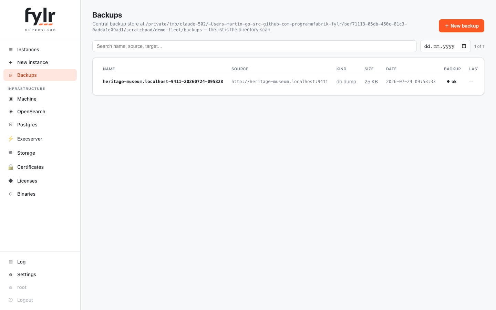

# Backups & copies

The supervisor keeps a central **backup store**: one directory per backup under the `backup_dir` setting. The catalog is the directory scan itself — anything placed there (or rsynced from another machine) shows up, and a missing metadata sidecar just means "foreign backup". Backup and restore are **separate actions**: a backup pulls a source into the store and touches no instance; a restore later pushes one catalog entry into an existing or new instance.

<figure><figcaption>
The Backups page: pulled backups and instance-copy seeds, each with phase logs
</figcaption></figure>

## Backup engines

* **api** — object-by-object replication via `fylr backup` through the source's public API. Works against any fylr (and easydb 5); optionally packs the file payloads (`include_files`), which is how sources keeping their files anywhere — disk or S3 — are copied completely.
* **db** — the source's native SQL dump via its `/api/v1/system/backup/new` API: a 1:1 copy of the database, downloaded into the store. Files are not in the dump; they stay in the source's storage, which the restored instance can attach read-only (see [Storage](storage.md)).

The source is any reachable fylr — one of this supervisor's own instances or a remote server. Credentials are a source login allowed to read everything, typically root.

## Restore

A restore pushes a catalog entry into a chosen instance — the destructive step, and it says so: the target is purged first. Restoring into a **new** instance creates and boots it in one go. A db-engine restore runs purge → SQL load → re-initialisation (schema migrations of the *target's* binary run here) → full reindex; the phase log streams into the backup's restore log. The source's encryption key can be adopted on the target so key-encrypted data (2FA secrets, passkeys, storage-location secrets) survives the copy.

## Instance copies

"Copy from instance" at create time is the same machinery end to end: a `seed-…` catalog entry records the pull and the restore with full logs. Disk-stored sources are dumped and their file tree hard-linked (instant); S3-stored sources are pulled through the api engine including files. The consent in the create dialog shows counts and sizes before anything runs, and a preflight refuses copies the disk cannot hold (projected need plus headroom).
