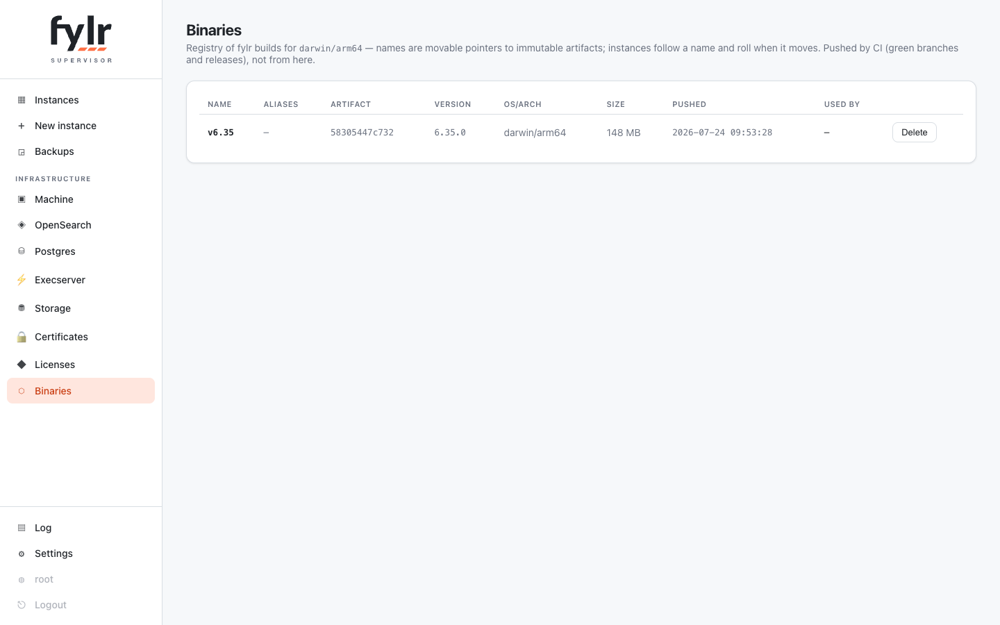
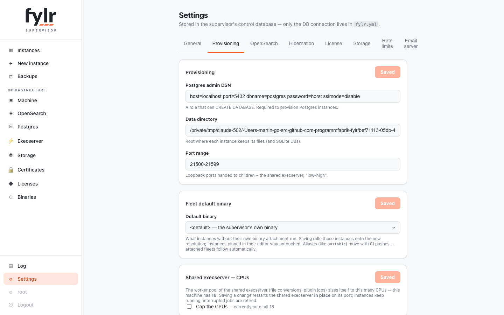

# Binaries & managed instances

## The registry

The supervisor keeps a docker-registry-style store of fylr builds: **artifacts** are immutable, sha256-identified binaries; **names** (branches, release tags, aliases like `latest`) are movable pointers to one artifact. Instances follow a *name* — when the name is repointed to a new artifact, every running follower is gently rolled onto it. Repointing the fleet's `default_binary` **is** the fleet upgrade.

<figure><figcaption><p>The Binaries page: artifacts, names and which instances follow them</p></figcaption></figure>

Pushing a build is one request — CI-friendly:

```sh
curl -T fylr-linux "https://supervisor.example.com/api/binaries/main?version=6.35.0&aliases=latest"
```

A retention setting (`binary_keep_days`) garbage-collects unreferenced artifacts.

## Managed branch instances

A push with `?managed=true&host=<name>.branch.example.com` additionally ensures a **standing public instance** for the name: created on the first push, rolled on every subsequent one. This turns CI into "every green branch has a running instance".

New managed instances are stamped with the provisioning presets from **Settings → Provisioning**:

* **Master instance** (`managed_master_id`) — the new instance starts as a full copy of this master (database and files, the same seed machinery as "copy from instance"), instead of empty.
* **Storage** (`managed_storage_id`) — the storage location for the new instance, the machine's disk or a configured S3 location.
* **Execserver** (`managed_execserver`) — the supervisor's shared execserver or an own in-process one.

<figure><figcaption><p>Settings → Provisioning: admin DSN, fleet binary, and the presets stamped onto new managed instances</p></figcaption></figure>

The presets apply once at creation; existing instances keep their own per-instance choices.
