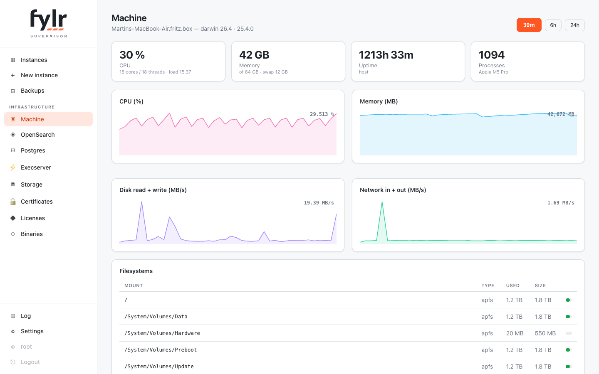
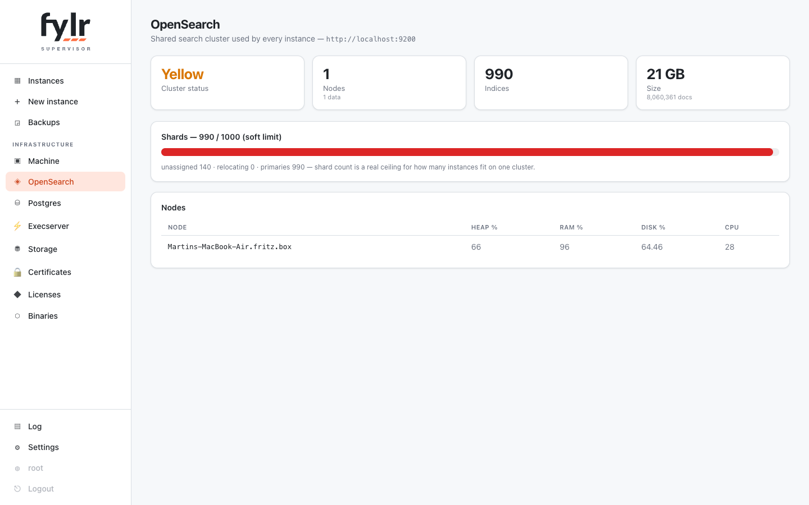
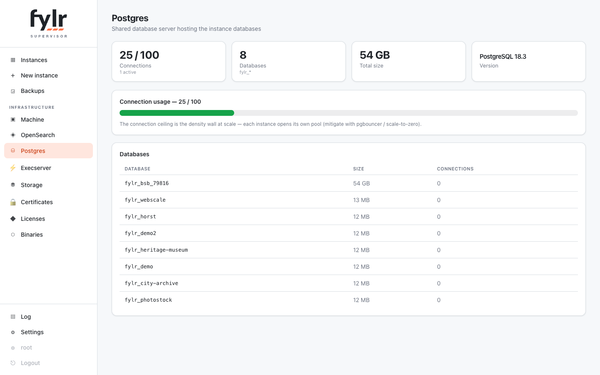
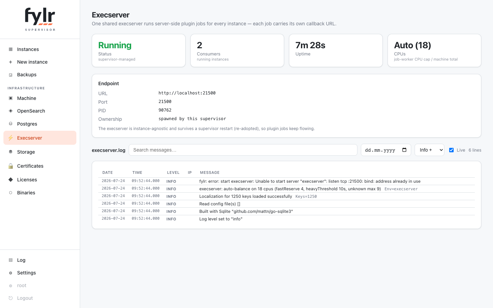
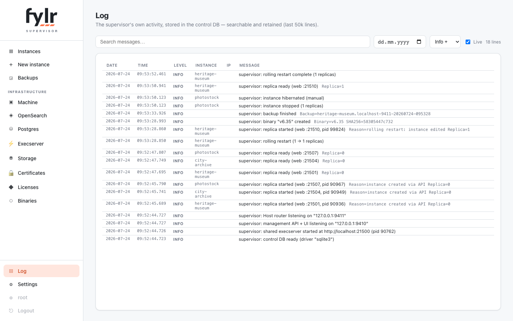

# Infrastructure pages

The shared infrastructure every instance depends on has its own dashboard pane.

## Machine

Host CPU, memory, disk and network as 24-hour time series (sampled every 10 seconds, kept in memory), filesystems, and the top processes — supervisor children labeled with their instance name.

<figure><figcaption></figcaption></figure>

## OpenSearch

Cluster health of the shared search cluster, nodes, and the shard-count ceiling — the number to watch when the fleet grows, since every instance brings its own indices.

<figure><figcaption></figcaption></figure>

## Postgres

Connection ceiling and per-database sizes across the fleet (requires the admin DSN).

<figure><figcaption></figcaption></figure>

## Execserver

The shared execserver that runs every instance's jobs (file processing, plugins): status, consumers, uptime and log. Instances can alternatively run their own in-process execserver (editor, General tab).

<figure><figcaption></figcaption></figure>

## Supervisor log

The supervisor's own log — every fleet event (creates, wakes, rolls, storage pushes, router bans) — as a filterable table with level, day, instance and client-IP columns.

<figure><figcaption></figcaption></figure>
