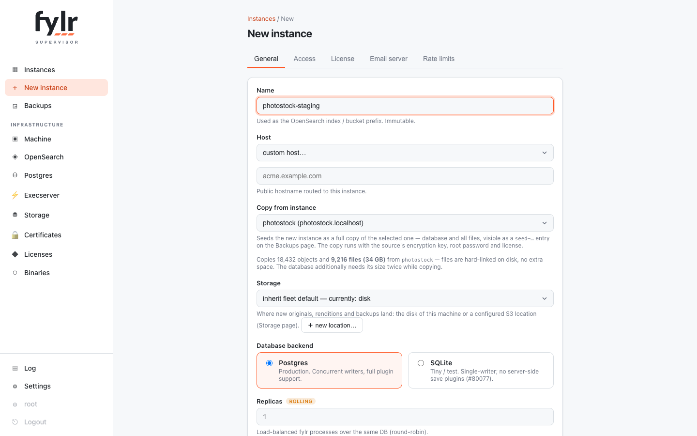
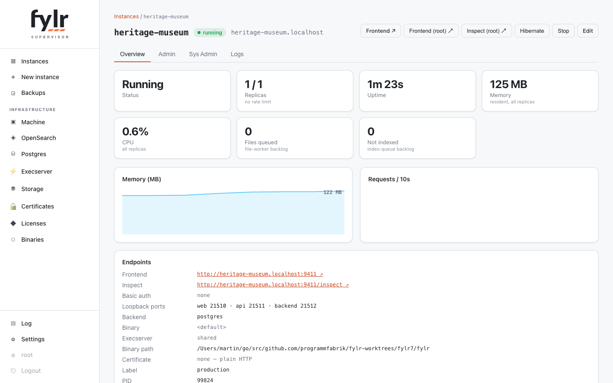

# Instances

An instance is one fylr tenant: its own PostgreSQL database (or SQLite file), its own OpenSearch indices, its own files, reachable under its own hostname through the router. The dashboard lists the fleet with live status, memory, CPU and content statistics; the per-instance page adds charts, endpoints and a log viewer.

_From version 6.35.0_ what the list is showing is part of the address: the domain filter, the search, the column filters, the sort and the page all live in the URL (`#/?group=web.example.com&sort=used&dir=desc`), as do an instance's open tab and a log's source, level and day. A reload comes back to the same view, and the address bar is a link to it — useful when a question is about one particular slice of the fleet.

## Creating an instance

<figure><figcaption>
Creating an instance: copy from an existing one — with the consent line spelling out what will be copied — and choose its storage
</figcaption></figure>

The two decisions at create time:

* **Copy from instance** — seeds the new instance as a **full copy** of an existing one: database and all files. The consent line under the select shows the source's object count, file count and file bytes before you commit. Sources whose files live on the machine's disk are hard-linked (instant, no extra space); sources keeping files on an S3 location are copied through their API, so the bytes are stored again locally. The copy runs with the source's encryption key, root password and license, and appears as a `seed-…` entry on the [Backups page](backups.md) with full logs. A disk-headroom preflight refuses copies the machine cannot hold.
* **Storage** — where new originals, renditions and backups land: the machine's **disk** location or a configured S3 location, inherited from the fleet default unless overridden. Locations themselves are created and edited in one place, on the [Storage](storage.md) page.

Everything else — database backend (PostgreSQL for production, SQLite for tiny tests), replica count, followed [binary](binaries.md), execserver, log level, host — has sensible defaults (the log level starts on the fleet preset from [Settings](settings.md)). The instance starts serving right after creation.

## The instance page

<figure><figcaption>
Instance detail: status tiles, charts, endpoints — and one-click root access to frontend and /inspect
</figcaption></figure>

Operation lives on the detail page: start/stop, hibernate, **Frontend (root) ↗** and **Inspect (root) ↗** (one-time root logins minted by the supervisor — no password juggling), plus tabs for the admin and system-admin views and the instance's parsed server log. _From version 6.35.0_, an instance whose host is web-only (see [Router, TLS & protection](router.md)) offers a single **Frontend (webOnly) ↗** instead: that host's entry page is the cross-server frontend, so a root session inside the instance is not what one goes there for. Setup lives in the editor (Edit button): host, access credentials, license, storage, log level, email server and rate-limit overrides — fleet-inherited concerns default to "inherit".

Edits that a child bakes in at startup (host, basic auth, replica count) apply through a **zero-downtime rolling restart**: new replicas come up and are confirmed serving before the old ones retire. Rate limits and storage assignments apply live.

A host may only be claimed once across the fleet, whether it arrives by creating an instance, editing one or restoring a backup into one. Two instances answering for the same name would leave the router choosing between them per request.

## Replicas

An instance can run several replica processes over the same database and indices, load-balanced round-robin with sticky sessions. Rolling restarts walk the replicas one by one, so a fleet upgrade never takes an instance down.

## Hibernation

Idle instances are stopped to free memory and woken by the next request for their host — the visitor sees a boot page for a few seconds. Idle means: no successful requests, empty work queues and cold CPU; background noise (scanner probes, failed logins) deliberately does not keep an instance awake. The idle window is a fleet setting with a per-instance override ("never hibernate" for production tenants). A hibernated instance can also be woken manually or by a restore.

## Logs

Every instance's server log is parsed into a filterable table (level, day, full-text) with the client IP as its own column — request lines carry the real client address as seen by the router, so "who is hammering this instance" is one click (the IP filters the log). The supervisor's own log has a per-instance column too, so one instance's slice of supervisor events (wakes, rolls, storage pushes) is equally filterable.

The fleet-wide **Log** page reads the same table over any source: all sources merged newest-first (with a Source column naming who wrote each line), the supervisor alone, the shared execserver, or a single instance. Every log on the machine is indexed into one searchable store — the instances' and the execserver's are read out of their log files as they are written — so search, level and day filters reach as far back as the retention instead of only over the last lines of a file. The files themselves stay exactly where they were. How much an instance writes is its **log level** — `fylr.logger.level` in the generated config, per instance, with a fleet preset for newly created ones in [Settings](settings.md); changing it rolls the instance.
