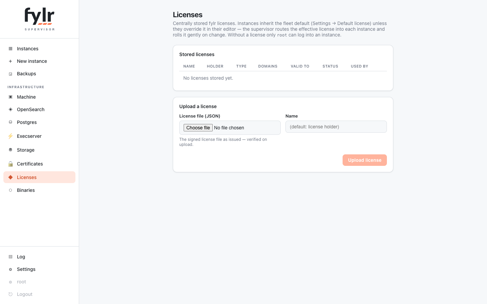

# Licenses

The supervisor stores fylr licenses centrally and routes them to instances with the fleet-default + override model: the **fleet default license** is inherited by every instance unless the instance selects its own in the editor's License tab — a specific stored license, or "instance configured" (the supervisor bakes nothing; whatever license is stored inside the instance applies, which is what a restored instance keeps).

<figure><figcaption>
The Licenses page: centrally stored licenses and which instances use them
</figcaption></figure>

Signatures are verified on upload, so broken files are rejected at the supervisor; expired licenses are stored but listed with their problems. The effective license is baked into the instance and a change rolls it gently — changing the fleet default rolls exactly the inheriting instances. A license that is the fleet default or selected by an instance cannot be deleted.

Without a license in service, fylr only lets `root` log in. The instance editor probes the live login gate and shows a red hint when users would be locked out; the same value is exposed as `users_can_login` in the instance's public settings capabilities.
