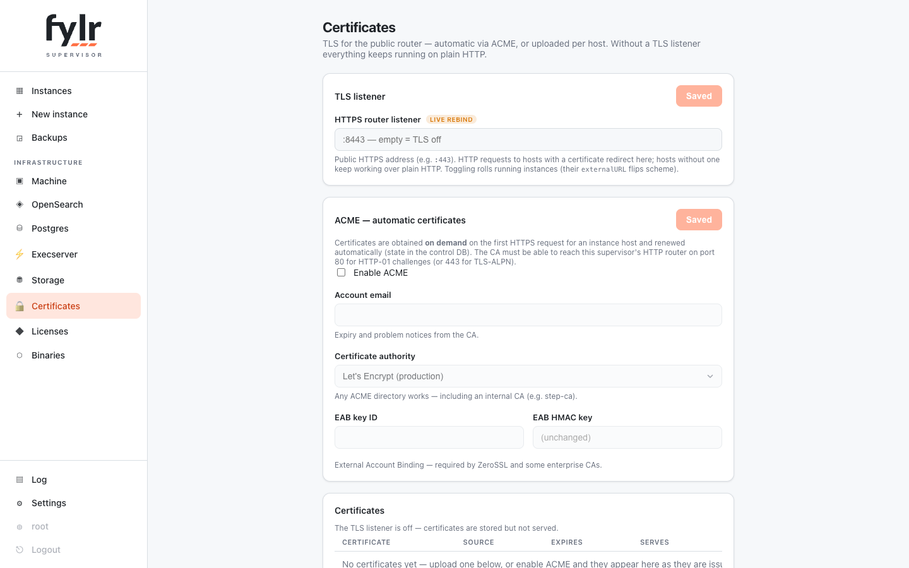

# Router, TLS & protection

The router is the public face of the fleet: it maps the request `Host` to a healthy replica of the owning instance, keeps sessions sticky (stateful flows like the interactive OAuth login stay on one backend), preserves the original host, and wakes hibernated instances on demand.

## TLS certificates

TLS is opt-in: without a `router_tls` listener everything stays plain HTTP (the localhost playground setup). With one, certificates come from two sources:

* **ACME** — obtained on demand at the first HTTPS request for an instance host and renewed automatically; state lives in the control DB. Any ACME directory works (Let's Encrypt production/staging, ZeroSSL, Buypass, a custom internal CA), including External Account Binding.
* **Manual upload** — PEM certificate + key per host, wildcards included. Manual certificates win over ACME.

HTTP requests to a host with a certificate are redirected to HTTPS; hosts without one keep serving plain HTTP. Certificate changes roll the affected instances gently, since the child's external URL scheme changes.

<figure><figcaption>
The Certificates page: TLS listener, ACME configuration and per-host certificate state
</figcaption></figure>

## Rate limits

Two independent levels, each a fleet default with per-instance overrides, both applied live:

* **Per client IP** — the single-client-abuse shield: a token bucket (rate + burst) checked first, so one abuser cannot drain an instance's own budget. The client IP is the connection peer; forwarded headers (`x-real-ip`, `x-forwarded-for`) are believed only from peers listed in the `trusted_proxies` setting and stripped from everyone else.
* **Per instance** — tenant fairness for the shared infrastructure: a token bucket plus a max-concurrent cap that catches slow requests staying under any rate. Over the limit means `429` with `Retry-After`.

## Abuse shield

Internet background noise (bots probing `/.env`, `/wp-login.php`, …) must neither wake hibernating instances nor keep them alive. Before any wake or proxy work, the router applies, in order:

* **Per-IP bans** — an IP producing only client errors (failed basic auth, scanner probes, 4xx) is banned for 15 minutes after 20 strikes within 10 minutes. Any successful response clears the strikes, so real users mixing in the odd 404 are never touched. Correct basic-auth credentials lift a ban — the penalty cuts anonymous noise, not a locked-out operator behind a shared (CGNAT) address. Every strike is logged with its reason; `GET /api/strikes` lists the current state and `DELETE /api/strikes/{ip}` unbans.
* **Scanner paths** — well-known probe paths (dot-paths except `/.well-known/`, `*.php`, `/wp-*`, `/cgi-bin/`, …) are answered `404` before host resolution.
* **Basic auth at the router** — an instance's HTTP basic auth is enforced *before* a hibernated instance is woken, mirroring the child's own scope and realm exactly. The child still checks again; the router just rejects the same credential earlier.
* **Activity by response** — only successful responses count as activity for the hibernation idle timer, so failed logins and 404 noise never keep an idle instance awake.

Every wake logs its trigger (`request GET / from 1.2.3.4`, `manual wake`, `restore`), and all instance-scoped supervisor log lines carry the instance as a column.
