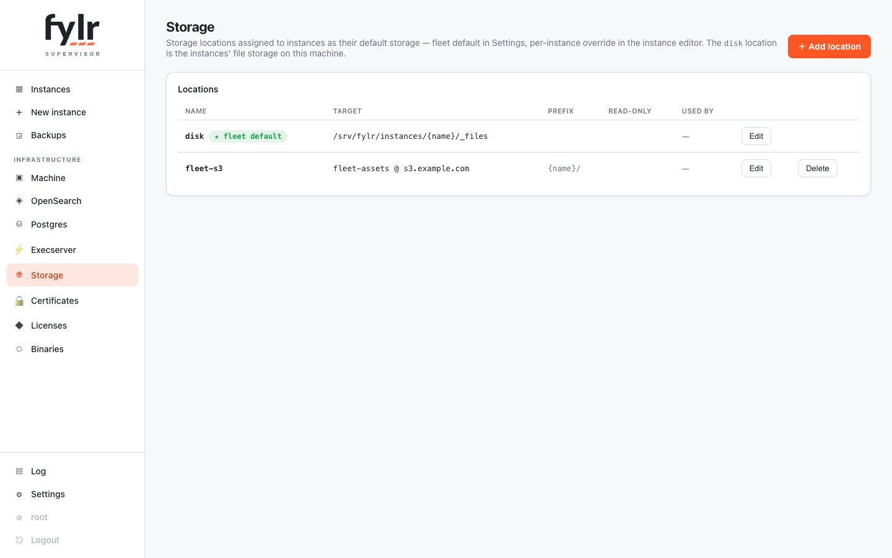
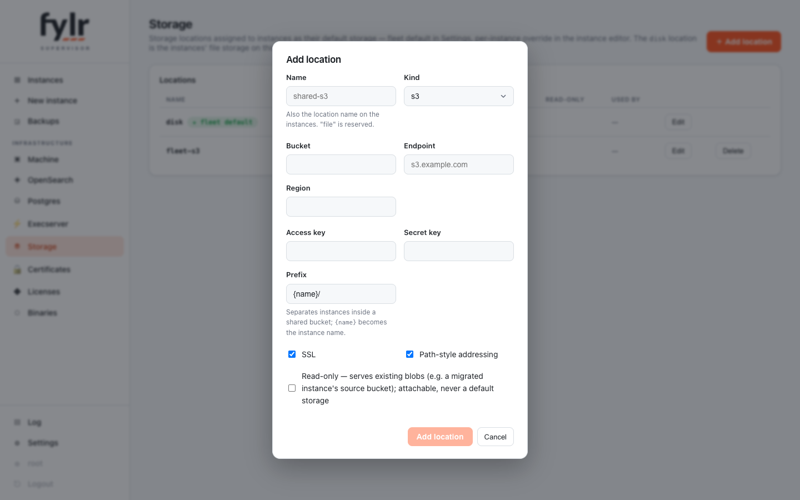

# Storage

The supervisor stores named **storage locations** centrally and assigns them to instances. A location is either **disk** — a directory on this machine, `{name}` templated per instance — or an **S3 bucket**, with the prefix (default `{name}/`) separating tenants inside a shared bucket.

<figure><figcaption>
The Storage page: the machine's disk location (always present, directory editable) and configured S3 locations
</figcaption></figure>

There is no invisible "built-in" storage: the per-instance disk is itself an explicit location, seeded at first boot with `<data_dir>/{name}/_files` and editable like any other — only its name and kind are fixed, and it cannot be deleted. It maps onto every instance's own `file` location rather than adding a second one.

## Assignment

Storage follows the same fleet-default + override model as licenses: the fleet default (Settings → Storage) is inherited by every instance that does not choose its own location in the editor's Storage tab. On top, additional locations can be **attached** to an instance without becoming its default — the tool for serving a migrated instance's blobs from its **read-only** source bucket. A read-only location can never be a default; the editor and the API refuse it.

<figure><figcaption>
The location dialog — reachable from the Storage page and from every storage select
</figcaption></figure>

## What an assignment does

The supervisor applies storage through the instance's ordinary API as root: every assigned location is upserted as a storage location on the instance, and the instance's `location_defaults` point originals, versions and backups at the default. Fresh instances get their locations seeded through the generated configuration, so the very first upload already lands right.

Existing files are **never moved** — switching storage affects new uploads only, and locations already created on an instance are never deleted (data lives there). The assignment converges on every instance readiness and applies live on an edit.
