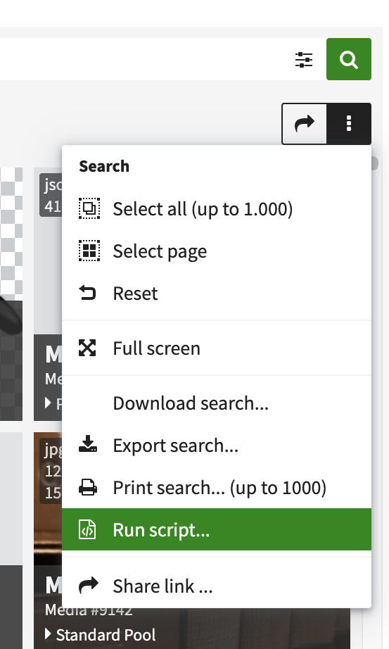
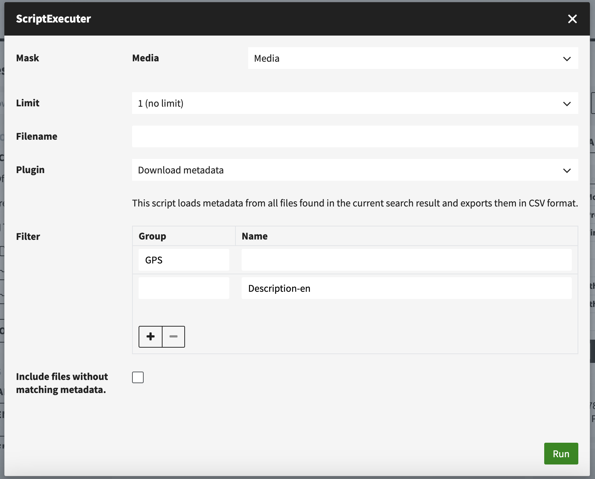

# Extracting File Metadata Later On

This can be done in a 2 step process. First, the metadata needs to be exported as a CSV file using the ScriptExecuter. The second step is importing the CSV file using the CSV Importer.

## Extracting Metadata Using The ScriptExecuter

If you want to extract XMP/IPTC/EXIF metadata from files that have already been uploaded, you can do so by using the ScriptExecuter. Simply search for the files you want the metadata for and then click on the 3-dot-menu for the search and click "Run Script".

<figure><figcaption></figcaption></figure>

The ScriptExecuter offers different plugins. For this specific case, we need to choose the plugin "Download Metadata".&#x20;

<figure><figcaption>
In this example, the complete GPS data and the value of the field "Description-en" will be exported.
</figcaption></figure>

You can either export all fields of a metadata group such as "GPS" or a specific field such as "Description-en". You can export multiple groups or fields at once by adding a filter for each group/field.


Open the detail of a record and click on "Info" in the asset browser to access all metadata from the file and copy the group name or field name you want to extract.


After you hit "Run", a CSV file is produced and downloaded. The CSV automatically contains all necessary data for the import. If a file has no metadata in the specified groups or fields, it will not be included in the CSV file (unless you enable "Include files without matching metadata").&#x20;

## Importing The Extracted Metadata Using The CSV-Importer

All you have to do now, is open the CSV Importer and upload the CSV file. Choose the appropriate object type, pool and mask and define the import mapping as usual. It's important that you include the "\_system\_object\_id" in the import mapping and also choose the "\_system\_object\_id" in the import settings as the "Update Field". Now simply click "Prepare" and "Update" to import the data.

More information about the CSV Importer can be found [here](../for-administrators/tools/csv-importer/).

