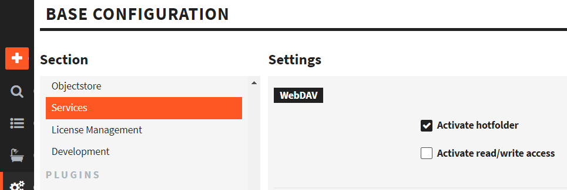
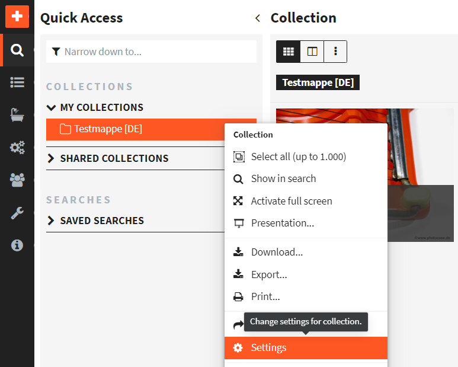
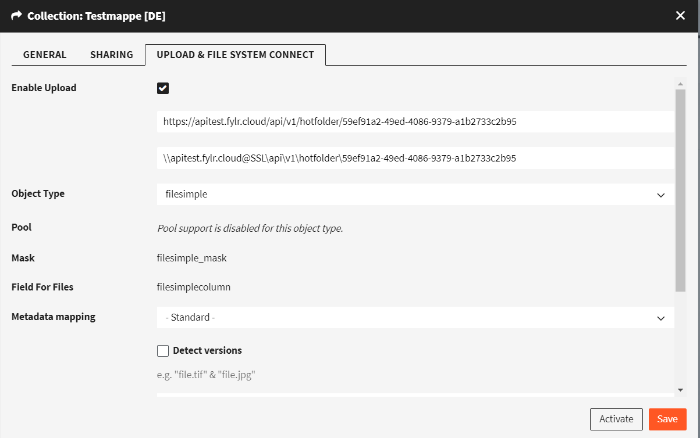
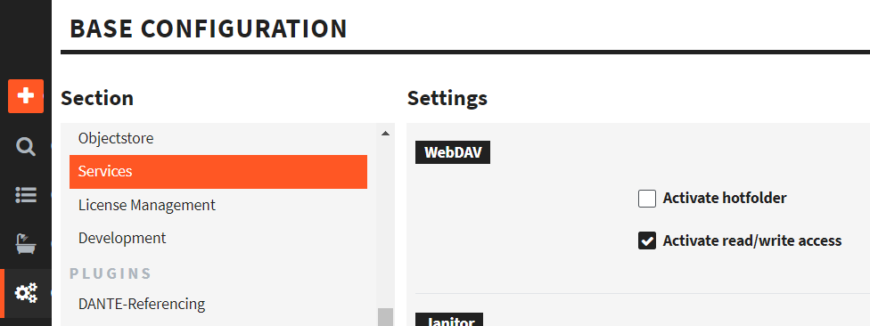
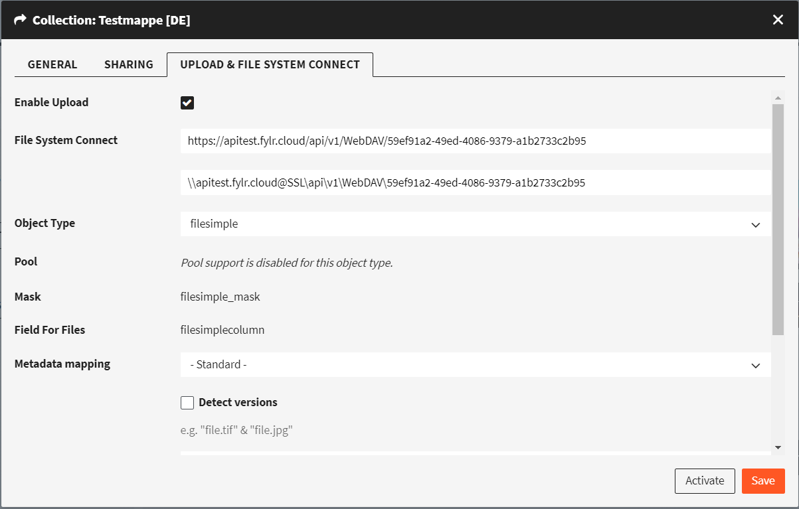

# How To Set Up As Administrator

## Settings

You can define if new **records** should be **created** for each uploaded file, or if already existing records should be **updated** with the uploaded file. Use the following **settings** to define the **behavior** of the upload.


To set up an upload collection, the user needs the **permissions** to create records and "read" permission for at least one pool.


For a table with all settings, see [Quick Access - Collections](../../for-users/quick-access/collections-and-presentations.md)

## Set up Upload

1. Make sure Uploading is enabled at the service level: Enable in Base Configuration - Services. See screenshot:

<figure><figcaption>
where to enable upload as a feature
</figcaption></figure>

Make sure that Uploading is also enabled for the individual collection:

2. Right click on a collection, choose `Settings`. See screenshot:

<figure><figcaption>
How to open collection Settings
</figcaption></figure>

3. In the tab `UPLOAD & FILE SYSTEM CONNECT` check the checkbox `Enable Upload`. See Screenshot:

<figure><figcaption>
Collection settings for upload
</figcaption></figure>

4. Make sure to choose an `Object Type` which has a field of type `File`.
5. Copy the https-URL for later use in your webdav client program.
6. Click `Activate` or `Save`
7. With your webdav client program, open the above copied https-URL. See our tutorials ...\
   [How To Use As A Windows User](how-to-use-as-a-windows-user.md) or\
   [How To Use As A Mac User](how-to-use-as-a-mac-user.md)

About 30 seconds after uploading, files will be imported into fylr and removed from the webdav "hotfolder". But they will then be in the collection.

## Set up File System Connect

1. Make sure it is enabled at the service level: Enable in `Base Configuration` - `Services.` See screenshot:

<figure><figcaption>
where to enable File Sysetm Connect as a feature
</figcaption></figure>

Make sure that File System Connect is also enabled for the individual collection:

2. Right click on a collection, choose `Settings`. See screenshot:

<figure><figcaption>
How to open collection Settings
</figcaption></figure>

3. In the tab `UPLOAD & FILE SYSTEM CONNECT` check the checkbox `Enable Upload`. See Screenshot:

<figure><figcaption>
Collection settings for File Sytem Connect
</figcaption></figure>

4. Make sure to choose an `Object Type` which has a field of type `File`. You will only see objects of that type via webdav. Objects of other types will not be visible.
5. Copy the https-URL for later use in your webdav client program.
6. Click Activate or Save
7. With your webdav client program, open the above copied https-URL. See our tutorials ...\
   [How To Use As A Windows User](how-to-use-as-a-windows-user.md) or\
   [How To Use As A Mac User](how-to-use-as-a-mac-user.md)

If you use your webdav client to upload files, they will stay visible after being imported.
