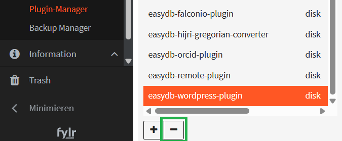

# LDAP

LDAP is an authentication service that you might already have, to hold your users' accounts centrally. It is part of **Microsoft Active Directory** (predecessor to Azure Active Directory) and available as a separate service (OpenLDAP).

You need a fylr licence including Authentification to use LDAP. To enable fylr users to **log in** with LDAP accounts, scroll the **User Management** page to LDAP, _above_ SAML:

<figure><figcaption><p>where to find LDAP in the menues</p></figcaption></figure>

Here is an **example** configuration with the public test provider ldap.forumsys.com:

<figure><figcaption><p>example ldap configuration</p></figcaption></figure>

**URL**: Do not forget the protocol, in this case, `ldap://`. This could also be `ldaps://`. `ldap://` can be combined with **Start TLS**.

**Allow insecure connection**: Can be safe if security is done by other means, e.g. fylr and LDAP server are running internally.

**Bind User**: An LDAP user, which fylr uses to search for other users and groups. Does not need administrative privileges.

**Bind Password**: Password of the Bind User.

**User Base DN**: Organizatinal Unit or whole organization, in which to search for users. All users who shall be able to log in must be inside this unit. Bind User does not have to be inside this unit. Example: `OU=Users,DC=example,DC=com` .

**User filter**: Which LDAP attribute shall be compared to the login string (which is entered during fylr login)? For example if I am Albert Einstein and my login username ist `einstein`: Which **LDAP attribute** contains the string `einstein`? In the example above it is the attribute `uid` . the values of `uid` are compared to the login given by the user. So if I enter `einstein` and my password, fylr then searches for LDAP objects which have the attribute `uid` with value `einstein` . If one is found, the password of _that_ LDAP object is also checked and if correct, this LDAP object is considered logged in. For this scenario, the user filter `(uid=%(login)s)` would be enough. To reduce search time and the number of objects compared, the example in the screenshot additionally restricts the search to only LDAP objects of `objectClass` = `person`. \
If it does not work, <mark style="color:red;">try upper/lower case</mark>. For example, in one case the log messages showed an unexpected replacement from `(Login)` to `%\28Login\29s` and the solution was to write `(login)` (_lower_ case L) in the User filter.

**User Update**

During login with LDAP credentials, fylr creates a fylr user that is considered equivalent to the LDAP user - if that fylr user does not already exist. To decide, whether the fylr user already exists, a fylr attribute is compared with an LDAP attribute. In the drop-down menu **User Update**, you can choose which fylr-Attribute is compared: **Referenz**, **Login** or **E-Mail**. Default is **Referenz** (English: reference). In **USER MAPPING** (below) you chose, which LDAP-Attribute to compare.\


As an example, let us assume that **E-Mail** is chosen in **User Update** and in **USER MAPPING**, the **Target** **Email** is set to **Value** `%(mail)s`, which is the LDAP attribute `mail`. When a user with email address Marity@example.com first logs in with her LDAP credentials, a new fylr user is created and it's attribute **Email** is filled with the string `Marity@example.com`.  Log message: `DBG user new in fylr [...] login=ldap`.\
When she logs in the second time, the same fylr user is used, as expected, because `Marity@example.com` is found in the fylr attribute **Email**. Log Message: `DBG user found in fylr with id 31, version 2 [...] login=ldap`. (`31` is just an example, `2` is increased with each login)\
Now, to make the disadvantages of using **E-Mail** clear, let us assume that the user marries and now has her email address in LDAP changed to Marity-Einstein@example.com. When she logs into fylr after the change, no fylr user is found with **Email**  `Marity-Einstein@example.com`. It is a different string than the stored `Marity@example.com` in the fylr attribute **Email**. Thus a _new_ fylr user is created. Log message: `DBG user new in fylr [...] login=ldap`. Problematic: The same person can no longer log into her original fylr account.\
To prevent this, we recommend to set **User Update** to **Referenz** and in **USER MAPPING** set the **Value** of the **Target**: **Reference** to an LDAP attribute that does _not_ change.

## USER MAPPING

<figure><figcaption><p>tested example for ldap.forumsys.com</p></figcaption></figure>

**+**: Add another mapped Attribute. We suggest you have the same ones as shown above. At least **`Login`** and the one chosen in **User Update**.

**Target:** Choose fylr attribute to be mapped to LDAP attribute.

**Value:** Enter one or more LDAP attributes, each given between `%(` and`)s`. <mark style="color:red;">Upper case / lower case</mark> _<mark style="color:red;">is</mark>_ <mark style="color:red;">important here, even if it is not important inside your LDAP Directory!</mark>\
The example values working with ldap.forumsys.com are simplistic. In your environment, they may look more like:\
`%(sAMAccountName)s` or\
`%(displayName)s`

If in doubt, which LDAP attributes can be used between `%(` and `)s` during **User Mapping**, check your LDAP structure or fylr's output after a LDAP login attempt. fylr's output is shown as container logs and in [https://fylr.example.com/inspect/system/console/](https://fylr.example.com/inspect/system/console/).\
The output may look like:

<pre><code><strong>2029-12-31 23:59:59 DBG search with base DN "dc=example,dc=com" and filter "(uid=einstein)" login=lda
</strong><strong>2029-12-31 23:59:59 DBG search found 1 entries [...] login=ldap
</strong>2029-12-31 23:59:59 DBG DN: uid=einstein,dc=example,dc=com
  objectClass: [inetOrgPerson organizationalPerson person top]
  cn: [Albert Einstein]
  sn: [Einstein]
  uid: [einstein]
  mail: [einstein@ldap.forumsys.com]
  telephoneNumber: [314-159-2653]
</code></pre>

So, usable attributes in this example are `DN`, `objectClass`, `cn`, `sn`, `uid`, `mail` and `telephoneNumber`.

If you do not see enough ldap-related log messages, check:

* Your license includes **Capabilties**: External Authentication : **true** .\
  (check in **Base Configuration** - **License Management**)
* fylr's log **Level** is at least `debug`.\
  (check in **Base Configuration** - **Development** - **Logging**)
* **Log Steps** is activated.\
  (check in **Base Configuration** - **User Management** - **LDAP** - **Debug**)

## Group settings

We recommend to only configure group settings after the above settings are working to log in. Group settings are optional.

<figure><figcaption><p>example for Group settings</p></figcaption></figure>

**Group Base DN**: Organizational Unit or whole organization, in which to search for groups. Example: `OU=Groups,DC=example,DC=com` .

**Group Filter**: Here, entere a search expression to find the LDAP objects to look at when deciding group membership. You can use attributes of the user here, e.g. `cn`, in the syntax `%(cn)s` - but you have to use it in an evaluation. In other words, compare it to another attribute with `=`.

Example: To compare all attributes named `member`, use as Group Filter: `(member=%(cn)s)`. This will result in all objects that have the user's `cn` in an attribute called `member`.

For the context of ldap.forumsys.com, the distinguished name (usable as `DN`) is in the group attribute `uniqueMember`.

So `(uniqueMember=%(DN)s)` could work. But to not evaluate _all_ objects, or in other words, to evaluate only groups, we add the object class: `(&(objectClass=groupOfUniqueNames)(uniqueMember=%(DN)s))`. This was successfully tested with ldap.formusys.com.

Another example, from a different LDAP installation:

`(&(member=%(distinguishedName)s)(objectClass=group))` .

Now you have narrowed the comparison to a few objects, likely groups. Next step: Which attribute of these objects shall be compared during matching of fylr groups to LDAP groups? This is determined in Group Mapping:

**Group Mapping**: Which attribute to look at when matching fylr groups to LDAP groups. Look at the (final) next step for an example. To use e.g. the group's common name, use `%(cn)s` here, which works with ldap.forumsys.com.\
If in doubt, which LDAP attributes can be used between `%(` and `)`, see fylr log output. How to do that see above around the previous log output. Log output for a group looks like:

```
2029-12-31 23:59:59 DBG search with base DN "dc=example,dc=com" and filter "(uniquemember=uid=einstein,dc=example,dc=com)"  login=ldap
2029-12-31 23:59:59 DBG search found 1 entries
2029-12-31 23:59:59 DBG DN: ou=scientists,dc=example,dc=com
  uniqueMember: [uid=einstein,dc=example,dc=com uid=galieleo,dc=example,dc=com uid=tesla,dc=example,dc=com uid=newton,dc=example,dc=com]
  ou: [scientists]
  cn: [Scientists]
  objectClass: [groupOfUniqueNames top]
```

So, usable attributes in this example are `DN`, `uniqueMember`, `cn`, `ou` and `objectClass`.

### Final step: **Matching an LDAP group to a fylr group**:

*   In the settings for a fylr group, enter a string that matches one LDAP group. For the example of ldap.forumsys.com, we created the fylr group `scientists` and since we chose `cn` above in **Group Mapping**, we now have to use the string `Scientists`, as this is the value in that group's common name (`cn`). In the fylr frontend this is done here:

    <figure><figcaption><p>fylr frontend > Rights Management > Groups > Choose group > Authentication Services > LDAP section > Add row</p></figcaption></figure>
* So now, when the ldap.forumsys.com's user `einstein` or `newton` logs into this fylr, they will be automatically in the fylr group `scientists` and enjoy all the group's system rights and permissions in fylr.

### Walk the chain of ancestry

In case your group filter does not give the results you expect, you can try to use `LDAP_MATCHING_RULE_IN_CHAIN` in the group search filter.

Example:

```
(&(member:1.2.840.113556.1.4.1941:=%(distinguishedName)s)(objectClass=group))
```

The string 1.2.840.113556.1.4.1941 specifies `LDAP_MATCHING_RULE_IN_CHAIN`. This applies only to `DN` attributes. This is an extended match operator that walks the chain of ancestry in objects all the way to the root until it finds a match. This reveals group nesting. It is available only on domain controllers with Windows Server 2003 SP2 or Windows Server 2008 (or above).

Usually, this is not needed, but it was needed for customers that are used to how Cumulus does LDAP group search.
