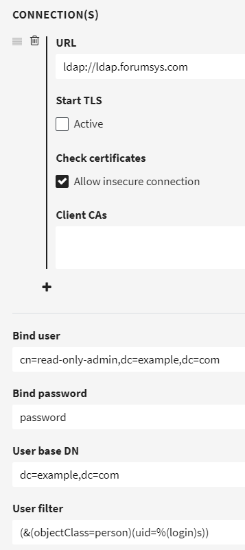

# LDAP

LDAP is an authentication service that you might already have, to hold your users' accounts centrally. It is part of **Microsoft Active Directory** (predecessor to Azure Active Directory) and available as a separate service (OpenLDAP).

To enable fylr users to **log in** with LDAP accounts, scroll the **User Management** page to LDAP, _above_ SAML:

<figure><figcaption><p>where to find LDAP in the menues</p></figcaption></figure>

Here is an **example** configuration with the public test provider ldap.forumsys.com:

<figure><figcaption><p>example ldap configuration</p></figcaption></figure>

**URL**: Do not forget the protocol, in this case, `ldap://`. This could also be `ldaps://`.

**Allow insecure connection**: Can be safe if security is done by other means, e.g. fylr and LDAP server are running internally.

**Bind User**: An LDAP user, which fylr uses to search for other users and groups. Does not need administrative privileges.

**Bind Password**: Password of the Bind User.

**User Base DN**: Organizatinal Unit or whole organization, in which to search for users. All users who shall be able to log in must be inside this unit. Bind User does not have to be inside this unit. Example: `OU=Users,DC=example,DC=com` .

**User filter**: Which LDAP attribute shall be compared to the login string (which is entered during fylr login)? For example if I am Albert Einstein and my login username ist `einstein`: Which **LDAP attribute** contains the string `einstein`? In the example above: the attribute `uid` is compared to the login given by the user. So if I enter `einstein` and my password, fylr then searches for LDAP objects which have the attribute `uid` with value `einstein` in that attribute. If one is found, the password of _that_ LDAP object is also checked and if correct, this LDAP object is considered logged in. fylr creates a fylr user (if not already existing) that is considered connected to this LDAP object. For this scenario, the user filter `(uid=%(login)s)` is enough. To reduce search time and number of objects searched, the example in the screenshot additionally restricts the search to only LDAP objects of `objectClass` = `person`.

## USER MAPPING

.png>)

**+**: Add another mapped Attribute. We suggest `Display Name` and `EMail`.

**Target:** Choose one, at least `Login`.

**Value:** Enter one or more LDAP attributes, each given between `%(` and`)s`. <mark style="color:red;">Upper case / lower case</mark> <mark style="color:red;"></mark>_<mark style="color:red;">is</mark>_ <mark style="color:red;"></mark><mark style="color:red;">important here, even if it is not important inside your LDAP Directory!</mark>

If in doubt, which LDAP attributes can be used between `%(` and `)` during **User Mapping**, set fylr's log level to at least `debug` and pick attributes from the log output after a LDAP search. It looks like:

<pre><code><strong>2029-12-31 23:59:59 DBG search with base DN "dc=example,dc=com" and filter "(uid=einstein)" login=lda
</strong><strong>2029-12-31 23:59:59 DBG search found 1 entries [...] login=ldap
</strong>2029-12-31 23:59:59 DBG DN: uid=einstein,dc=example,dc=com
  objectClass: [inetOrgPerson organizationalPerson person top]
  cn: [Albert Einstein]
  sn: [Einstein]
  uid: [einstein]
  mail: [einstein@ldap.forumsys.com]
  telephoneNumber: [314-159-2653]
</code></pre>

So, usable attributes in this example are `DN`, `objectClass`, `cn`, `sn`, `uid`, `mail` and `telephoneNumber`.

## Group settings

We recommend to only configure group settings after the above settings are working to log in. Group settings are optional.

**Group Base DN**: Organizational Unit or whole organization, in which to search for groups. Example: `OU=Groups,DC=example,DC=com` .

**Group Filter**: Here, entere a search expression to find the LDAP objects to look at when deciding group membership. You can use attributes of the user here, e.g. `cn`, in the syntax `%(cn)s` - but you have to use it in an evaluation. In other words, compare it to another attribute with `=`.

Example: To compare all attributes named `member`, use as Group Filter: `(member=%(cn)s)`. This will result in all objects that have the user's `cn` in an attribute called `member`.

For the context of ldap.forumsys.com, the distinguished name (usable as `DN`) is in the group attribute `uniqueMember`.

So `(uniqueMember=%(DN)s)` could work. But to not evaluate _all_ objects, or in other words, to evaluate only groups, we add the object class: `(&(objectClass=groupOfUniqueNames)(uniqueMember=%(DN)s))`. This was successfully tested with ldap.formusys.com.

Another example, from a different LDAP installation:&#x20;

`(&(member=%(distinguishedName)s)(objectClass=group))` .

Now you have narrowed the comparison to a few objects, likely groups. Next step: Which attribute of these objects shall be compared during matching of fylr groups to LDAP groups? This is determined in Group Mapping:

**Group Mapping**: Which attribute to look at when matching groups. Look at the (final) next step for an example. To use e.g. the group's common name, use `%(cn)s` here, which works with  ldap.forumsys.com. \
If in doubt, which LDAP attributes can be used between `%(` and `)`, set the log level of fylr to at least `debug` and pick attributes from the log output after a LDAP search. It looks like:

```
2029-12-31 23:59:59 DBG search with base DN "dc=example,dc=com" and filter "(uniquemember=uid=einstein,dc=example,dc=com)"  login=ldap
2029-12-31 23:59:59 DBG search found 1 entries
2029-12-31 23:59:59 DBG DN: ou=scientists,dc=example,dc=com
  uniqueMember: [uid=einstein,dc=example,dc=com uid=galieleo,dc=example,dc=com uid=tesla,dc=example,dc=com uid=newton,dc=example,dc=com]
  ou: [scientists]
  cn: [Scientists]
  objectClass: [groupOfUniqueNames top]
```

So, usable attributes in this example are `DN`, `uniqueMember`, `cn`, `ou` and `objectClass`.

Final step: **Matching an LDAP group to a fylr group**:

*   In a fylr group's settings, enter a string that matches one LDAP group. For the example of ldap.forumsys.com, we created the fylr group `scientists` and since we chose `cn` above in **Group Mapping**, we now have to use the string `Scientists`, as this is the value in that group's common name (`cn`). In the fylr frontend this is done here:

    <figure><figcaption><p>fylr frontend > Rights Management > Groups > Choose group > Authentication Services > LDAP section > Add row</p></figcaption></figure>
* So now, when the ldap.forumsys.com's user `einstein` or `newton` logs into this fylr, they will be automatically in the fylr group `scientists` and enjoy all the group's system rights and permissions in fylr.&#x20;


