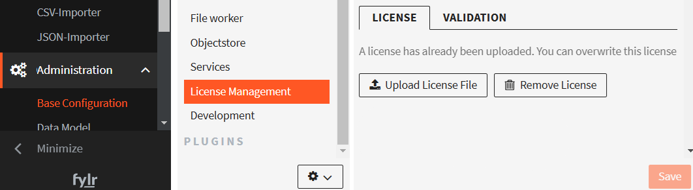

# PDF Creator


The "PDF Creator" plugin is licensed as a separate module. Please check your license agreement in case of doubt.


### Install the plugin

1. Got to **Plugin-Manager** and if there is no **Server PDF Plugin** yet, press the **+** button at the bottom:

2. Choose type **url** and enter the URL of the latest release zip file, e.g.: [https://github.com/programmfabrik/fylr-plugin-server-pdf/releases/download/v1.0.0/fylr-plugin-server-pdf.zip](https://github.com/programmfabrik/fylr-plugin-server-pdf/releases/download/v1.0.0/fylr-plugin-server-pdf.zip) (you may check for newer plugin releases [here](https://github.com/programmfabrik/fylr-plugin-server-pdf/releases) )
3. Make sure the plugin is marked as **enabled**, as in the screenshot above

### Create at least one PDF template

4. Go to **Rights Management** (the 3 people icon, _NOT_ the gear cogs icon) - **Object Types** - choose one object type - go to the tab named **PDF Creator** (see screenshot)

&#x20;.png>) (click to enlarge)

5. Click the **+** button.
6. Name your template.
7. Do not forget to click **Save** at the end.

### Create a PDF

8. Go to **Lists** - **Object Types** - choose one type - Select one Object - right click - **Print**

.png>)

9. In **Custom Layouts** - open the dropdown - choose one (pdf template 1 in below example) - click **Print**

.png>)

Then a PDF is created and downloaded.

